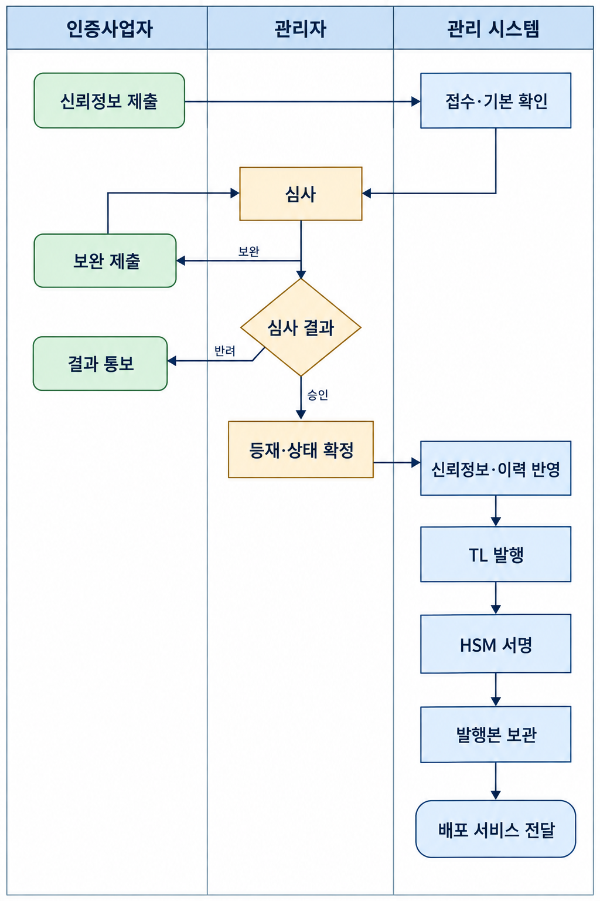
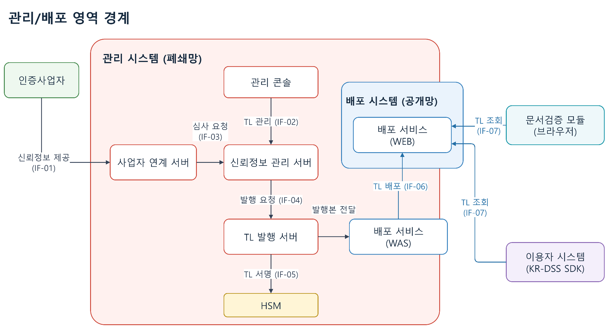
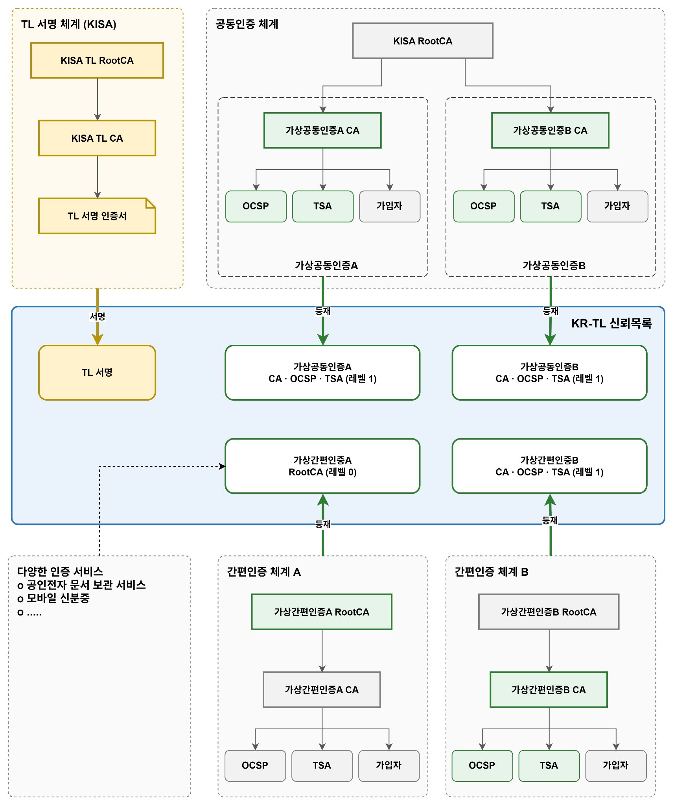
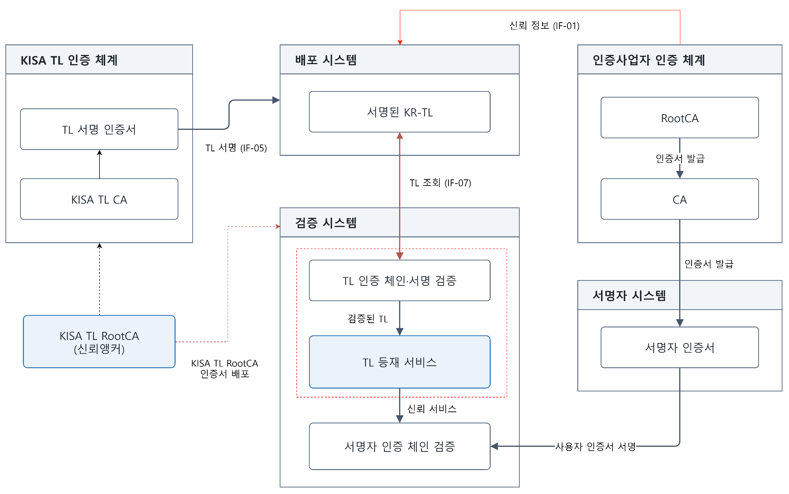
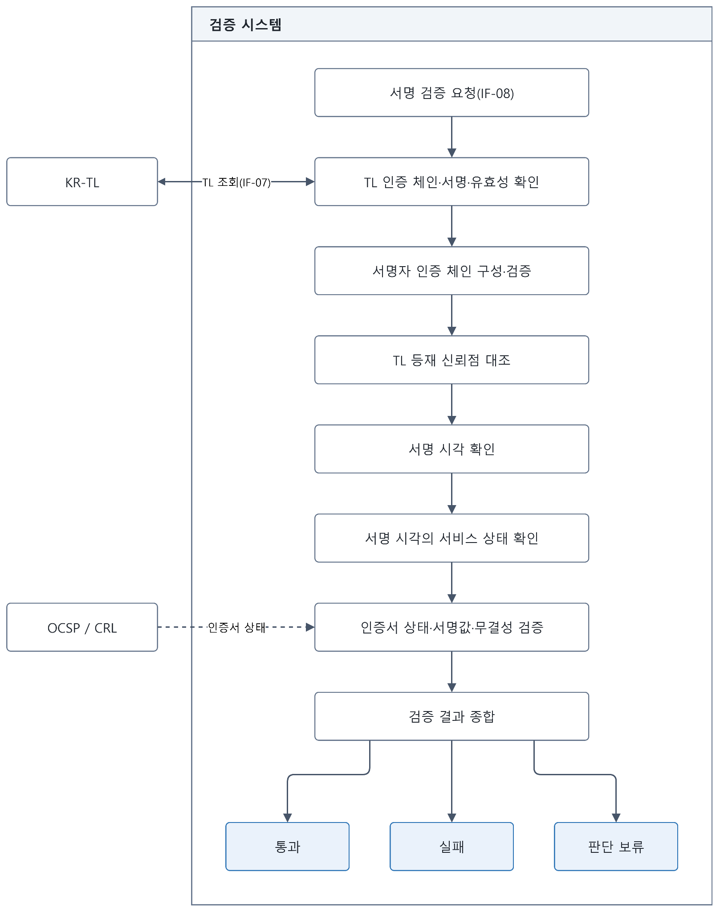
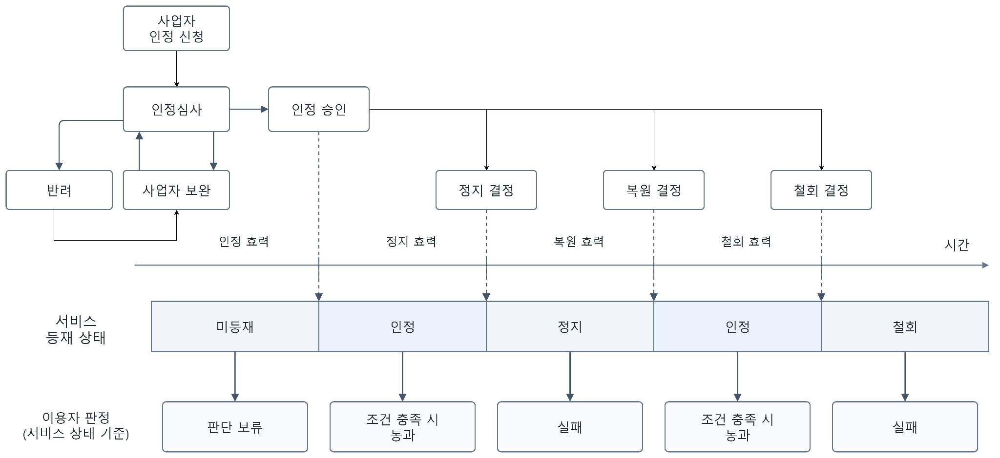
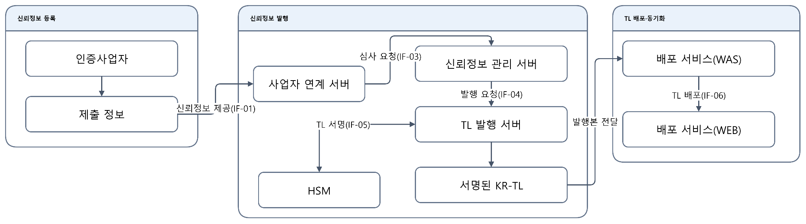
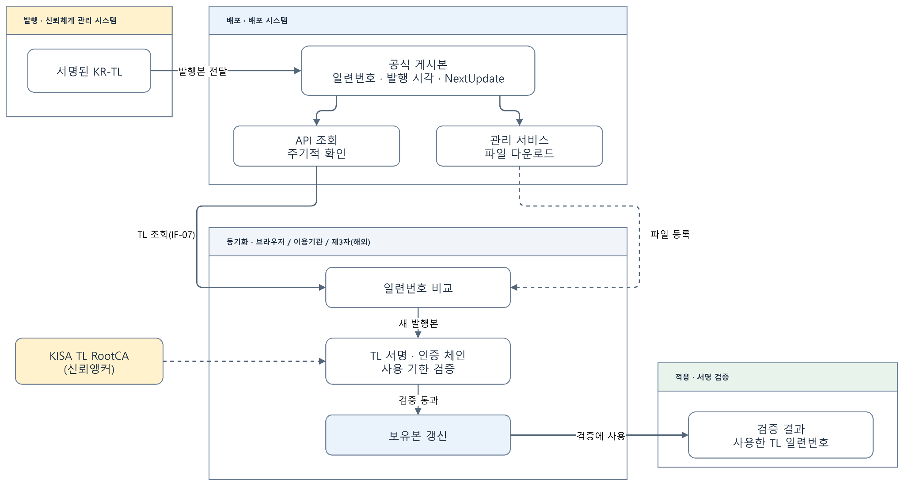
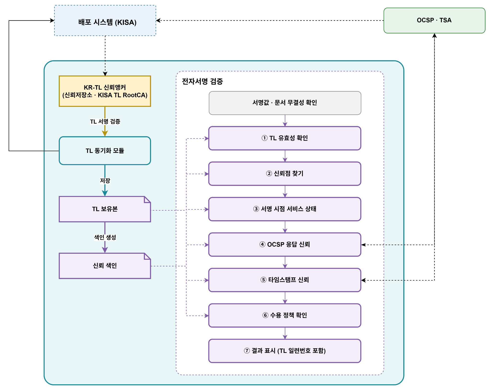
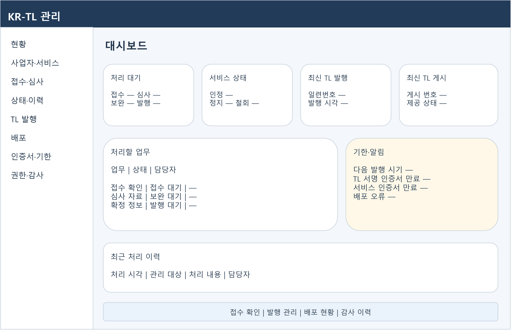

> 2026-10-07 본문 보관본. 1.1·1.2절은 이후 대화에서 정리한 설계를 반영했다. 이 수정분의 Google Docs 반영 여부는 별도 확인한다.

# KR-TL 시스템 및 신뢰체계

# 목차

## 1 시스템 구성

### 1.1 시스템 구성

한국 신뢰서비스 목록(Korea Trust List, KR-TL) 관리체계는 국내 신뢰서비스의 인정 정보를 관리하고, 이를 신뢰목록으로 발행·배포하는 체계다. 인증사업자가 제출한 정보를 심사하여 서비스의 등재 여부와 인정 상태를 확정하고, 변경 이력을 관리한다. 사용자와 이용기관은 배포된 KR-TL을 통해 전자서명 검증에 필요한 신뢰서비스의 인정 상태를 확인한다.

관리 시스템은 폐쇄망에서 신뢰정보의 접수·심사·발행을 수행한다. 배포 시스템은 서명된 KR-TL을 공개망에 제공하며, 브라우저의 문서검증 모듈과 이용기관의 서버 검증모듈은 이를 조회하여 사용한다.

KR-TL의 서명은 KISA TL 인증체계를 기반으로 한다. TL 발행 서버는 HSM에 보관된 서명키로 TL을 서명하며, 검증모듈은 사전에 신뢰한 KISA TL RootCA를 기준으로 TL의 인증 체인과 서명을 검증한다.

그림 1 시스템 구성도

#### 1.1.1 구성 요소

| 영역 | 구성 요소 | 역할 |
| --- | --- | --- |
| 인증사업자 | CA | 가입자 인증서를 발급하고 신뢰 서비스 정보를 제공한다. |
| 인증사업자 | OCSP | 인증서의 폐지 상태를 제공한다. |
| 관리 시스템 | 관리 콘솔 | 신뢰정보, 심사 결과, 서비스 상태와 TL 발행을 관리한다. |
| 관리 시스템 | 사업자 연계 서버 | 제출 정보를 접수하고 심사를 요청한다. |
| 관리 시스템 | 신뢰정보 관리 서버 | 사업자·서비스 정보, 심사 결과와 상태 이력을 관리하고 TL 발행을 요청한다. |
| 관리 시스템 | TL 발행 서버 | 확정된 정보로 TL을 구성하고 서명된 발행본을 생성한다. |
| 관리 시스템 | HSM | TL 서명키를 보호하고 서명을 수행한다. |
| KISA TL 인증체계 | KISA TL RootCA · KISA TL CA · TL 서명 인증서 | TL 서명 인증서의 인증 체인을 구성한다. KISA TL RootCA는 TL 검증의 신뢰앵커다. |
| 배포 서비스 | WAS | 관리 영역에서 발행본을 받아 보관하고 배포 WEB에 전달한다. |
| 배포 시스템 | WEB | 공개망에서 KR-TL 조회와 다운로드를 제공한다. |
| 가입자 | 가입자 SW(서명 앱) | 가입자의 인증서와 서명키로 전자서명을 생성한다. |
| 어플리케이션 | 문서검증 모듈(브라우저) | 사용자가 전달받은 전자서명을 브라우저에서 검증한다. |
| 이용기관 | 이용자 시스템(KR-DSS SDK) | 이용기관 서비스에서 전자서명을 생성하거나 전달받은 서명을 서버에서 검증한다. |

#### 1.1.2 인터페이스

**1) 신뢰정보 제공(IF-01)**

인증사업자는 가입자 인증서를 발급하고, 자신의 신뢰 서비스에 대한 정보를 관리 시스템에 제출한다. 사업자 연계 서버는 사업자·서비스 정보, 인증서·공개키 정보와 변경 신청을 접수한다.

**2) 신뢰목록 관리(IF-02)**

관리자는 관리 콘솔에서 신뢰정보와 심사 결과를 확인하고, 등재 정보와 서비스 상태를 관리한다. 확정된 내용은 신뢰정보 관리 서버에 반영한다.

**3) 심사 요청(IF-03)**

사업자 연계 서버는 접수한 신뢰정보를 신뢰정보 관리 서버에 전달하여 심사를 요청한다. 제출 정보는 심사·보완을 거쳐 등재 여부와 적용 상태가 확정된다.

**4) 발행 요청(IF-04)**

신뢰정보 관리 서버는 확정된 사업자·서비스 정보와 상태 이력을 TL 발행 서버에 전달하고 발행을 요청한다. TL 발행 서버는 이를 바탕으로 새로운 발행본을 구성한다.

**5) TL 서명(IF-05)**

TL 발행 서버는 HSM에 TL 서명을 요청한다. HSM은 보호된 서명키로 서명을 수행하고, TL 발행 서버는 서명된 발행본을 배포 서비스(WAS)에 전달한다.

**6) TL 배포(IF-06)**

배포 서비스(WAS)는 서명된 TL 발행본을 배포 서비스(WEB)에 전달한다. 배포 WEB은 외부에서 조회·다운로드할 수 있도록 발행본을 제공한다.

**7) TL 조회(IF-07)**

브라우저의 문서검증 모듈과 이용기관의 서버 검증모듈은 배포 WEB에서 KR-TL을 조회한다. 수신한 TL의 인증 체인·서명·사용 기한을 확인한 후, 등재 서비스와 상태 정보를 서명 검증에 활용한다.

**8) 서명 검증(IF-08)**

서명 검증은 사용자와 이용기관 양쪽에서 수행할 수 있다.

- 이용기관 검증: 사용자가 서명 앱으로 서명한 내용을 이용기관 서비스에 전달하면, 이용기관은 서버 검증모듈로 서명을 검증한다.
- 사용자 검증: 이용기관이 서명한 내용을 사용자에게 전달하면, 사용자는 브라우저의 문서검증 모듈로 서명을 검증한다.

두 검증모듈은 KR-TL을 이용하여 서명자의 인증 체인에 연결된 신뢰 서비스와 해당 시각의 인정 상태를 확인한다.

### 1.2 관리 시스템

신뢰목록 관리 시스템은 인증사업자가 제출한 신뢰정보를 접수하고, 인정심사 결과에 따라 서비스의 등재 정보와 상태 이력을 관리한다. 확정된 정보는 KISA의 전자서명이 포함된 KR-TL로 발행하여 배포 시스템에 전달한다.

관리자는 폐쇄망의 관리 콘솔에서 접수·심사·상태 변경·발행 업무를 처리한다. 시스템은 각 처리 단계의 담당자, 처리 시각과 변경 사유를 기록한다.

#### 1.2.1 시스템 기능

| 기능 | 주요 내용 |
| --- | --- |
| 사업자 관리 | 사업자 식별 정보, 담당자와 제출 권한을 관리한다. |
| 서비스 관리 | 서비스 유형, 인증서·공개키와 관련 정보를 관리한다. |
| 접수 관리 | 신규 등재, 정보 변경, 인증서 갱신과 상태 변경 신청을 접수한다. |
| 심사 관리 | 제출 자료, 보완 요청과 심사 결과를 관리한다. |
| 상태 관리 | 서비스의 인정·정지·철회 상태와 효력 시각을 관리한다. |
| 이력 관리 | 서비스 정보, 인증서와 상태의 변경 이력을 보존한다. |
| TL 발행 | 확정된 신뢰정보로 TL을 구성하고 일련번호·발행 시각·다음 발행 시기를 설정한다. |
| TL 서명 | HSM으로 TL을 서명하고 서명된 발행본을 보관한다. |
| 배포 연계 | 서명된 발행본을 배포 서비스에 전달하고 처리 결과를 확인한다. |
| 권한·감사 | 담당자별 처리 권한과 주요 작업 기록을 관리한다. |

#### 1.2.2 관리 절차

관리 절차는 신뢰정보 접수 → 심사 → 등재·상태 확정 → TL 발행·서명 → 배포 전달 순서로 진행한다. 신규 등재와 기존 정보의 변경 모두 심사·확정된 내용을 발행본에 반영한다.

신뢰목록 관리 절차

**1) 신뢰정보 접수**

인증사업자가 사업자·서비스 정보와 신청 자료를 제출한다. 시스템은 필수 항목과 제출 형식을 확인하고 심사 대상으로 등록한다.

**2) 심사**

관리자는 제출 정보와 근거 자료를 검토한다. 보완이 필요하면 추가 자료를 요청하고 다시 심사한다. 반려된 신청은 사유를 통보하며 TL에 반영하지 않는다.

**3) 등재·상태 확정**

심사 결과에 따라 서비스의 등재 여부, 인정 상태와 효력 시각을 확정한다. 접수·보완·반려 등 신청 처리 상태는 TL에 등재하는 서비스 상태와 구분한다.

**4) 신뢰정보·이력 반영**

확정된 정보를 관리 시스템에 반영한다. 기존 정보가 변경되면 이전 인증서·공개키와 상태 이력을 보존하여 과거 시점의 검증에 사용할 수 있도록 한다.

**5) TL 발행·서명**

TL 발행 서버는 확정된 정보로 발행본을 구성하고 HSM에 서명을 요청한다. 서명이 완료된 TL은 일련번호와 함께 보관한다.

**6) 배포 전달**

서명된 발행본을 배포 서비스(WAS)에 전달하고 처리 결과를 확인한다. 전달에 실패하면 같은 일련번호의 발행본으로 재시도하며, 외부 제공과 이용환경의 동기화는 배포 시스템에서 이어진다.

### 1.3 배포 시스템

배포 WAS는 발행 서버에서 받은 TL을 검증하고 버전별로 보관한다.

TL 배포(IF-06)는 이 서명본을 배포 WEB에서 외부에 제공하도록 하는 연계다. 이용자 시스템과 브라우저 문서검증 모듈은 TL 조회(IF-07)로 배포 WEB에 접근한다.

그림 2 관리/배포 영역 경계

관리 영역에서 발행한 TL은 배포 WAS를 거쳐 공개망의 WEB으로 제공된다. 발행 서버에서 WAS로 전달하는 단계와 WAS에서 WEB으로 배포하는 단계를 구분한다.

## 2 신뢰 체계 구성

### 2.1 신뢰 체계 구성

그림 3 인증 체계와 KR-TL 관리 관계

KR-TL은 인증사업자의 서비스와 인정 상태를 담은 신뢰목록이다. 검증 시스템은 KR-TL을 통해 서명자의 인증 체인이 신뢰할 수 있는 서비스에 연결되는지 확인한다.

신뢰 체계는 TL 서명 체계와 인증사업자 인증 체계로 구성된다. TL 서명 체계는 KISA TL RootCA, KISA TL CA, TL 서명 인증서로 이어지며, KR-TL의 발행 주체와 무결성을 확인하는 데 사용한다. 인증사업자 인증 체계는 가입자 인증서를 발급하고 OCSP, TSA 등의 인증 서비스를 제공한다.

KR-TL에는 사업자의 인증 체계에 따라 RootCA를 등재하거나, CA·OCSP·TSA 서비스를 개별적으로 등재한다. RootCA를 기준으로 등재하는 방식은 레벨 0, 개별 서비스를 기준으로 등재하는 방식은 레벨 1로 구분한다.

각 인증사업자는 자신의 인증 체계를 유지하며, KR-TL은 등재된 서비스의 인증서·공개키 정보와 인정 상태를 제공한다.

### 2.2 인증 체인 구성

검증 시스템은 TL 서명 체인과 서명자 인증 체인을 각각 확인한다. 신뢰정보의 접수·심사·TL 서명은 관리 시스템이 담당하고, 배포 시스템은 서명된 TL을 제공한다.

그림 4 인증 체인 구성

KR-TL 검증에는 사전에 배포받은 KISA TL RootCA 인증서를 신뢰앵커로 사용한다. 검증 시스템은 TL 조회(IF-07)로 받은 KR-TL의 서명 인증서를 KISA TL CA와 신뢰앵커까지 연결하여 검증하고, TL 서명과 내용의 무결성을 확인한다.

서명자 인증 체인은 인증사업자의 RootCA와 CA에서 서명자 인증서로 이어진다. 검증 시스템은 이 체인을 검증된 TL의 등재 서비스와 대조하여, 신뢰 기준으로 사용할 RootCA 또는 CA를 찾는다. 이어 해당 서비스의 인정 상태를 확인하여 서명자 인증 체인의 신뢰 여부를 판단한다.

KISA TL RootCA는 TL 자체를 신뢰하기 위한 기준이고, TL에 등재된 RootCA 또는 CA는 서명자 인증 체인을 신뢰하기 위한 기준이다.

### 2.3 신뢰 검증 절차

그림 5 신뢰 검증 절차

서명 검증(IF-08)은 사용자의 브라우저와 이용자 서비스에서 수행한다. 이용자 서비스가 서명한 내용을 브라우저에서 검증하거나, 사용자가 서명한 내용을 이용자 서비스에서 검증할 수 있다. 두 경우 모두 다음 절차로 신뢰 여부를 확인한다.

1) TL 확인

TL 조회(IF-07)로 확보한 KR-TL의 인증 체인과 서명을 검증하고, 유효기간과 버전을 확인한다.

2) 서명자 인증 체인 확인

서명자 인증서에서 상위 CA로 이어지는 체인을 구성하고, 인증서 간 발급 관계와 서명을 검증한다.

3) TL 등재 신뢰점 대조

인증 체인의 RootCA 또는 CA를 검증된 TL의 등재 정보와 대조하여 해당 서비스를 식별한다.

4) 서명 시각 확인

서명 자료와 시간 증거를 확인하여 서비스 상태를 판단할 기준 시각을 정한다.

5) 서비스 상태 확인

TL의 상태 이력에서 서명 시각에 해당하는 구간을 찾아 서비스의 인정·정지·철회 상태를 확인한다.

6) 인증서와 서명 확인

인증서의 유효기간과 OCSP·CRL에 따른 폐지 상태를 확인하고, 서명값과 서명 대상의 무결성을 검증한다.

7) 결과 판정

검증 조건을 충족하면 통과, 서명 오류나 신뢰 조건 위반이 확인되면 실패, 필요한 정보나 증거가 부족하여 결론을 내릴 수 없으면 판단 보류로 표시한다.

## 3 TL 데이터 구조

### 3.1 TL 구성

KR-TL은 발행 정보, 사업자·서비스 정보, 상태 이력과 TL 서명으로 구성한다. ETSI TS 119 612 구조를 바탕으로 국내 서비스 정보를 담으며, XML과 XAdES 서명을 사용한다.

그림 6 KR-TL 데이터 구조

| 정보 묶음 | 주요 항목 | 검증에서의 의미 |
| --- | --- | --- |
| 발행 정보 | 운영자, 체계 이름, 관할, 일련번호, 발행 시각, NextUpdate | 어느 체계의 어느 버전인지와 사용 기한 확인 |
| 사업자 정보 | 이름·상호, 주소·정보 URI, 인정 정보 | 서비스 운영 주체 식별 |
| 서비스 정보 | 유형, 이름, 디지털 ID, 신뢰 분야, 신뢰점 레벨 | 검증 대상과 TL 서비스 연결 |
| 상태·이력 | 현재 상태, 효력 시각, 과거 상태와 시작 시각 | 서명 시각의 서비스 상태 조회 |
| TL 서명 | XML 서명값, TL 서명 인증서 체인 | TL 출처와 무결성 확인 |

규격 버전은 TL의 문서 구조를, 일련번호는 발행 순서를 나타낸다.

### 3.2 서비스 유형

서비스 유형은 CA(인증서 발급), OCSP(인증서 상태 확인), TSA(시점확인)로 구분한다. 공동인증·간편인증은 신뢰 분야로 별도 구분하며, 신뢰점 레벨은 CA 서비스에 적용한다.

### 3.3 서비스 식별 정보

서비스 디지털 ID는 서비스를 식별하는 인증서와 공개키 정보다. 인증서 갱신과 공개키 교체에 따른 이력 관리는 4.4절에서 설명한다.

관리 시스템은 사업자 정보(D-01), 서비스 정보(D-02), 상태 이력(D-03), 서비스 디지털 ID(D-04), 제출 건(D-05)과 TL 버전을 관리한다. TL에는 확정된 서비스 정보를 담는다.

### 3.4 데이터 저장

원천 등재 정보와 발행한 TL은 관리 시스템이 보관한다. 배포 시스템은 서명된 TL의 사본과 게시·접속 기록을 보관한다. 이용환경은 신뢰앵커, 검증한 TL 보유본, TL에서 만든 신뢰 색인, 검증 결과를 갖는다.

신뢰 색인은 TL의 사업자·서비스·상태 이력을 조회하기 위한 데이터이며, TL 교체 시 함께 갱신한다.

## 4 상태 및 이력 관리

### 4.1 상태 정의

서비스 상태는 KISA가 확정한 인정 상태다. 접수·심사·보완·반려는 신청 처리 상태이며 TL에 등재하는 인정·정지·철회와 구분한다. 미등재는 TL에 해당 서비스가 없는 경우다. 인증서 폐지 여부는 서비스 인정 상태와 별도로 확인한다.

| 서비스 상태 | 의미 | 해당 구간의 TL 판정 |
| --- | --- | --- |
| 인정 accredited | 그 시각에 인정 상태인 서비스 | 다른 검증 조건도 정상이면 통과 |
| 정지 suspended | 인정 효력이 정지된 구간 | 실패 |
| 철회 withdrawn | 인정이 철회된 이후 구간 | 실패 |
| 최초 인정 이전 | 상태 이력에 인정 근거가 없는 시각 | 판단 보류 |

### 4.2 상태 이력

그림 7 상태 변경 관계

사업자가 인정 신청을 제출하면 심사·보완을 거쳐 등재 여부를 결정한다. 인정 이후의 정지·복원·철회는 각 효력 시각부터 적용한다. 상태 구간은 시작 시각을 포함하고 다음 상태의 시작 시각은 포함하지 않는다. 정지 효력 시각과 서명 시각이 같으면 정지 상태를 적용하며, 복원 후에도 앞선 정지 이력은 유지한다.

### 4.3 상태 효력 시각

이 설계에서 새 상태의 효력 시각은 해당 상태를 처음 담은 TL의 발행 시각보다 앞설 수 없다. 발행 직전에 확인하고, 발행 지연으로 효력 시각이 과거가 되면 수정 후 발행한다.

효력 시각, 발행 시각, 수신 시각과 검증 시각은 구분한다. 이용 시나리오 별지의 시험에서는 효력 시각과 발행 시각을 같게 둔다.

### 4.4 인증서 갱신

상태를 변경하면 직전 상태를 이력으로 보존하고 새 상태와 효력 시각을 기록한다.

| 변경 | 서비스 처리 | 과거 검증에 필요한 정보 |
| --- | --- | --- |
| 정지·복원·철회 | 같은 서비스에 상태 이력 추가 | 이전 상태와 각 효력 시각 |
| 같은 키·주체의 인증서 갱신 | 같은 서비스의 디지털 ID에 인증서 추가 | 기존 공개키와 인증서 |
| 공개키 교체 | 새 서비스로 등록 | 구 서비스·인증서·상태 이력 보존 |
| 서비스 운영 종료 | 상태 변경으로 표현 | 과거 인정 구간과 종료 이후 구간 |

## 5 신뢰정보 상세

이용자는 KISA가 서명한 KR-TL의 서비스 식별 정보, 인정 상태와 이력, 발행 정보를 근거로 신뢰 여부를 판단한다. 사업자의 제출 정보가 심사를 거쳐 TL로 발행되고 갱신되는 과정을 설명한다.

### 5.1 신뢰정보 등록

사업자는 인정받을 서비스와 그 서비스를 식별할 수 있는 인증서·공개키 정보를 등록한다. 신규 등록뿐 아니라 서비스 정보 변경, 인증서 갱신, 상태 변경에 필요한 정보도 제출한다.

제출 정보는 신뢰정보 제공(IF-01)으로 사업자 연계 서버에 접수하고, 심사 요청(IF-03)을 통해 KISA의 검토 대상으로 전달한다. 사업자가 제출한 내용은 심사·확정 전까지 신청 정보로 관리한다.

| 등록 정보 | 내용 |
| --- | --- |
| 사업자 정보 | 사업자 식별 정보, 명칭, 연락처 |
| 서비스 정보 | 서비스 이름·유형·신뢰 분야, 서비스 제공 위치 |
| 인증서·공개키 정보 | 등재 대상 인증서, 공개키 식별 정보, 인증 체인 |
| 신청·변경 정보 | 등록·변경 유형, 변경 내용과 사유, 요청 효력 시각 |
| 심사 자료 | 신청 내용의 근거 자료, 보완 자료, 제출 시각 |

KISA는 사업자와 서비스의 식별 정보, 인증서와 인증 체계의 관계, 신청 내용의 근거를 확인한다. 보완이 필요하면 사업자에게 요청하고, 심사 결과에 따라 등재 정보와 상태를 확정한다. 상태 변경의 적용 기준은 4장에서 설명한다.

### 5.2 신뢰정보 발행

그림 8 신뢰정보 등록·발행·활용

KISA는 심사로 확정한 사업자·서비스 정보와 인정 상태를 KR-TL로 발행한다. 이용자는 TL에 담긴 서비스 인증서·공개키 정보로 서명자의 인증 체인을 대조하고, 상태 이력으로 서명 시각의 인정 여부를 확인한다.

발행본에는 사업자·서비스 정보와 함께 인정 상태·이력, 발행 정보와 TL 서명을 담는다.

TL 발행 서버는 발행 요청(IF-04)으로 받은 확정 정보를 구성하고, TL 서명(IF-05)으로 HSM에 서명을 요청한다. 이용자는 사전에 신뢰한 KISA TL RootCA를 기준으로 TL의 인증 체인과 서명을 검증하여 발행 주체와 내용의 무결성을 확인한다.

| 구분 | 발행 정보 | 확인할 내용 |
| --- | --- | --- |
| 발행 주체 | KISA의 발행기관 정보 | 누가 발행한 신뢰정보인가 |
| 사업자·서비스 | 확정된 사업자와 서비스의 식별 정보 | 어느 사업자의 어떤 서비스인가 |
| 서비스 디지털 ID | 서비스 인증서·공개키 정보 | 서명자의 인증 체인과 연결되는가 |
| 인정 상태·이력 | 서비스 상태와 각 상태의 효력 시각 | 서명 시각에 인정 상태였는가 |
| 발행 관리 | 일련번호, 발행 시각, NextUpdate | 어느 발행본이며 사용 기한 안에 있는가 |
| TL 서명 | 서명값, TL 서명 인증서와 인증 체인 | 발행 주체와 내용의 무결성을 확인할 수 있는가 |

### 5.3 신뢰정보 관리

신뢰정보를 사용할 수 있는지는 서비스 상태, 인증서 유효기간, TL의 갱신 기한을 각각 확인하여 판단한다.

서비스 상태와 효력 시각: 인정·정지·철회의 적용 시각과 과거 이력을 관리한다. 현재 상태만으로 과거 서명의 신뢰 여부를 판단하지 않는다.

인증서 유효기간: 서비스 인증서와 TL 서명 인증서의 유효기간을 구분하여 관리한다. 인증서를 갱신하더라도 과거 검증에 필요한 인증서와 공개키 정보는 보존한다.

TL 발행 시각: 해당 TL을 발행한 시각을 기록한다. 서비스 상태의 효력 시각과 구분한다.

다음 발행 시기: 다음 갱신 시각(NextUpdate)까지 새 TL을 제공한다. 등재 정보의 변경이 없어도 기한 갱신을 위해 재발행하며, 상태 변경이 있으면 그 내용을 반영해 발행한다.

TL 사용 기한: 이용자는 NextUpdate가 지난 TL을 신뢰 판정에 사용하지 않는다. 사용 가능한 TL이 없으면 판단을 보류한다.

발행 버전: 일련번호로 발행본을 구분한다. 서명 성공 시 번호를 확정하고, 배포 재시도에는 같은 번호와 같은 서명본을 사용한다.

## 6 TL 배포 및 동기화

### 6.1 TL 배포

신뢰체계 관리 시스템은 KR-TL의 발행·관리 기준점이다. TL 발행 서버는 서명된 TL을 배포 WAS에 전달하고, WAS는 TL 서명과 일련번호를 확인하여 발행본을 보관한다.

TL 배포(IF-06)는 WAS의 발행본을 배포 WEB에서 외부에 제공하는 단계다. 브라우저·이용기관·해외 제3자는 이 공식 게시본을 기준으로 동기화한다.

| 수신 조건 | 게시 처리 |
| --- | --- |
| 정상 서명, 현재보다 큰 번호 | 새 버전 게시 |
| 같은 번호와 같은 내용 | 정상 재전송 처리 |
| 같은 번호와 다른 내용 | 내용 충돌로 거부 |
| 현재보다 작은 번호 | 구버전으로 거부 |
| TL 서명 검증 실패 | 서명 오류로 거부 |

### 6.2 조회 및 다운로드

이용환경은 API로 주기적으로 TL을 조회하거나 관리 서비스에서 파일을 다운로드하여 등록한다. 두 방식 모두 같은 공식 발행본을 제공하며 수신한 TL에 동일한 검증 기준을 적용한다.

API 조회는 보유본과 최신 게시본의 일련번호를 비교하여 새 발행본을 가져온다. 파일 다운로드 방식은 관리 서비스에서 받은 발행본을 이용환경에 등록하며, 갱신할 때도 같은 절차를 따른다.

### 6.3 동기화 기준

그림 9 TL 배포 및 동기화

| 단계 | 기준 | 확인 정보 |
| --- | --- | --- |
| 발행 | 관리 시스템이 서명하여 확정한 발행본 | 일련번호·발행 시각 |
| 배포 | 외부에서 제공하는 공식 게시본 | 게시 번호·제공 상태 |
| 동기화 | 이용환경이 검증하여 보유한 발행본 | 보유 번호·NextUpdate |
| 적용 | 실제 서명 검증에 사용한 발행본 | 검증 결과의 TL 번호 |

새 발행본은 보유본보다 큰 일련번호인지 확인하고, 사전 신뢰앵커를 기준으로 TL 서명·인증 체인과 사용 기한을 검증한다. 통과하면 보유본과 신뢰 색인을 갱신한다. 조회 주기는 다음 발행 시기(NextUpdate)를 고려하여 정한다.

다운로드 완료와 실제 적용은 구분한다. 이용환경마다 동기화 시점이 다를 수 있으므로 검증 결과에는 사용한 TL 일련번호를 남긴다.

### 6.4 예외 처리

새 TL 검증에 실패하면 기존 보유본을 유지한다. 기존 보유본도 NextUpdate가 지나면 검증에 사용하지 않는다. 유효한 TL이 없으면 ‘사용 가능한 TL 없음(NO_VALID_TL)’으로 판단을 보류한다.

배포가 중단돼도 이용환경은 유효기한 안의 보유본을 사용할 수 있다. 관리 시스템이 중단되면 배포 시스템은 마지막 게시본을 제공한다.

## 7 신뢰 검증

### 7.1 TL 준비

그림 10 이용환경의 TL 신뢰검증

이용환경은 TL 조회(IF-07)로 받은 KR-TL을 사전에 확보한 KISA TL RootCA로 검증하고 보유본을 갱신한다. 신뢰 색인은 보유본의 서비스와 상태 이력을 조회하는 데 사용한다. TL의 수신·갱신 기준은 6장을 따른다.

브라우저 문서검증 모듈은 이용자 서비스의 서명을, 이용자 시스템은 사용자의 서명을 검증한다. 두 환경 모두 검증을 시작할 때 사용할 TL의 일련번호와 사용 기한을 확인한다. 이 장은 그림 10의 TL 관련 절차를 설명한다.

### 7.2 신뢰점과 서비스 상태

서명자 인증서의 체인과 TL의 서비스 디지털 ID를 대조하여 등재 신뢰점을 찾는다. 서비스의 이름만 비교하지 않고 인증서·공개키 정보로 연결 관계를 확인한다.

레벨 1은 등재된 CA를, 레벨 0은 등재된 RootCA를 신뢰점으로 사용한다. 연결된 서비스의 상태 이력에서 서명 시각이 속한 구간을 찾고 그때의 인정 상태를 적용한다. 정지된 신뢰점을 상위 RootCA로 우회하지 않으며, 복원 후에도 과거 정지 구간은 유지한다.

### 7.3 OCSP·TSA 신뢰

OCSP 응답과 타임스탬프를 사용하는 경우 해당 서비스의 인증서·인증 체인을 TL의 등재 정보와 연결한다. 레벨 1에서는 등재된 OCSP·TSA 서비스를, 레벨 0에서는 등재 RootCA까지의 연결과 해당 서비스 상태를 확인한다.

OCSP 응답에 담긴 인증서 폐지 상태와 OCSP 서비스의 인정 상태는 구분한다. TSA도 TL의 등재·인정 상태를 확인하며, 타임스탬프 자체의 검증 결과와 함께 사용한다.

### 7.4 수용 정책과 판정

이용환경은 확인한 서비스 유형·신뢰 분야·인정 상태를 업무의 수용 정책과 대조한다. 아래 표는 TL 관련 판정이며, 전체 전자서명 검증 결과는 서명값·문서 무결성·인증서 상태 등 다른 검증 결과와 함께 결정한다.

| 결과 | TL 관련 기준 | 대표 사유 |
| --- | --- | --- |
| 통과 | 등재 신뢰점·해당 시각의 인정 상태·수용 정책을 충족함 | 인정 상태와 정책 조건 충족 |
| 실패 | 확인된 상태 또는 정책 조건을 충족하지 못함 | 정지·철회 구간, 수용 정책 불충족 |
| 판단 보류 | 판정에 필요한 신뢰정보를 확보하지 못함 | 미등재, 유효 TL 없음, 서명 시각·인정 이력 부족 |

### 7.5 검증 결과

검증 결과(D-11)에는 TL 관련 판정과 사유, 사용한 TL의 일련번호·발행 시각, 등재 신뢰점, 서명 시각과 당시 서비스 상태, 적용한 수용 정책을 남긴다. OCSP·TSA를 사용했다면 해당 서비스의 신뢰 확인 결과도 함께 기록한다.

TL 버전에 따라 결과가 달라질 수 있으므로 실제 판정에 사용한 일련번호를 표시한다. 비교 사례와 기대 결과는 이용 시나리오 별지에 정리한다.

## 8 관리 기능

### 8.1 기능 목록

TL 관리 시스템은 사업자가 제출한 신뢰정보를 접수·심사하고, 확정된 서비스 정보와 상태 이력을 관리하여 TL로 발행한다. 관리자는 관리 콘솔에서 처리할 업무와 진행 상태를 확인한다.

| 관리 기능 | 기능 목록 | 관리 대상 |
| --- | --- | --- |
| 현황 관리 | 처리 대기·상태·기한 알림 조회 | 접수·심사·발행·배포 현황 |
| 사업자·서비스 관리 | 사업자·서비스 등록·변경, 인증서 정보 확인 | 사업자, 서비스, 디지털 ID, 신뢰점 레벨 |
| 접수·심사 관리 | 제출 확인, 보완 요청, 심사 결과 확정·반려 | 제출 자료, 변경 내용, 심사 결과 |
| 상태·이력 관리 | 인정·정지·복원·철회 반영 | 상태, 효력 시각, 사유, 과거 이력 |
| TL 발행 관리 | 발행 대상·변경 내용 확인, 서명·발행 | 일련번호, 발행 시각, NextUpdate, 발행본 |
| 배포 관리 | 게시 확인, 다운로드 제공, 실패 재처리 | 발행·게시 번호, 제공 상태, 조회 기록 |
| 인증서·기한 관리 | 인증서 유효기간과 다음 발행 시기 확인 | TL 서명 인증서, 서비스 인증서, 기한 알림 |
| 권한·감사 관리 | 관리자 권한 설정, 처리 이력 조회 | 권한, 담당자, 처리 시각, 변경 사유 |

### 8.2 대시보드

대시보드는 처리 대기 업무, 서비스 상태, 최신 TL 발행·배포 현황과 기한 알림을 한 화면에 보여 준다. 각 항목에서 해당 관리 기능으로 이동한다.

그림 11 관리 대시보드

| 영역 | 표시 항목 |
| --- | --- |
| 처리 대기 | 접수·심사·보완·발행 대기 현황 |
| 서비스 상태 | 인정·정지·철회 현황과 최근 변경 |
| TL 발행 | 최신 일련번호, 발행 시각, 다음 발행 시기 |
| TL 배포 | 최신 게시 번호, 제공 상태, 최근 배포 오류 |
| 기한·알림 | TL·인증서 기한, 미처리 업무, 처리 필요 사항 |

조회·다운로드 기록은 배포 현황을 확인하는 자료다. 이용환경에서 실제 검증에 적용한 TL은 해당 환경의 검증 결과에 기록된 일련번호로 확인한다.

### 8.3 운영 관리

관리자는 담당 업무에 따라 조회·입력·심사·확정·발행 권한을 부여받는다. 제출 정보 변경, 심사 결과 확정, 상태 변경, TL 발행과 배포 처리에는 담당자·처리 시각·사유를 기록한다. 오류가 발생하면 실패 단계와 마지막 정상 발행·게시본을 표시하고 해당 단계에서 재처리한다.

## 별첨 A 인터페이스와 데이터

### A.1 인터페이스

| 번호 | 출발 → 도착 | 명칭과 주요 내용 |
| --- | --- | --- |
| IF-01 | 인증사업자 → 사업자 연계 서버 | 신뢰정보 제공: 사업자·서비스·인증서·상태 정보 접수 |
| IF-02 | 관리 콘솔 → 신뢰정보 관리 서버 | TL 관리: 등재 정보·상태·이력 관리와 입력 확정 |
| IF-03 | 사업자 연계 서버 → 신뢰정보 관리 서버 | 심사 요청: 접수 정보와 확인 결과 전달 |
| IF-04 | 신뢰정보 관리 서버 → TL 발행 서버 | 발행 요청: 확정된 등재 정보·이력으로 TL 발행 요청 |
| IF-05 | TL 발행 서버 → HSM | TL 서명: 서명 입력을 보내고 서명값 반환 |
| IF-06 | 배포 WAS → 배포 WEB | TL 배포: 서명된 TL을 외부 조회용으로 제공 |
| IF-07 | 브라우저·이용기관·해외 제3자 → 배포 WEB | TL 조회: API로 발행본을 조회·수신하고 검증 후 보유본 갱신 |
| IF-08 | 이용자 서비스 → 사용자 브라우저 / 사용자 → 이용자 서비스 | 서명 검증: 서비스 서명은 브라우저에서, 사용자 서명은 KR-DSS SDK로 검증 |

발행 서버 → 배포 WAS의 전달과 TL 배포(IF-06)의 WAS → WEB 구간을 구분한다.

### A.2 데이터

| 번호 | 데이터 | 관리·사용 위치 |
| --- | --- | --- |
| D-01 | 사업자 정보 | 관리 원천 → TL |
| D-02 | 서비스 정보와 현재 상태 | 관리 원천 → TL |
| D-03 | 서비스 상태 이력 | 관리 원천 → TL → 시점 판정 |
| D-04 | 서비스 디지털 ID | 관리 원천 → TL → 신뢰점 대조 |
| D-05 | 제출 정보와 심사 결과 | 관리 시스템 내부 |
| D-06 | TL 스냅숏·발행 정보 | 확정 정보·일련번호·발행 시각·NextUpdate 관리 |
| D-07 | 서명된 발행본 | 관리 보관 → 배포 → 이용환경 |
| D-08 | TL 서명키와 인증서 | 개인키는 HSM, 공개 체인은 검증용 |
| D-09 | 접속 기록 | 배포 시스템, 전달 확인 보조 |
| D-10 | 시나리오 시험 기록 | 이용 시나리오 별지의 시험 기록 |
| D-11 | 검증 결과 | 이용환경, 실제 사용 버전 확인 |

## 별첨 B 판정 사유와 용어

### B.1 TL 판정 사유

| 사유 | 처리·판정 | 의미 |
| --- | --- | --- |
| OK | 통과 | TL 관련 조건과 수용 정책 충족 |
| SIGNATURE_INVALID | 채택 거부 | 수신한 TL의 서명 검증 실패 |
| TL 인증 체인 미확인 | 채택 거부 | TL 서명을 사전 신뢰앵커까지 검증하지 못함 |
| SERVICE_SUSPENDED_AT_TIME | 실패 | 서명 시각이 서비스 정지 구간 |
| SERVICE_WITHDRAWN_AT_TIME | 실패 | 서명 시각이 서비스 철회 구간 |
| NOT_IN_TL | 판단 보류 | TL 등재 신뢰점과 연결되지 않음 |
| NO_VALID_TL | 판단 보류 | 사용 가능한 TL 없음 |
| 수용 정책 불충족 | 실패 | 확인된 서비스 유형·신뢰 분야 등이 정책에 맞지 않음 |
| NOT_ACCREDITED_AT_TIME | 판단 보류 | 최초 인정 이전의 서명 |
| NO_SIGNING_TIME | 판단 보류 | 서비스 상태를 판단할 서명 시각 없음 |

TL 수신 시 서명·인증 체인 검증에 실패한 발행본은 채택하지 않는다. 유효한 보유본이 있으면 유지하고, 사용 가능한 TL이 없으면 판단을 보류한다.

### B.2 용어

| 용어 | 뜻 |
| --- | --- |
| 신뢰앵커 | 이용환경이 사전에 신뢰하도록 배치한 KISA TL RootCA 인증서 |
| 신뢰점 | 검증된 TL에 등재되어 서명자 인증서 경로의 끝으로 사용하는 RootCA 또는 CA |
| 디지털 ID | 서비스를 식별하는 인증서·공개키 정보 |
| 스냅숏 | 이번 발행에 포함할 확정 정보를 한 시점으로 고정한 데이터 |
| 신뢰 색인 | TL에서 서비스와 상태 이력을 조회하기 위한 파생 데이터 |
| 효력 시각 | 서비스 상태가 적용되기 시작하는 시각 |
| NextUpdate | 다음 TL 발행 시기이며, 이 설계에서는 보유본 사용 기한의 기준 |
| 일련번호 | 발행 성공 때 확정되는 TL 버전 순번 |
| 이용환경 | TL을 사용하는 브라우저·이용기관·해외 제3자의 검증 시스템 |

## 별첨 C 관련 문서와 그림

인터페이스는 그림 1과 별첨 A를 기준으로 한다. 인증 체계, 상태 이력, 배포·동기화, 이용환경의 검증은 각 장의 그림과 본문을 함께 참조한다.

이용 시나리오 별지에는 시험 조건, 상태·버전별 판정, 동기화 차이와 예외 상황을 정리했다. 표와 그림의 결과는 설계상 기대 결과이며 실제 시험 성적을 뜻하지 않는다.[이용 시나리오 별지](https://docs.google.com/document/d/1ZADkFJPatquWtQPJAJPmkdh9E3QBiCFsRaPiobryRTY/edit)

| 그림 | draw.io 원본 | 내용 |
| --- | --- | --- |
| 1 | krtl-system.drawio | 시스템 구성·인터페이스 |
| 2 | krtl-network.drawio | 관리/배포 영역 경계 |
| 3 | krtl-pki.drawio | 신뢰 체계 구성 |
| 4 | krtl-trust-connection-v02.drawio | 인증 체인 구성 |
| 5 | krtl-trust-validation-v01.drawio | 신뢰 검증 절차 |
| 6 | krtl-tl-structure.drawio | TL 데이터 구조 |
| 7 | krtl-state-history.drawio | 심사·상태 변경·시간 구간 |
| 8 | krtl-flow-vertical.drawio | 신뢰정보 등록·발행·배포 |
| 9 | krtl-version-flow.drawio | 배포·동기화 기준 |
| 10 | krtl-rp-tl-usage.drawio | 이용환경의 TL 신뢰검증 |
| 11 | krtl-management-dashboard.drawio | 관리 대시보드 |
| 별지 | krtl-trustpath.drawio | 상태 변경 전후의 판정 비교 |
