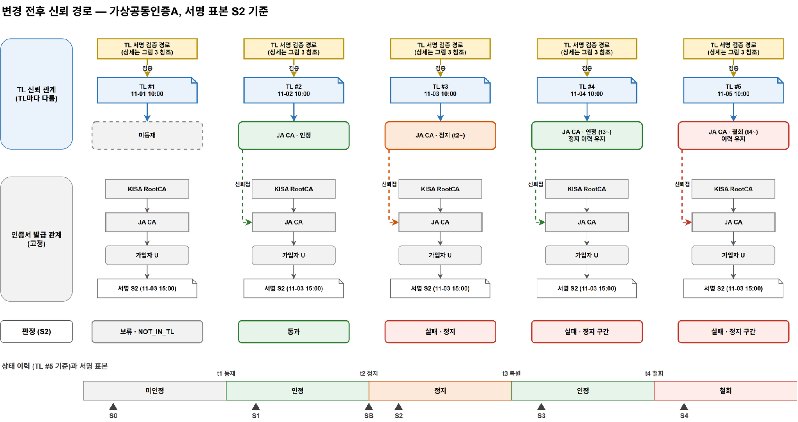
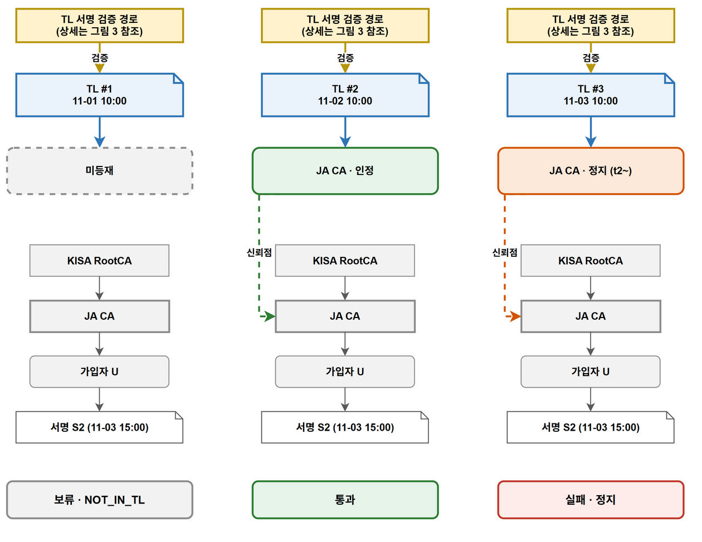
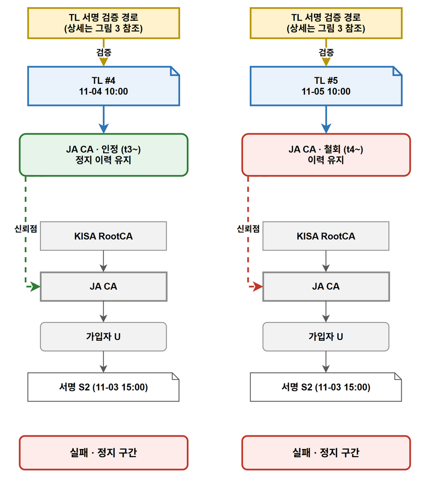

> 2026-10-07 Google Docs 본문 보관본. 이후 수정 전 원격 문서를 다시 읽는다.

## KR-TL 이용 시나리오

### 1 시험 조건

주 사례는 공동인증용 KISA RootCA → 사업자 CA(JA-01) → 가입자 U다. 다른 공동인증사업자(JB)의 가입자 W를 대조군으로 사용하고, 간편인증사업자(SA)의 가입자 V로 레벨 0을 비교한다. 문서·정책·검증 증거를 고정하고 TL의 등재 상태와 보유 버전을 바꾼다. 사업자명과 표본은 시험용 가정이다.

서명 검증(IF-08)은 사용자 서명을 이용자 서비스에서 검증하는 경우와 서비스 서명을 브라우저에서 검증하는 경우를 포함한다.

시험은 미등재 → 최초 인정 → 정지 → 복원 → 철회 순서로 진행한다. 각 단계는 하루 간격이며, 상태 변경 시각에 새 TL을 발행하는 조건이다. 표의 시점 표기(t0~t4)는 이 순서를 뜻하며 서명 시각은 각 표본에 기록한 값을 사용한다.

| TL | JA 상태 | 이력 | 비교 목적 |
| --- | --- | --- | --- |
| #1, t0 | 미등재 | JA 없음 | 인증서 체인이 있어도 TL 신뢰점 없음 |
| #2, t1 | 인정 | 인정 시작 | 등재 전후 비교 |
| #3, t2 | 정지 | 인정 → 정지 | 정지 전후·동기화 비교 |
| #4, t3 | 인정 복원 | 인정 → 정지 → 인정 | 과거 정지 구간 보존 |
| #5, t4 | 철회 | 앞선 이력 → 철회 | 철회 전후 구간 비교 |

### 2 버전별 판정

별지 그림 1 TL 변경 전후의 신뢰 경로

별지 그림 2 미등재·인정·정지 시 판정

별지 그림 3 복원·철회 후의 상태 이력

정지 구간에 생성한 서명(S2)은 정지 이력을 반영한 발행본(TL #3)부터 실패한다. 이후 복원·철회되어도 과거 정지 구간의 판정은 유지된다.

별지 그림 1의 위쪽은 TL의 등재·상태 관계, 아래쪽은 인증서 발급 관계다.

| 표본과 서명 시각 | TL #1 | TL #2 | TL #3 | TL #4 | TL #5 |
| --- | --- | --- | --- | --- | --- |
| S0 최초 인정 전 | 보류 A | 보류 B | 보류 B | 보류 B | 보류 B |
| S1 첫 인정 구간 | 보류 A | 통과 | 통과 | 통과 | 통과 |
| SB 정지 효력과 같음 | 보류 A | 통과 | 실패 C | 실패 C | 실패 C |
| S2 정지 구간 | 보류 A | 통과 | 실패 C | 실패 C | 실패 C |
| S3 복원 구간 | 보류 A | 통과 | 실패 C | 통과 | 통과 |
| S4 철회 이후 | 보류 A | 통과 | 실패 C | 통과 | 실패 D |

표의 A는 미등재(NOT_IN_TL), B는 최초 인정 이전(NOT_ACCREDITED_AT_TIME), C는 서명 시각의 서비스 정지(SERVICE_SUSPENDED_AT_TIME), D는 서명 시각의 서비스 철회(SERVICE_WITHDRAWN_AT_TIME)를 뜻한다. 표는 TL 요인만 비교하며 서명값·인증서 체인·폐지 상태는 정상, 모든 사용 TL은 NextUpdate 이내라고 가정한다.

과거 TL은 이후의 상태 변경을 알 수 없으므로 같은 서명에도 다른 판정을 내릴 수 있다.

### 3 상태별 판정

신규 등재 후 최초 인정 구간의 서명(S1)은 통과하고, 최초 인정 이전의 서명(S0)은 판단을 보류한다.

정지 시에는 인정 구간의 서명(S1)과 정지 효력 시각·정지 구간의 서명(SB·S2)을 비교한다. 복원 후에도 정지 구간의 서명(S2)은 실패하고 복원 구간의 서명(S3)은 통과한다. 철회 이후의 서명(S4)은 실패하며 과거 인정 구간의 서명(S1·S3)은 당시 상태로 판단한다.

### 4 동기화 및 대조

| 상황 | 이용기관 | 브라우저의 TL 요인 판정 |
| --- | --- | --- |
| 한쪽만 TL #3 수신 | #3으로 S2 실패 | #2로 S2 통과 |
| 양쪽 모두 TL #3 수신 | #3으로 S2 실패 | #3으로 S2 실패 |
| JA 정지 중 JB 표본 W 검증 | JB 인정 상태로 통과 | 같은 조건이면 동일 |
| SA 표본 V 검증 | 신뢰점 SA-00 Root로 통과 | 레벨 0 경로 표시 |

### 5 예외 상황

| 조건 | 채택 동작 | 판정에 미치는 영향 |
| --- | --- | --- |
| 내용을 바꾼 위조 TL #6 | 서명 실패로 거부, 유효한 #5 유지 | S4의 철회 실패 유지 |
| 이전 TL #2 재제공 | 구버전 거부, 유효한 #5 유지 | 과거 인정 상태로 되돌아가지 않음 |
| #5 기한 경과, 새 TL 없음 | #5를 검증 기준에서 제외 | NO_VALID_TL로 보류 |
| JA 등재, 서명 시각 없음 | 시간 구간 선택 불가 | NO_SIGNING_TIME으로 보류 |

이 표들은 설계상 기대 결과다. TL 요인 판정은 전체 서명 검증과 구분한다.
