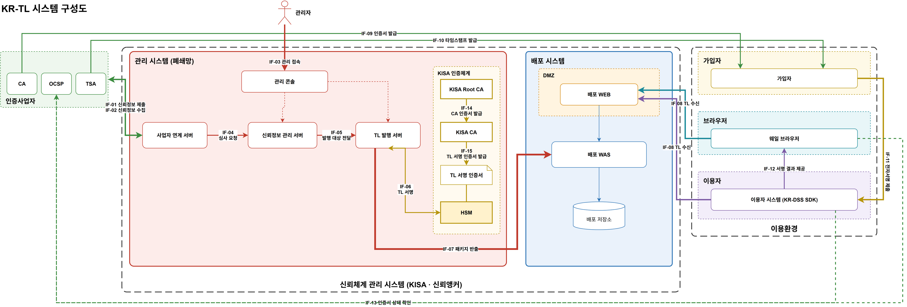

# 01. 시스템 구성도 — 구조 · 인터페이스 · 데이터

> 이 문서는 아래 **구성도 1장**을 설명한다. 구성요소(무엇이 있는가), 인터페이스(무엇이 오가는가), 데이터(무엇을 누가 갖는가) 순서로 읽는다.
> 구성도에는 구성요소 이름과 인터페이스 번호·이름만 적는다. 설명은 이 문서가 맡는다. 데이터 저장소(DB)는 각 서버의 내부 요소로 보고 구성도에 그리지 않는다.
> 편집본: [`diagrams/krtl-system.drawio`](diagrams/krtl-system.drawio)



## 1. 개념

KR-TL은 "**어떤 인증사업자의 어떤 서비스를 언제부터 언제까지 신뢰하는가**"를 KISA가 서명해 공표한 목록이다.

구성도는 세 영역으로 나뉜다.

```
 인증사업자            신뢰체계 관리 시스템 (KISA · 신뢰앵커)            이용환경
 CA · OCSP · TSA  ─▶  관리 시스템 (폐쇄망) ─▶ 배포 시스템        ─▶  가입자 · 브라우저 · 이용자
```

- **인증사업자**와 **이용환경** 사이에 **신뢰체계 관리 시스템(KISA)** 이 있다. 이용환경은 인증사업자를 직접 믿지 않고, KISA가 서명한 TL을 통해 믿는다.
- KISA는 **신뢰앵커**다. 이용환경이 미리 갖고 있는 것은 KISA Root CA 인증서 하나뿐이고, 나머지 신뢰는 모두 TL을 거쳐 전달된다.
이 체계에는 네 주체가 있다.

| 주체 | 정의 | 하는 일 | TL과의 관계 |
|---|---|---|---|
| **관리자 (KISA)** | TL 운영 기관 | 인증사업자 신뢰정보를 심사하고 TL을 발행한다 | TL을 **만든다** |
| **인증사업자** | 전자서명 인정사업자 | 가입자에게 인증서를 발급하고, 자신의 서비스 정보를 KISA에 제출한다 | TL에 **실린다** |
| **가입자** | 인증사업자에게서 인증서를 받은 사람 또는 법인 | **서명의 주체.** 인증서로 문서에 전자서명한다 | TL에 실린 사업자를 통해 **신뢰받는다** |
| **이용자** | 전자서명을 이용해 서비스하는 기관 | 가입자가 제출한 전자서명을 **검증**하고 서비스한다 | TL을 **사용한다** |
| **브라우저 (웨일)** | 서비스를 이용하는 사람의 브라우저 | 이용자가 제공한 **서명된 결과를 검증**해 보여 준다 (사용자 입장의 확인) | TL을 **사용한다** |

> 검증은 두 곳에서 일어난다. **이용자**는 서비스 처리를 위해 검증하고, **브라우저**는 서명된 결과를 받아 보는 사람의 입장에서 다시 확인한다.

PoC가 증명할 핵심 명제:

> **관리자가 TL을 바꾸면, 그 변화가 배포를 거쳐 이용자·브라우저의 검증 결과에 정확하게(시점까지 맞게) 반영된다. 그리고 그 과정은 위조·누락 없이 추적된다.**

## 2. 구성요소

구성도에는 구성요소 **이름만** 적고, 역할은 아래 표에서 설명한다.

### 관리 시스템 (폐쇄망)

| 구성요소 | 역할 |
|---|---|
| **관리 콘솔** | 관리자 화면. 역할별 권한(운영자·심사자·승인자·감사자) |
| **사업자 연계 서버** | 인증사업자 제출 접수(IF-01), 사업자 정보 자동 수집(IF-02). 기존 VPN으로 연결 |
| **신뢰정보 관리 서버** | 사업자·서비스·서비스 인증서·**상태 이력**의 원천 관리, 제출 건 심사 |
| **TL 발행 서버** | 승인된 신뢰정보로 TL 편성 → 승인 → 서명 → 배포 패키지 생성 |
| **KISA Root CA** | KISA 최상위 인증기관. 이용자·브라우저가 TL을 신뢰하는 **최종 기준(신뢰 앵커)**. 평상시 오프라인 |
| **KISA CA** | KISA Root CA가 발급한 하위 인증기관. TL 서명 인증서 발급 |
| **TL 서명 인증서** | TL 서명키에 대응하는 인증서. KISA CA가 발급, TL에 함께 실려 이용자가 서명을 검증하는 데 쓴다 |
| **HSM** | TL 서명키 생성·보관·서명. 키는 밖으로 나가지 않음 |

### 배포 시스템

| 구성요소 | 역할 |
|---|---|
| **배포 WEB** | DMZ에 두는 유일한 구성요소. TLS·프록시만, 데이터 없음 |
| **배포 WAS** | TL 배포, 버전 확인(변경 여부 응답), 반출된 패키지 검증·게시, 접속 기록 저장과 **수신 현황 조회** |
| **배포 저장소** | 서명된 TL 사본, 버전별 보관 |

### 인증사업자 · 가입자 · 이용자 · 브라우저

| 구성요소 | 역할 |
|---|---|
| **CA** | 가입자 인증서 발급 (IF-09) |
| **OCSP** | 인증서 폐지 상태 응답 (IF-13) |
| **TSA** | 서명 시각을 증명하는 타임스탬프 발급 (IF-10) |
| **가입자** | 인증서로 문서에 전자서명 (KR-AdES) |
| **이용자 시스템 (KR-DSS SDK)** | TL 수신·TL 서명 검증·캐시, 가입자 전자서명 검증, 서명된 결과 제공 |
| **웨일 브라우저** | TL 수신, 서명된 결과 검증·표시 |

## 3. 인터페이스

| IF | 이름 | 출발 → 도착 | 언제 | 오가는 데이터 | 이 IF에서 확인할 것 |
|---|---|---|---|---|---|
| **IF-01** | 신뢰정보 제출 | 인증사업자 → 사업자 연계 서버 | 등록·변경·상태 신고 시 | 제출서(사업자·서비스·인증서·상태 변경), 사업자 전자서명 | 제출자 인증, 제출서 서명·형식 |
| **IF-02** | 신뢰정보 수집 | 사업자 연계 서버 → 인증사업자 | 주기적 | 사업자가 공개하는 서비스 인증서·상태 | 관리 DB 기준값과의 차이 |
| **IF-03** | 관리 접속 | 관리자 → 관리 콘솔 | 운영 시 | 심사 결정, 상태 변경, 발행 승인, 조회 | 역할 권한, 생성자 ≠ 승인자 |
| **IF-04** | 심사 요청 | 사업자 연계 서버 → 신뢰정보 관리 서버 | 제출·수집 직후 | 제출 건, 변경 후보 | 자동 반영 금지 — 심사 대기로만 |
| **IF-05** | 발행 대상 전달 | 신뢰정보 관리 서버 → TL 발행 서버 | 발행 시 | 승인된 신뢰정보 스냅숏 | 스냅숏 시점 고정 |
| **IF-06** | TL 서명 | TL 발행 서버 ↔ HSM | 서명 시 | 서명 대상 → 서명값 | 승인 이력이 있는 요청만 |
| **IF-07** | 패키지 반출 | TL 발행 서버 → 배포 WAS | 발행 직후 (push) | 배포 패키지 (서명된 TL, 매니페스트) | 배포측 서명 검증, 버전 단조 증가 |
| **IF-08** | TL 수신 | 이용자 시스템·웨일 브라우저 → 배포 WEB | 주기적·수시 | 버전 확인 요청 / 서명된 TL | 변경 시에만 다운로드, 요청자 기록 |
| **IF-09** | 인증서 발급 | CA → 가입자 | 기존 체계 | 가입자 인증서 | (PoC는 시뮬레이터 사용) |
| **IF-10** | 타임스탬프 발급 | TSA → 가입자 | 서명 시 | 타임스탬프 | 서명 시각 증명 — 시점별 판단의 근거 |
| **IF-11** | 전자서명 제출 | 가입자 → 이용자 시스템 | 서비스 이용 시 | 전자서명 문서 (KR-AdES) | — |
| **IF-12** | 서명 결과 제공 | 이용자 시스템 → 웨일 브라우저 | 결과 조회 시 | 서명된 결과 (문서·증명서 등) | — |
| **IF-13** | 인증서 상태 확인 | 이용자 시스템·웨일 브라우저 → OCSP | 검증 시 | 인증서 폐지 상태 (OCSP·CRL) | 기존 체계 그대로 사용 |
| **IF-14** | CA 인증서 발급 | KISA Root CA → KISA CA | 체계 구축·CA 갱신 시 | KISA CA 인증서 | Root CA 오프라인 운영 |
| **IF-15** | TL 서명 인증서 발급 | KISA CA → TL 서명 인증서 (HSM 키) | 구축·서명키 교체 시 | HSM에서 만든 서명키의 인증서 요청 → TL 서명 인증서 | 키는 HSM 안에서 생성, 인증서만 발급 |

채널 원칙 (상세는 [부록 A](부록/A-아키텍처-결정기록.md))
- 관리 ↔ 배포는 **IF-07 한 채널**뿐이고 연결은 **관리 쪽에서만** 시작한다 (방화벽 통제).
- 인증사업자는 기존 **VPN**으로 관리 시스템에 연결한다 (IF-01·02).
- 관리자 접근(IF-03)과 외부 배포(IF-08)는 다른 채널이다.
- DMZ에는 배포 WEB만 둔다.

### TL 신뢰 체인

```
KISA Root CA ──IF-14──▶ KISA CA ──IF-15──▶ TL 서명 인증서 ── (키: HSM) ──IF-06──▶ TL 서명
```

이용자·브라우저는 **KISA Root CA 인증서 하나만** 미리 갖고 있으면 된다. TL에 실린 인증서 체인(TL 서명 인증서 → KISA CA)을 Root CA까지 따라가 TL 서명을 검증한다. 그래서 TL 서명키를 바꿔도(SC-09) 이용자 쪽 신뢰 기준은 바꾸지 않는다.

## 4. 데이터

### 4.1 데이터 목록

| 데이터 | 주요 항목 | 원천 | 흐르는 곳 |
|---|---|---|---|
| **D-01 사업자** | 사업자 식별자, 명칭, 연락처, 인정 상태 | 신뢰정보 관리 서버 | TL |
| **D-02 서비스** | 서비스 유형(CA·OCSP·TSA), 서비스명, **현재 상태와 상태 시작 시각** | 신뢰정보 관리 서버 | TL |
| **D-03 서비스 상태 이력** | (상태, 시작 시각, 사유, 근거 제출 건) 목록 | 신뢰정보 관리 서버 | TL (이력 포함) |
| **D-04 서비스 디지털 ID** | 서비스 인증서(복수 가능: 갱신 중 신·구 공존) | 신뢰정보 관리 서버 | TL |
| **D-05 제출 건** | 제출 유형, 내용, 제출 서명, 심사 상태·의견 | 신뢰정보 관리 서버 | 관리 시스템 안 |
| **D-06 TL** | 일련번호, 발행 시각, **다음 발행 예정(NextUpdate)**, D-01~04 스냅숏 | TL 발행 서버 | 배포 패키지 |
| **D-07 배포 패키지** | 서명된 TL(XML·JWS), 매니페스트(버전·해시), TL 서명 인증서 | TL 발행 | 배포 저장소 |
| **D-08 TL 서명키·인증서** | 서명키(HSM 안), TL 서명 인증서 → KISA CA 인증서 → KISA Root CA 인증서 (인증서 체인) | HSM · KISA CA · KISA Root CA | 인증서 체인은 TL에 실림. 이용자·브라우저는 **KISA Root CA 인증서만** 미리 보유 |
| **D-09 접속 기록** | 시각, 요청자(기관·클라이언트 유형·버전), 요청 버전, 결과(신규 수신/변경 없음) | 배포 WAS | 배포 시스템 안 (수신 현황 조회) |
| **D-10 감사 기록** | 누가·언제·무엇을·왜, 이전 기록 해시 | 관리 시스템 | 관리 시스템 안 |
| **D-11 검증 결과** | 판정(PASSED·FAILED·INDETERMINATE), 사유, **사용한 TL 버전** | 이용자 | 이용자 안 |

### 4.2 데이터가 TL 상태 판단에 쓰이는 방식

이용자와 브라우저는 서명을 검증할 때 TL에서 **"서명 시점에 그 서비스가 어떤 상태였는가"** 를 본다. 그래서 TL에는 현재 상태뿐 아니라 **상태 이력(D-03)** 이 실려야 한다.

```
서비스 X 상태 이력:  granted(2026-01-01) ── suspended(2026-11-10 09:00) ── granted(2026-11-12 18:00)

서명 시각 2026-11-09  → granted 구간 → 신뢰
서명 시각 2026-11-11  → suspended 구간 → 불신
타임스탬프 없음       → 서명 시각 증명 불가 → 검증 정책에 따름 (아래 개념 참고)
```

서명 시각은 **타임스탬프(TSA, IF-10)** 로 증명한다.

**개념 — 타임스탬프 없는 서명**: 서명 시각을 증명할 수 없으므로 "언제 기준으로 상태를 볼 것인가"가 정해지지 않는다. 검증 시점의 상태로 볼 수도, 판단을 보류할 수도 있다. 이 기준은 **검증 정책으로 향후 결정**하며, PoC에서는 두 경우의 결과 차이를 보여 주는 것으로 개념을 설명한다.

## 5. 한 번의 TL 변경이 흐르는 경로

```
인증사업자 신고(IF-01) ─▶ 심사(IF-04, IF-03) ─▶ 발행·서명(IF-05, IF-06)
   ─▶ 반출(IF-07) ─▶ 이용자·브라우저 TL 수신(IF-08) ─▶ 검증 결과 변화(D-11)
   ─▶ 배포 WAS가 접속 기록(D-09) 저장 ─▶ "누가 아직 안 받았는지" 확인
```

이 경로 하나하나가 [03 시나리오](03-이용-시나리오.md)에서 검증 대상이 된다.
