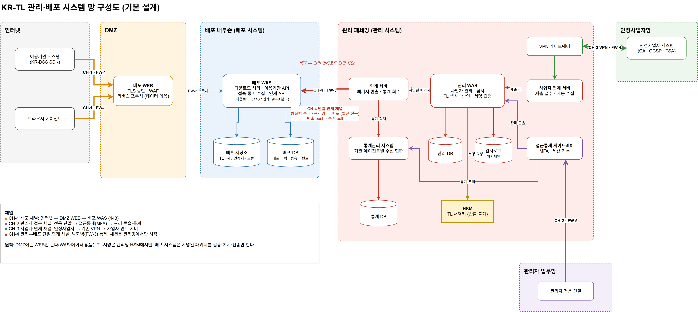
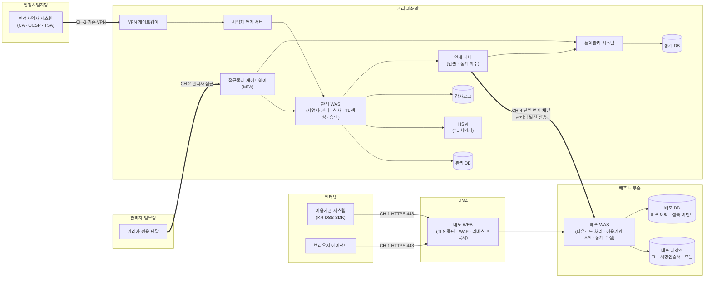
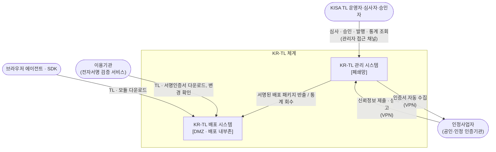
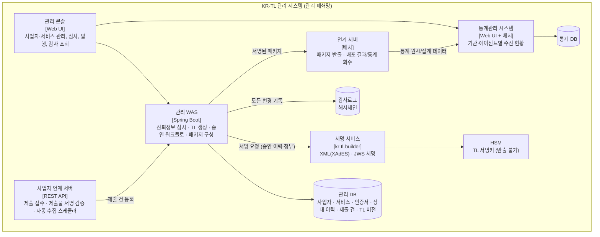
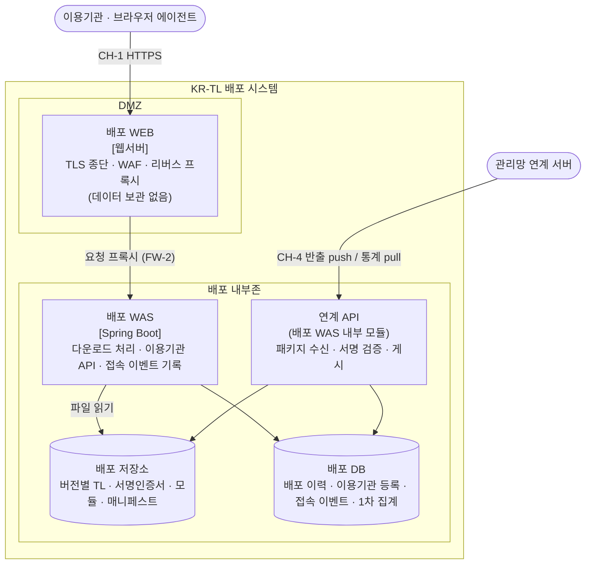
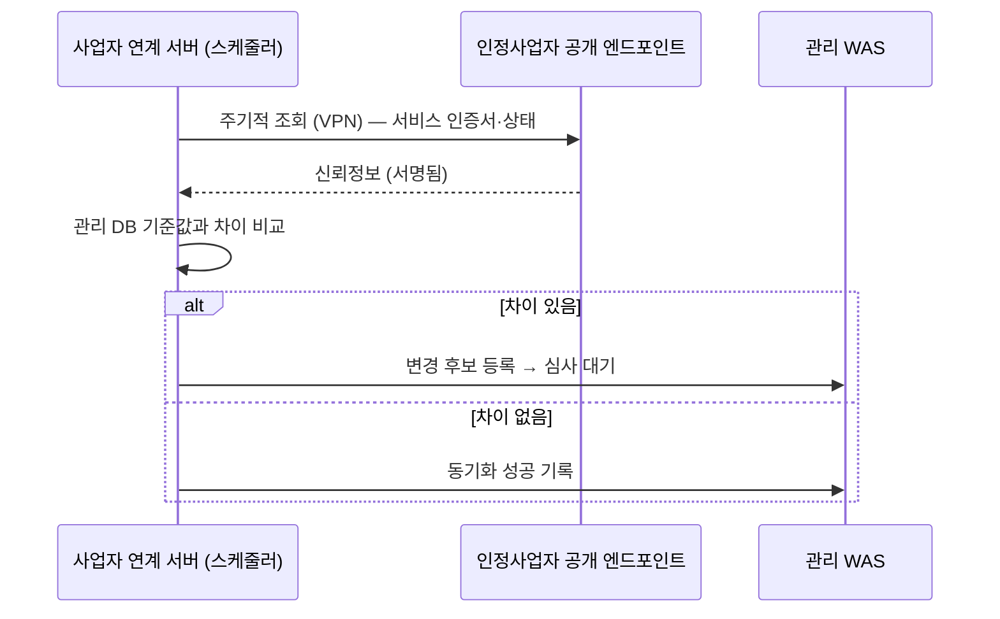

# 02. 시스템 구성도 (기본 설계)

> 근거 결정: [01 설계 브리프](01-아키텍처-설계브리프.md) AD-1 ~ AD-8 · 상세 구성(서버·방화벽·컴포넌트): [04](04-시스템구성-상세.md)
> 표기: 구성도는 Mermaid. 망 구성도 편집본은 [`diagrams/krtl-network.drawio`](diagrams/krtl-network.drawio)



## 1. 전체 망 구성 (구역·채널)

**이 그림이 답하는 질문**: 어떤 망 구역에 무엇이 있고, 구역 사이를 지나는 채널은 몇 개이며 어느 방향인가.



### 1.1 채널 정의

| 채널 | 구간 | 방향(세션 시작) | 용도 | 보호 수단 |
|---|---|---|---|---|
| **CH-1 배포 채널** | 인터넷 → DMZ WEB → 배포 WAS | 외부 → 배포 | TL·서명인증서·모듈 다운로드, 이용기관 API | HTTPS, (선택) API 키·클라이언트 인증서, WAF·속도 제한 |
| **CH-2 관리자 접근 채널** | 관리자 업무망 → 접근통제 게이트웨이 → 관리 콘솔·통계 화면 | 관리자 → 관리망 | TL 운영, 심사·승인, 통계 조회 | 전용 단말, MFA, 접근통제·세션 기록, 역할 기반 권한 |
| **CH-3 사업자 연계 채널** | 인정사업자망 → 기존 VPN → 사업자 연계 서버 | 양방향 (제출: 사업자 시작 / 자동 수집: 관리망 시작) | 신뢰정보 제출, 상태 변경 신고, 인증서 자동 수집 | 기존 VPN, mTLS(사업자 연계 인증서), 제출물 전자서명 |
| **CH-4 관리↔배포 연계 채널** | 관리망 연계 서버 → 배포 WAS 연계 API | **관리망 → 배포만** | 배포 패키지 반출(push), 배포 결과·통계 회수(pull) | **방화벽 통제**(단일 포트), mTLS, 패키지 서명. 배포→관리 인바운드 규칙 없음 |

방화벽 원칙
- 인터넷 → DMZ: 443만 허용
- DMZ → 배포 내부존: WEB → 배포 WAS 서비스 포트만 허용
- 관리 폐쇄망 → 배포 내부존: 연계 서버 → 배포 WAS 연계 포트 1개만 허용 (CH-4)
- 배포 내부존·DMZ → 관리 폐쇄망: **전면 차단**
- 인정사업자 VPN → 관리 폐쇄망: VPN 게이트웨이 → 사업자 연계 서버만 허용

## 2. C4 Level 1 — 시스템 컨텍스트

**독자**: KISA 협의 담당, 보안 심사자 / **질문**: KR-TL 체계에 누가 참여하고 무엇을 주고받는가.



## 3. C4 Level 2 — 관리 시스템 컨테이너

**질문**: 폐쇄망 안에서 신뢰정보가 어떻게 TL로 만들어지고 반출되는가.



| 컨테이너 | 책임 | 비고 |
|---|---|---|
| 관리 콘솔 | 운영 화면. 역할(운영자·심사자·서명승인자·감사자)별 메뉴 | CH-2로만 접근 |
| 사업자 연계 서버 | 인증사업자 API 제공(제출·조회), 사업자 엔드포인트 자동 수집 | 관리 WAS와 분리해 VPN 구간 공격면을 좁힘 |
| 관리 WAS | 신뢰정보 심사, 서비스 상태 변경, TL 초안 생성, 이중 승인, 배포 패키지 구성 | 모듈러 모놀리스 |
| 서명 서비스 | TL을 XML+XAdES / JWS로 직렬화·서명, 매니페스트 서명 | 서명키는 HSM 안에만 존재 |
| 연계 서버 | CH-4 유일 사용자. 반출 큐, 재전송·멱등 처리, 통계 커서 관리 | 세션은 항상 여기서 시작 |
| 통계관리 시스템 | 배포 통계 장기 보관, 기관별 최신 TL 수신 여부, 에이전트 버전 분포 | 관리 콘솔과 같은 CH-2로 접근 |

## 4. C4 Level 2 — 배포 시스템 컨테이너

**질문**: 외부 요청이 어떻게 처리되고, 통계는 어디에 쌓이는가.



| 컨테이너 | 책임 |
|---|---|
| 배포 WEB | **DMZ의 유일한 구성요소.** TLS 종단, WAF·속도 제한, 배포 WAS로 리버스 프록시. 파일·DB를 두지 않음 |
| 배포 WAS | 요청자 식별(API 키·인증서·User-Agent), 버전 협상(`ETag`/`If-None-Match`), 저장소 파일 응답, 접속 이벤트 기록, 이용기관 API |
| 연계 API | CH-4 수신 전용. 매니페스트 서명 검증 → 저장소 게시 → 배포 이력 기록. 통계 회수 요청에 응답 |
| 배포 저장소 | 서명된 산출물의 사본. 버전별 보관, `latest` 포인터 |
| 배포 DB | 배포 이력, 이용기관 등록 정보, 접속 원시 이벤트(단기 보관), 1차 집계 |

### 4.1 배포 패키지 구성 (안)

```
krtl-package-<seq>/
  manifest.json          # 버전, 발행시각, NextUpdate, 파일 목록·해시
  manifest.jws           # 관리망 HSM 서명 (배포측은 검증만)
  kr-tl-<seq>.xml        # ETSI TS 119 612 + XAdES enveloped
  kr-tl-<seq>.jws        # JWS(평탄화 JSON) — SDK용
  tl-signer.cer          # TL 서명 인증서 (트러스트 앵커 공지용)
  modules/…              # (O-7 결정 시) SDK · 브라우저 에이전트
```

### 4.2 수집하는 접속 정보 (안)

| 항목 | 출처 | 용도 |
|---|---|---|
| 기관 식별자 | API 키 / 클라이언트 인증서 (등록 기관만) | 기관별 수신 현황 |
| 클라이언트 유형·버전 | User-Agent 또는 전용 헤더 (`X-KRTL-Client: sdk/1.2`) | SDK·에이전트 버전 분포 |
| 요청 자원·버전 | URL, `If-None-Match` | 최신 TL 수신 여부 |
| 결과 | 200 / 304 / 4xx | 실제 다운로드와 변경 확인 구분 |
| 시각·출발지 | 서버 시각, IP(마스킹·해시, O-5) | 추이 분석, 이상 접속 탐지 |

## 5. 주요 데이터 흐름

### F1. 신뢰정보 제출부터 TL 배포까지

```mermaid
sequenceDiagram
    autonumber
    participant TSP as 인정사업자
    participant PGW as 사업자 연계 서버
    participant MWAS as 관리 WAS
    participant OP as 심사자·승인자 (CH-2)
    participant HSM as HSM
    participant LINK as 연계 서버
    participant RCV as 배포 연계 API
    participant RP as 이용기관

    TSP->>PGW: 신뢰정보 제출 (VPN, mTLS, 제출물 서명)
    PGW->>PGW: 제출물 서명·형식 검증
    PGW->>MWAS: 제출 건 등록 (접수)
    OP->>MWAS: 심사 → 승인
    MWAS->>MWAS: TL 초안 생성 (sequence+1)
    OP->>MWAS: 발행 승인 (생성자와 다른 승인자)
    MWAS->>HSM: TL·매니페스트 서명
    MWAS->>LINK: 배포 패키지 등록
    LINK->>RCV: 패키지 push (CH-4)
    RCV->>RCV: 매니페스트 서명·해시 검증, 버전 단조 증가 확인
    RCV-->>LINK: 게시 결과
    RP->>RCV: (CH-1 경유) 최신 TL 요청 If-None-Match
    Note over RP: 새 버전 수신 → TL 서명 검증 후 적용
```

### F2. 인증서 자동 수집 (RFP: 자동 수집·주기적 동기화)



자동 수집 결과는 **바로 TL에 반영하지 않고** 심사 대기로 둔다. TL 반영은 항상 사람의 승인을 거친다.

### F3. 통계 수집·회수

```mermaid
sequenceDiagram
    participant C as 이용기관/에이전트
    participant DWAS as 배포 WAS
    participant DDB as 배포 DB
    participant LINK as 연계 서버 (관리망)
    participant STAT as 통계관리 시스템
    C->>DWAS: 다운로드 요청 (CH-1)
    DWAS->>DDB: 접속 이벤트 기록
    loop 주기적 (관리망 발신)
        LINK->>DWAS: 통계 회수 요청 (cursor=마지막 회수 위치)
        DWAS-->>LINK: 이벤트·집계 묶음 + 다음 cursor
        LINK->>STAT: 적재
    end
    Note over DDB: 회수 확인된 구간만 보존기간 경과 후 삭제
```

## 6. 다음 단계

- 04 시스템 구성 상세: 서버·방화벽·컴포넌트 ([04](04-시스템구성-상세.md))
- 05 API 연계 설계: CH-3(인증사업자 API), CH-4(연계 API), CH-1(이용기관 API) 각각 OpenAPI 계약
- 06 운영 절차: F1~F3를 정기·긴급 절차와 역할(RACI)로 확장
