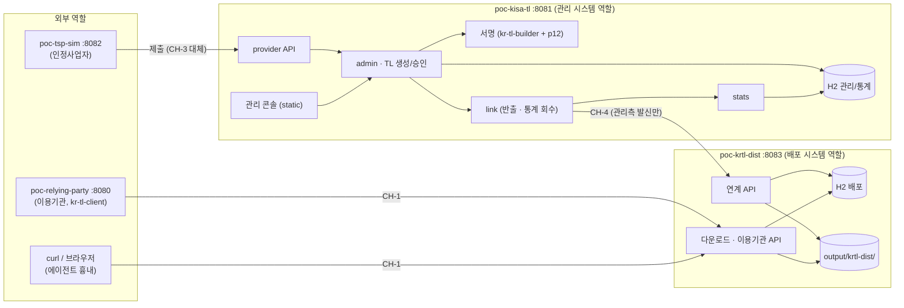

# 03. 데모 시스템 구성 (기본 설계 가정 축소판)

> 기본 설계([02](02-시스템구성도.md))의 구역·채널·책임은 그대로 두고, 인프라 요소만 PoC 수준으로 바꾼다.
> 원칙: **구성요소 경계와 채널 방향은 유지**하고, 장비(방화벽·VPN·HSM·망연계)만 소프트웨어로 대체한다.

## 1. 기본 설계 ↔ 데모 대체

| 기본 설계 요소 | 데모 대체 | 유지하는 성질 |
|---|---|---|
| 관리 폐쇄망 | 관리 서비스 프로세스 (`poc-kisa-tl`, :8081) | 서명·관리 DB·감사로그는 이 프로세스에만 존재 |
| 배포 DMZ + 배포 내부존 | 배포 서비스 프로세스 (신규 `poc-krtl-dist`, :8083). WEB·WAS를 한 Spring Boot로 합침 | 서명키 없음, 패키지 서명 검증 후 게시 |
| 관리 WAS · 사업자 연계 서버 · 통계관리 | `poc-kisa-tl` 안의 패키지로 분리 (`admin`, `provider`, `stats`) | 책임 경계 |
| 연계 서버 · CH-4 | `poc-kisa-tl`의 `link` 패키지가 `poc-krtl-dist` 연계 API 호출 (HTTP, 데모 mTLS 선택) | **관리측 발신 전용** — 배포측에는 관리측 주소 설정을 두지 않음 |
| HSM | PKCS#12 소프트 키스토어 (`krdss-cli cert`로 발급). 옵션: `poc-hsm`(:8092) 연동 | 서명 경로를 서명 서비스 인터페이스 하나로 고정해 교체 가능 |
| 관리 DB · 배포 DB · 통계 DB | 각 프로세스의 H2 (파일 모드) | DB 분리 |
| 배포 저장소 | 로컬 디렉터리 `output/krtl-dist/` | 버전별 보관, `latest` |
| CH-2 관리자 접근 (전용 단말·MFA) | 관리 콘솔 로그인 + 역할 선택 (운영자/심사자/승인자/감사자) | 생성자 ≠ 승인자 규칙 |
| CH-3 VPN | 생략. `poc-tsp-sim`(:8082) → `poc-kisa-tl` 사업자 API 직접 호출, 클라이언트 인증서로 사업자 식별 | 제출물 서명 검증 |
| 이용기관 | `poc-relying-party`(:8080)가 `kr-tl-client`로 `poc-krtl-dist`에서 TL 수신 | TL 서명 검증·캐시 |
| 브라우저 에이전트 | curl/브라우저 요청 + `X-KRTL-Client` 헤더로 흉내 | 통계 유형 구분 |

## 2. 데모 구성도

## 3. 데모 시나리오 (E2E 확인 항목)

| # | 시나리오 | 확인 | 대응 품질 시나리오 |
|---|---|---|---|
| S1 | tsp-sim이 서비스 인증서 제출 → 심사·승인 → TL 발행 → 배포 게시 | relying-party가 새 TL 수신, 서명 검증 성공 | F1 |
| S2 | 사업자 서비스 정지 처리 → 긴급 발행 | relying-party 검증 결과가 정지 상태 반영 | QS-5 |
| S3 | 배포 저장소의 TL 파일을 직접 변조 | relying-party가 서명 검증 실패로 거부 | QS-1 |
| S4 | `poc-kisa-tl` 중지 상태에서 다운로드 | 마지막 TL 정상 배포 | QS-4 |
| S5 | 여러 클라이언트 유형으로 다운로드 후 통계 회수 | 통계 화면에 기관·유형·버전별 수신 현황 | QS-7 |
| S6 | 생성자와 같은 계정으로 발행 승인 시도 | 거부, 감사로그 기록 | QS-2·6 |

## 4. 현 코드에서 바뀌는 점 (구현 단계 참고)

- `poc-kisa-tl`: 현재 하드코딩 대시보드(`KrTlAdminController`)를 관리 시스템 역할 패키지 구조로 재편. 기존 화면 탭(대시보드·사업자 상세·등록 대기·배포 파이프라인·감사 로그)은 관리 콘솔로 재사용
- `poc-krtl-dist`: 신규 모듈 (`settings.gradle.kts` 등록 필요 — 공용 파일이므로 작게 커밋)
- `kr-tl-client`: 인터페이스만 있음 → HTTP 구현체 추가
- `poc-tsp-sim`: 신뢰정보 제출 클라이언트 추가

구체 API는 04 API 연계 설계에서 정한다.
