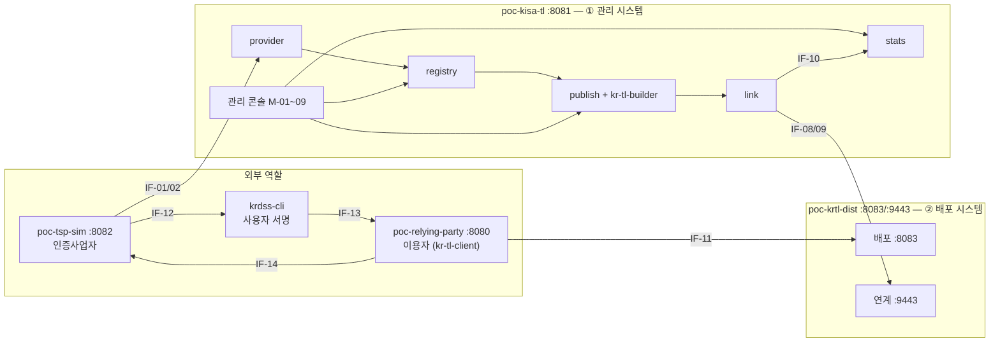

# 04. PoC 구성

> [01 시스템 구성도](01-시스템-구성도.md)의 구성요소·인터페이스를 **그대로 유지**하고, 인프라(방화벽·VPN·HSM·DMZ)만 소프트웨어로 대신한다.
> 목표는 [03 시나리오](03-이용-시나리오.md)의 ★ 항목을 실제로 돌려 보는 것이다.

## 1. 구성요소 ↔ PoC 모듈

| 구성도 요소 | PoC 모듈 | 대체한 것 |
|---|---|---|
| ① 관리 시스템 전체 | `poc-kisa-tl` (:8081) | 폐쇄망 → 단일 프로세스. 내부 구성요소는 패키지로 나눔 |
| 관리 콘솔 | `poc-kisa-tl` 정적 화면 | MFA·접근통제 → 역할 선택 로그인 |
| 사업자 연계 | `poc-kisa-tl` `provider` 패키지 | VPN → 생략, 클라이언트 인증서로 사업자 식별 |
| 신뢰정보 관리 · TL 발행 | `poc-kisa-tl` `registry`, `publish` 패키지 + `kr-tl-builder` | — |
| HSM | PKCS#12 소프트 키스토어 | 서명 경로는 인터페이스 하나로 감춰 교체 가능 |
| 관리 DB · 감사로그 · 통계 | H2 (파일 모드) | — |
| 연계 | `poc-kisa-tl` `link` 패키지 → `poc-krtl-dist` 호출 | 방화벽 → **배포 쪽 설정에 관리 시스템 주소를 두지 않는 것**으로 단방향 보장 |
| ② 배포 시스템 | `poc-krtl-dist` (:8083, 신규) | DMZ WEB 생략. 연계 API는 별도 포트(:9443)로 분리 |
| 배포 저장소 · 배포 DB | `output/krtl-dist/` + H2 | — |
| 인증사업자 | `poc-tsp-sim` (:8082) | CA·OCSP 이미 있음. 제출 기능 추가 |
| 사용자 | `krdss-cli` 또는 `poc-relying-party` 서명 화면 | 타임스탬프 포함/미포함 서명 생성 |
| 이용자 (이용기관) | `poc-relying-party` (:8080) + `kr-tl-client` | 검증 결과 화면에 **사용한 TL 버전** 표시 |
| 이용자 (브라우저 에이전트) | curl + `X-KRTL-Client` 헤더 | 접속 유형 구분용 |

## 2. PoC 구성도

## 3. 시나리오 실행 순서 (1차)

| 순서 | 시나리오 | 준비물 |
|---|---|---|
| 1 | SC-01 신규 등재 | tsp-sim 사업자 2개, 사용자 서명 1건 |
| 2 | SC-06 동기화·미수신 | 이용자 2개(동기화 주기 다르게) |
| 3 | SC-03 → SC-04 정지·해제 | 타임스탬프 있는 서명(정지 전/중/후), 없는 서명 |
| 4 | SC-05 철회 | 철회 전후 서명 |
| 5 | SC-08 변조 | 배포 저장소 파일 직접 수정, 예전 버전 재게시 |
| 6 | SC-11 내부 통제 | 계정 2개, H2 직접 수정 |

각 시나리오 결과는 "관리 화면 캡처 + 이용자 검증 결과(사용 TL 버전 포함) + 감사 기록"으로 남긴다.
