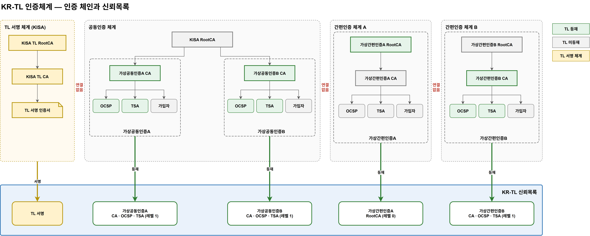

# 07. 인증체계 설계 (D4)

> PoC에서 쓰는 **임의 인증체계**다. 실제 인증기관을 기준으로 만들지 않으며, 사업자 이름은 모두 가상이다.
> 도식: [`diagrams/krtl-pki.drawio`](diagrams/krtl-pki.drawio)



## 0. 확정 사항 (2026-10-05)

| 항목 | 결정 |
|---|---|
| TL 서명 RootCA | 공동인증 KISA RootCA와 **분리** — `KISA TL RootCA`를 따로 둔다 |
| TL 등재 대상 | ~~RootCA와 서비스 인증서(CA·OCSP·TSA) 모두 등재~~ → **신뢰점 레벨로 결정** (0 = Root, 1 = CA), OCSP·TSA는 서비스로 등재. [10 TL 구조](10-TL-구조.md) §3.1 (2026-10-05 변경). 아래 §3·§7은 변경 전 기준이며 D3-8에서 사업자별 레벨을 정할 때 갱신한다 |
| 사업자 수 | **4곳** — 공동인증 2, 간편인증 2 |
| 인증서·키 보관 | 키스토어·트러스트 스토어를 쓰지 않고 **폴더 구조**로 관리. 파일 추가·삭제로 인증서를 넣고 뺀다 |

## 1. 개념

- 현행 전자서명 인증 체계는 **서로 연결되어 있지 않다.** 공동인증서는 KISA RootCA 아래에, 간편인증 사업자는 각자 자체 RootCA 아래에 CA를 둔다. 체인 사이에 상호 인증이 없다.
- KR-TL은 각 체계의 **RootCA와 서비스 인증서**를 한 목록에 묶고 KISA가 서명한다. 연결되지 않던 체인들이 TL을 통해 **하나의 신뢰체계**가 된다.
- TL 자체를 믿는 근거는 별도의 **TL 서명 체계(KISA TL RootCA)** 다. 이용환경이 미리 갖는 것은 KISA TL RootCA 인증서 하나뿐이다.

## 2. 사업자 목록

| ID | 사업자 (가상) | 구분 | 인증체계 | 구축하는 인증서 |
|---|---|---|---|---|
| **KISA-TL** | KISA | TL 서명 (신뢰앵커) | KISA TL RootCA | TL RootCA, TL CA, TL 서명 인증서 |
| **KISA-J** | KISA | 공동인증 최상위 | KISA RootCA | RootCA |
| **JA** | 가상공동인증A | 공동인증 사업자 | KISA RootCA 하위 | CA, OCSP, TSA |
| **JB** | 가상공동인증B | 공동인증 사업자 | KISA RootCA 하위 | CA, OCSP, TSA |
| **SA** | 가상간편인증A | 간편인증 사업자 | 자체 RootCA | RootCA, CA, OCSP, TSA |
| **SB** | 가상간편인증B | 간편인증 사업자 | 자체 RootCA | RootCA, CA, OCSP, TSA |

KISA는 두 체계를 운영한다: TL에 서명하는 **TL 서명 체계**와, 공동인증 사업자를 발급하는 **공동인증 RootCA**.

## 3. 인증 체인 구조 (Tree)

```
[TL 서명 체계 — KISA]                                    (TL 미등재 · 신뢰앵커)
KISA TL RootCA
└── KISA TL CA
    └── TL 서명 인증서 (키: HSM)                          → TL 서명

[공동인증 체계]                                           ── TL 서명 체계와 연결 없음
KISA RootCA                                     ★TL
├── 가상공동인증A CA                            ★TL
│   ├── 가상공동인증A OCSP                      ★TL
│   ├── 가상공동인증A TSA                       ★TL
│   └── 가입자 인증서 (개인 · 법인)              ← 인증서 발급 서비스
└── 가상공동인증B CA                            ★TL
    ├── 가상공동인증B OCSP                      ★TL
    ├── 가상공동인증B TSA                       ★TL
    └── 가입자 인증서 (개인 · 법인)

[간편인증 체계 A]                                         ── 다른 체계와 연결 없음
가상간편인증A RootCA                            ★TL
└── 가상간편인증A CA                            ★TL
    ├── 가상간편인증A OCSP                      ★TL
    ├── 가상간편인증A TSA                       ★TL
    └── 가입자 인증서 (개인 · 법인)

[간편인증 체계 B]                                         ── 다른 체계와 연결 없음
가상간편인증B RootCA                            ★TL
└── 가상간편인증B CA                            ★TL
    ├── 가상간편인증B OCSP                      ★TL
    ├── 가상간편인증B TSA                       ★TL
    └── 가입자 인증서 (개인 · 법인)

★TL = KR-TL 등재
```

- OCSP·TSA 인증서는 각 사업자 CA가 발급한다.
- TL 서명 체계는 TL에 싣지 않는다. TL을 검증하는 기준이기 때문이다. 대신 TL 서명 인증서 체인(TL 서명 인증서 → KISA TL CA)을 TL 서명에 함께 넣는다.

## 4. 인증서 목록

| ID | 인증서 | 발급자 | 유형 | TL 등재 | 만드는 방법 |
|---|---|---|---|---|---|
| T-00 | KISA TL RootCA | 자기 자신 | Root | — (신뢰앵커) | 구축 도구 |
| T-01 | KISA TL CA | T-00 | CA | — | 구축 도구 |
| T-02 | TL 서명 인증서 | T-01 | TL 서명 | — (TL 서명에 체인 수록) | 구축 도구 · 키는 HSM |
| K-00 | KISA RootCA | 자기 자신 | Root | ★ | 구축 도구 |
| JA-01 | 가상공동인증A CA | K-00 | CA | ★ | 구축 도구 |
| JA-02 | 가상공동인증A OCSP | JA-01 | OCSP | ★ | 구축 도구 |
| JA-03 | 가상공동인증A TSA | JA-01 | TSA | ★ | 구축 도구 |
| JB-01~03 | 가상공동인증B CA · OCSP · TSA | K-00 / JB-01 | CA · OCSP · TSA | ★ | 구축 도구 |
| SA-00 | 가상간편인증A RootCA | 자기 자신 | Root | ★ | 구축 도구 |
| SA-01~03 | 가상간편인증A CA · OCSP · TSA | SA-00 / SA-01 | CA · OCSP · TSA | ★ | 구축 도구 |
| SB-00 | 가상간편인증B RootCA | 자기 자신 | Root | ★ | 구축 도구 |
| SB-01~03 | 가상간편인증B CA · OCSP · TSA | SB-00 / SB-01 | CA · OCSP · TSA | ★ | 구축 도구 |
| xx-EE | 가입자 인증서 (개인 · 법인) | 각 사업자 CA | 가입자 | — | **인증서 발급 서비스** |

## 5. 인증서 프로파일 (PoC 기본안)

| 유형 | 주체 DN 형식 | BasicConstraints | KeyUsage | ExtendedKeyUsage | 기타 확장 |
|---|---|---|---|---|---|
| Root | `CN=<이름> RootCA, O=<사업자>, C=KR` | CA:true | keyCertSign, cRLSign | — | SKI |
| CA | `CN=<이름> CA, O=<사업자>, C=KR` | CA:true, pathLen 0 | keyCertSign, cRLSign | — | SKI, AKI |
| OCSP | `CN=<이름> OCSP, O=<사업자>, C=KR` | CA:false | digitalSignature | OCSPSigning | AKI |
| TSA | `CN=<이름> TSA, O=<사업자>, C=KR` | CA:false | digitalSignature | timeStamping (critical) | AKI |
| TL 서명 | `CN=KISA TL Signer, O=KISA, C=KR` | CA:false | digitalSignature | tslSigning (`0.4.0.2231.3.0`) | AKI |
| 가입자 — 개인 | `CN=<성명>, serialNumber=<가상 식별번호>, O=<사업자>, C=KR` | CA:false | digitalSignature, nonRepudiation | — | AKI, AIA(OCSP), 정책 OID(개인) |
| 가입자 — 법인 | `CN=<법인명>, O=<법인명>, OU=<가상 사업자번호>, C=KR` | CA:false | digitalSignature, nonRepudiation | — | AKI, AIA(OCSP), 정책 OID(법인) |

- 정책 OID는 PoC용 **가상 OID**를 쓴다 (실제 OID 체계와 겹치지 않게 별도 정의).
- 키 알고리즘·유효기간은 `krdss-cli cert` 기본값으로 생성하고, 운영 값은 향후 결정한다.

## 6. 연계 목록

| ID | 출발 → 도착 | 관계 | 내용 |
|---|---|---|---|
| L-01 | KISA TL RootCA → KISA TL CA → TL 서명 인증서 | 발급 | TL 서명 체계 |
| L-02 | KISA RootCA → 가상공동인증A CA, 가상공동인증B CA | 발급 | 공동인증 체계 |
| L-03 | 가상간편인증A RootCA → 가상간편인증A CA | 발급 | 간편인증 체계 A |
| L-04 | 가상간편인증B RootCA → 가상간편인증B CA | 발급 | 간편인증 체계 B |
| L-05 | 각 사업자 CA → 자기 OCSP · TSA 인증서 | 발급 | 서비스 인증서 |
| L-06 | 각 사업자 CA → 가입자 인증서 | 발급 | 인증서 발급 서비스 |
| L-07 | TL 서명 체계 ↔ 공동인증 ↔ 간편인증 A ↔ 간편인증 B | **연결 없음** | 체계 사이에 상호 인증 없음 |
| L-08 | 각 체계 RootCA · CA · OCSP · TSA → KR-TL | **등재** | IF-01 신뢰정보 제출 → 심사 → TL 발행 |
| L-09 | TL 서명 인증서 → KR-TL | **서명** | IF-05 TL 서명 |
| L-10 | 이용환경 → KR-TL | **검증 기준** | TL 서명을 KISA TL RootCA까지 검증 → TL 등재 인증서로 가입자 인증서 체인 검증 |

## 7. KR-TL 등재 목록

> **변경 (2026-10-05):** 신뢰점 레벨 적용 결과 등재 목록은 [14 메타데이터·실제 데이터](14-메타데이터-실제데이터.md) §4.3(TSP 4 · 서비스 10)으로 바뀌었다. 한 체인에는 신뢰점이 하나이므로 공동인증(레벨 1)일 때 KISA RootCA는 등재하지 않는다. 아래 표는 변경 전 기준이다. 도식은 변경 후 기준으로 갱신했다.

| 사업자 (TSP) | 서비스 | 인증서 | 서비스 유형 |
|---|---|---|---|
| KISA (공동인증 최상위) | 공동인증 최상위 인증 | K-00 | Root CA |
| 가상공동인증A | 인증서 발급 · 상태 확인 · 시점 확인 | JA-01 · JA-02 · JA-03 | CA · OCSP · TSA |
| 가상공동인증B | 인증서 발급 · 상태 확인 · 시점 확인 | JB-01 · JB-02 · JB-03 | CA · OCSP · TSA |
| 가상간편인증A | 최상위 인증 · 인증서 발급 · 상태 확인 · 시점 확인 | SA-00 · SA-01 · SA-02 · SA-03 | Root CA · CA · OCSP · TSA |
| 가상간편인증B | 최상위 인증 · 인증서 발급 · 상태 확인 · 시점 확인 | SB-00 · SB-01 · SB-02 · SB-03 | Root CA · CA · OCSP · TSA |

TL 서명: T-02 TL 서명 인증서 (체인 T-02 → T-01 수록, 검증 기준 T-00)
합계(변경 전): TSP 5 · 인증서 15장 → **변경 후: TSP 4 · 서비스 10** ([14](14-메타데이터-실제데이터.md) §4.3)

- KISA RootCA는 JA·JB가 공유하므로 사업자마다 중복 등재하지 않고 **KISA 항목 하나로** 싣는다.

## 8. 폴더 구조

키스토어·트러스트 스토어 대신 **폴더와 파일**로 인증서를 관리한다. 인증서를 넣고 빼는 일은 파일을 추가·삭제하는 것으로 끝난다.

### 8.1 공통 규칙

| 항목 | 규칙 |
|---|---|
| 인증서 | `cert.pem` (PEM, 1장) |
| 개인키 | `key.pem` (PEM). **TL·배포·제출 대상에서 항상 제외** |
| 메타데이터 | `meta.json` — ID, 이름, 유형, 발급자 ID, 상태, TL 등재 여부 |
| 폴더 이름 | 인증서 ID 기준 (`JA-01-ca`, `JA-02-ocsp` …) |
| 추가 | 폴더를 만들고 `cert.pem`·`meta.json`을 넣는다 |
| 삭제 | 폴더를 지우거나 `meta.json`의 상태를 바꾼다 (이력 보존이 필요하면 상태 변경) |

### 8.2 인증기관 PoC 쪽 (사업자가 갖는 것)

```
pki/
├── tl-signer/                     # TL 서명 체계 (KISA)
│   ├── T-00-root/   cert.pem key.pem meta.json
│   ├── T-01-ca/     cert.pem key.pem meta.json
│   └── T-02-signer/ cert.pem key.pem meta.json   # key.pem = 모의 HSM (PoC)
└── providers/
    ├── KISA-J/
    │   └── K-00-root/     cert.pem key.pem meta.json
    ├── JA/
    │   ├── provider.json                           # 사업자 정보
    │   ├── JA-01-ca/      cert.pem key.pem meta.json
    │   ├── JA-02-ocsp/    cert.pem key.pem meta.json
    │   ├── JA-03-tsa/     cert.pem key.pem meta.json
    │   └── subscribers/                            # 가입자 인증서 (발급 서비스가 기록)
    │       └── <serial>/  cert.pem key.pem meta.json
    ├── JB/ …
    ├── SA/
    │   ├── SA-00-root/ …
    │   ├── SA-01-ca/ … SA-02-ocsp/ … SA-03-tsa/ …
    │   └── subscribers/
    └── SB/ …
```

### 8.3 관리 시스템 쪽 (KISA가 TL로 만드는 것)

```
krtl/
├── registry/                      # 심사 승인된 등재 인증서 (TL 편성 원천)
│   ├── KISA-J/  provider.json  K-00-root/ cert.pem service.json
│   ├── JA/      provider.json  JA-01-ca/ cert.pem service.json  JA-02-ocsp/ …  JA-03-tsa/ …
│   ├── JB/ …
│   ├── SA/      provider.json  SA-00-root/ …  SA-01-ca/ …  SA-02-ocsp/ …  SA-03-tsa/ …
│   └── SB/ …
├── signer/                        # TL 서명 인증서 체인 (키는 HSM, PoC는 pki/tl-signer 참조)
│   └── chain/ T-02.pem T-01.pem
└── published/                     # 발행된 TL
    └── <seq>/ kr-tl.xml
```

- `service.json`에는 서비스 유형과 **상태 이력**(상태, 효력 시각, 사유)을 둔다 (D3 데이터 설계와 연결).
- TL 편성은 `registry/` 폴더를 읽어 만든다. 등재 인증서를 빼면 다음 TL에서 빠지고, 상태를 바꾸면 이력에 남는다.
- `registry/`에는 개인키가 없다.

### 8.4 이용환경 쪽

```
krtl-client/
├── trust-anchor/   T-00-root.pem      # KISA TL RootCA — 유일한 사전 신뢰 기준
└── cache/          kr-tl.xml  meta.json
```

- 트러스트 스토어를 쓰지 않는다. 이용자 SDK와 웨일 브라우저는 `trust-anchor/` 폴더의 인증서로 TL 서명을 검증하고, 가입자 인증서는 **TL에 등재된 인증서**로 검증한다.

## 9. 키 관리

| 키 | 보관 (PoC) | 운영 기준 |
|---|---|---|
| KISA TL RootCA | `pki/tl-signer/T-00-root/key.pem` | 오프라인 보관 |
| TL 서명키 | `pki/tl-signer/T-02-signer/key.pem` (모의 HSM) | HSM 안에서 생성·사용, 반출 불가 |
| 사업자 RootCA · CA · OCSP · TSA | `pki/providers/<ID>/…/key.pem` | 각 사업자 책임 |
| 가입자 키 | `subscribers/<serial>/key.pem` (서버 생성 시) | 가입자에게 전달 후 삭제 또는 CSR 방식으로 서버에 두지 않음 |

- 서명 처리는 "키 파일을 읽는 방식"과 "HSM 호출 방식"을 같은 인터페이스로 감싼다. PoC는 키 파일, 운영은 HSM.

### TL 서명키 교체 (SC-09)

1. HSM(PoC: 폴더)에서 새 서명키 생성
2. KISA TL CA가 새 TL 서명 인증서 발급 → `pki/tl-signer/`에 새 폴더 추가
3. 새 키로 다음 TL 서명, 새 체인 수록
4. 구 TL 서명 인증서 폴더를 폐기 상태로 변경
5. 이용환경 `trust-anchor/`는 그대로 (KISA TL RootCA가 같으므로)

## 10. 신뢰앵커 배포

| 대상 | 방법 (PoC) |
|---|---|
| 이용자 시스템 (SDK) | 설치 시 `trust-anchor/` 폴더에 KISA TL RootCA 인증서 배치 |
| 웨일 브라우저 | 브라우저 검증 모듈에 KISA TL RootCA 인증서 포함 |
| 확인 수단 | KISA TL RootCA 인증서 지문(SHA-256)을 공지해 설치된 파일과 대조 |

TL 배포 경로(IF-07)로는 신뢰앵커를 바꾸지 않는다. 배포 시스템이 침해되어도 신뢰 기준이 바뀌지 않게 하기 위해서다.

## 11. 인증기관 PoC — 인증서 발급 서비스

| 기능 | 내용 |
|---|---|
| CA-F01 인증체계 구축 | §8.2 폴더에 사업자별 RootCA·CA·OCSP·TSA를 §12 순서로 생성 |
| CA-F02 사업자·인증서 조회 | 관리 화면에서 사업자를 고르면 폴더 기준 체인 Tree 표시 |
| CA-F03 가입자 인증서 발급 | **개인 / 법인** 선택 → 정보 입력 → 키 생성 방식(서버 생성 / CSR 업로드) → 발급 → `subscribers/`에 기록, 내려받기 |
| CA-F04 상태 관리 | 가입자 인증서 폐지·정지 → OCSP 응답에 반영 |
| CA-F05 OCSP | 사업자별 OCSP 응답 (TSA는 PoC에서 쓰지 않음) |
| CA-F06 TL 제출 | 사업자 폴더의 등재 대상(`meta.json` 기준)을 묶어 KISA에 제출 (IF-01) |

### 관리 화면 (인증기관 PoC)

| 화면 | 내용 |
|---|---|
| A-01 사업자 목록 | 4개 사업자 + KISA, 체계 구분(공동·간편), 인증서 수 |
| A-02 인증 체인 | 사업자 체인을 Tree로 표시, 인증서 상세(주체·발급자·유효기간·지문), TL 등재 여부 |
| A-03 가입자 인증서 발급 | 개인 / 법인 입력 양식, 발급 결과·내려받기 |
| A-04 발급 목록 | 가입자 인증서 목록, 폐지·정지 |
| A-05 TL 제출 | 등재 대상 확인 → 제출 → 처리 상태 |

- PoC 모듈: `poc-tsp-sim` 확장 (이미 CA·RA·OCSP·CSR 기반 발급이 있음). TSA는 새로 만든다.

## 12. 구축 순서

| 순서 | 대상 | 폴더 |
|---|---|---|
| 1 | TL 서명 체계 (T-00 ~ T-02) | `pki/tl-signer/` |
| 2 | KISA RootCA (K-00) | `pki/providers/KISA-J/` |
| 3 | 가상공동인증A (JA-01 ~ 03) | `pki/providers/JA/` |
| 4 | 가상공동인증B (JB-01 ~ 03) | `pki/providers/JB/` |
| 5 | 가상간편인증A (SA-00 ~ 03) | `pki/providers/SA/` |
| 6 | 가상간편인증B (SB-00 ~ 03) | `pki/providers/SB/` |
| 7 | 등재 제출 → 심사 → `krtl/registry/` 반영 | IF-01 |
| 8 | 첫 TL 발행 | `krtl/published/1/` |
| 9 | 가입자 인증서 발급 (사업자별 개인·법인 1건 이상) | `subscribers/` |

## 13. 다음 작업 (D4 남은 것)

| 작업 | 내용 |
|---|---|
| D4-a | `meta.json` · `provider.json` · `service.json` 항목 정의 (D3 데이터 설계와 함께) |
| D4-b | 가상 정책 OID 체계 정의 |
| D4-c | 구축 도구 정리 — `krdss-cli cert`로 §12 순서를 한 번에 만드는 템플릿 |
| D4-d | 인증기관 PoC 화면(A-01~05) 상세 |
