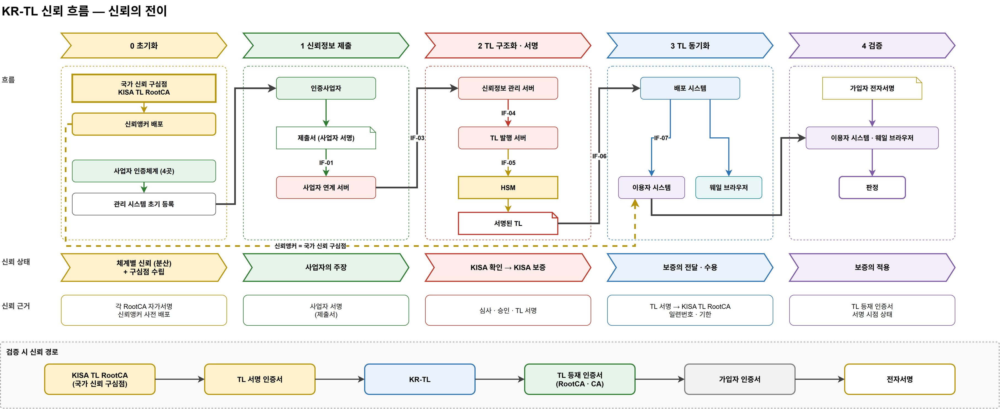

# 08. 신뢰 흐름 설계 — 신뢰의 전이

> 지금까지 [01 구성도](01-시스템-구성도.md)로 **구성요소**를, [07 인증체계](07-인증체계-설계.md)로 **신뢰 체인**을 정했다.
> 이 문서는 그 위에서 **신뢰가 어디에서 어디로, 어떻게 옮겨 가는지**를 프로세스 순서대로 개념화한다. 구체적인 메시지 순서(시퀀스)는 다루지 않는다.
> 도식: [`diagrams/krtl-flow.drawio`](diagrams/krtl-flow.drawio)



## 1. 핵심 개념

### 1.1 신뢰의 뿌리 — 국가 신뢰 구심점 (Single Point of Trust)

- 지금의 전자서명 신뢰는 **분산**되어 있다. 공동인증은 KISA RootCA, 간편인증 사업자는 각자의 RootCA를 뿌리로 하고, 이 뿌리들은 서로 연결되지 않는다. 이용환경은 뿌리마다 따로 믿어야 한다.
- KR-TL 체계는 신뢰의 뿌리를 **하나로 모은다.** 그 한 점이 **KISA TL RootCA — 국가 신뢰 구심점**이다.
- 이용환경이 미리 믿는 것은 이 한 점뿐이다. 나머지 모든 신뢰(어느 사업자의 어떤 서비스를 언제까지 믿을지)는 이 구심점에서 출발해 TL을 거쳐 **전이**된다.

```
            [분산된 뿌리]                                  [하나의 구심점]
 KISA RootCA   간편A RootCA   간편B RootCA      →      KISA TL RootCA (국가 신뢰 구심점)
     │              │              │                         │ 서명
   (서로 연결 없음 · 이용환경이 각각 믿어야 함)              KR-TL ── 모든 체계의 RootCA·서비스 인증서를 묶음
                                                              │
                                                         이용환경은 한 점만 믿는다
```

### 1.2 신뢰의 전이

신뢰는 다섯 단계를 거치며 성격이 바뀐다.

| 단계 | 신뢰 상태 | 의미 |
|---|---|---|
| 0 초기화 | **체계별 신뢰(분산) + 구심점 수립** | 각 체계는 자기 RootCA만 믿는다. 국가 신뢰 구심점을 세우고 이용환경에 심는다 |
| 1 신뢰정보 제출 | **사업자의 주장** | "우리 서비스는 이것이고 이 인증서를 쓴다" — 아직 사업자 자신의 말일 뿐이다 |
| 2 TL 구조화·서명 | **KISA 확인 → KISA 보증** | KISA가 심사로 주장을 확인하고, TL로 구조화해 서명함으로써 보증으로 바꾼다 |
| 3 TL 동기화 | **보증의 전달·수용** | 서명된 보증이 배포를 거쳐 이용환경에 도착하고, 구심점으로 검증되어 받아들여진다 |
| 4 검증 | **보증의 적용** | 이용환경이 받아들인 보증으로 가입자의 전자서명을 판단한다 |

**주장 → 확인 → 보증 → 전달·수용 → 적용.** 이 흐름이 KR-TL의 신뢰 전이다.

## 2. 단계별 흐름

### 단계 0 — 초기화 (인증서 구조와 신뢰앵커)

| 항목 | 내용 |
|---|---|
| 목적 | 신뢰가 흐를 바탕을 만든다 |
| 하는 일 | ① 국가 신뢰 구심점 수립: KISA TL RootCA → KISA TL CA → TL 서명 인증서 ② 신뢰앵커 배포: KISA TL RootCA 인증서를 이용자 시스템·웨일 브라우저의 `trust-anchor/`에 설치 ③ 사업자 인증체계 구축: 공동인증 2곳, 간편인증 2곳 ④ 관리 시스템 초기 등록: 사업자 계정, 사업자 연계 인증서 |
| 신뢰 근거 | 각 RootCA의 자가서명, 신뢰앵커의 사전 배포(지문 대조) |
| 결과 | 체계는 여전히 분산되어 있지만, 이들을 묶을 **한 점**이 이용환경에 놓였다 |
| 참고 | [07 인증체계](07-인증체계-설계.md) §3·§8·§10·§12 |

> 신뢰앵커는 TL 배포 경로로 바꾸지 않는다. 구심점이 배포 경로에 의존하면, 배포 시스템이 침해될 때 뿌리까지 흔들리기 때문이다.

### 단계 1 — 신뢰정보 제출 (사업자 → 관리 시스템)

| 항목 | 내용 |
|---|---|
| 목적 | 사업자가 자기 서비스와 인증서를 KISA에 알린다 |
| 흐름 | 인증사업자 → 제출서(사업자 서명) → 사업자 연계 서버 (IF-01) → 심사 대기 (IF-03) |
| 옮겨 가는 것 | 사업자 RootCA·CA·OCSP·TSA 인증서와 상태 (예: 정지 신고) |
| 신뢰 근거 | 사업자의 제출서 서명, 등록된 연계 인증서 |
| 신뢰 상태 | **사업자의 주장** — 출처는 확인되었지만 내용은 아직 KISA가 확인하지 않았다 |
| 끊기는 지점 | 서명 불일치·미등록 사업자 → 즉시 반려, 심사로 넘어가지 않음 |

### 단계 2 — TL 구조화·서명 (관리 시스템 내부)

| 항목 | 내용 |
|---|---|
| 목적 | 사업자의 주장을 KISA의 보증으로 바꾼다 |
| 흐름 | 심사·승인 (신뢰정보 관리 서버) → 한 시점으로 고정 (IF-04) → TL 구조화 (TL 발행 서버) → 승인 → 서명 (IF-05, HSM) → 서명된 TL |
| 구조화 | 흩어진 체계의 인증서를 **TSP → 서비스 → 서비스 인증서 → 상태 이력**의 한 구조로 정리한다. 이때 서로 연결되지 않던 체인들이 한 목록 안에 들어온다 |
| 신뢰 근거 | 심사자의 확인, 생성자와 다른 승인자, 국가 신뢰 구심점 아래의 TL 서명 인증서 |
| 신뢰 상태 | **KISA 확인 → KISA 보증** — 이 순간 분산된 신뢰가 구심점 하나로 수렴한다 |
| 끊기는 지점 | 심사 반려, 승인 없음 → 서명하지 않음 |

### 단계 3 — TL 동기화 (관리 시스템 → 배포 → 이용환경)

| 항목 | 내용 |
|---|---|
| 목적 | KISA의 보증을 이용환경까지 온전히 옮긴다 |
| 흐름 | 서명된 TL → 패키지 반출 (IF-06) → 배포 시스템 → TL 수신 (IF-07) → 이용자 시스템·웨일 브라우저 |
| 받아들이는 조건 | ① TL 서명을 `trust-anchor/`의 KISA TL RootCA까지 검증 ② 일련번호가 보유본보다 큼 ③ 다음 발행 예정(NextUpdate) 이내 |
| 신뢰 근거 | TL 서명 → 국가 신뢰 구심점. 배포 시스템 자체는 믿지 않는다 |
| 신뢰 상태 | **보증의 전달·수용** — 배포 경로가 아니라 서명 덕분에 신뢰가 유지된다 |
| 끊기는 지점 | 서명 검증 실패·이전 버전 → 버리고 보유본 유지 / 기한 경과 → 검증 정책에 따름 |

> 배포 시스템은 신뢰를 **나르기만** 한다. 서명키가 없으므로 신뢰를 만들거나 바꿀 수 없다.

### 단계 4 — 검증 (이용환경)

| 항목 | 내용 |
|---|---|
| 목적 | 받아들인 보증으로 가입자의 전자서명을 판단한다 |
| 흐름 | 가입자 전자서명 → 이용자 시스템·웨일 브라우저 → 판정 (+ 사용한 TL 버전) |
| 신뢰 경로 | KISA TL RootCA → TL 서명 인증서 → KR-TL → TL 등재 인증서(RootCA·CA) → 가입자 인증서 → 전자서명 |
| 시점 | 서명 시각(타임스탬프)에 그 서비스가 TL에서 어떤 상태였는지 본다 |
| 신뢰 근거 | TL 등재 여부, 서명 시점의 서비스 상태, 인증서 폐지 상태(OCSP) |
| 신뢰 상태 | **보증의 적용** — 가입자는 구심점에서 시작된 신뢰 경로 끝에서 신뢰받는다 |
| 끊기는 지점 | 등재되지 않은 체계 → 판단 보류 / 서명 시점에 정지·철회 → 실패 |

## 3. 검증 시 신뢰 경로

```
KISA TL RootCA          ← 국가 신뢰 구심점 (이용환경이 미리 믿는 유일한 것)
  └─ TL 서명 인증서      ← TL에 체인 수록
       └─ KR-TL          ← KISA의 보증 (서명된 목록)
            └─ TL 등재 인증서 (예: 가상간편인증A RootCA · CA)   ← 보증의 대상
                 └─ 가입자 인증서
                      └─ 전자서명
```

- 기존 방식: 이용환경 → (각 체계 RootCA를 따로 신뢰) → 가입자 인증서
- KR-TL 방식: 이용환경 → **국가 신뢰 구심점** → KR-TL → 각 체계 → 가입자 인증서
- 가입자 인증서의 체인 자체(예: 가상간편인증A CA → 가입자)는 바뀌지 않는다. 바뀌는 것은 **그 체인의 꼭대기를 왜 믿는가**의 근거다. 근거가 "개별 RootCA를 따로 설치했기 때문"에서 "국가 신뢰 구심점이 TL로 보증했기 때문"으로 바뀐다.

## 4. 신뢰가 끊기는 지점 정리

| 단계 | 끊기는 조건 | 결과 | 관련 시나리오 |
|---|---|---|---|
| 1 | 제출서 서명 불일치, 미등록 사업자 | 반려, TL에 들어가지 않음 | SC-12 |
| 2 | 심사 반려, 생성자 = 승인자 | 서명하지 않음 | SC-11 |
| 3 | TL 서명 검증 실패, 이전 버전 | TL 거부, 보유본 유지 | SC-08 |
| 3 | 기한(NextUpdate) 경과 | 검증 정책에 따름 | SC-07 |
| 4 | TL에 없는 체계의 인증서 | 판단 보류 | SC-01 |
| 4 | 서명 시점에 서비스 정지·철회 | 실패 | SC-03·05 |
| 0 | 신뢰앵커 미설치·불일치 | 모든 TL을 거부 | — |

## 5. 단계와 기존 설계의 연결

| 단계 | 구성요소 (01) | IF (06) | 인증체계 (07) | 시나리오 (03) |
|---|---|---|---|---|
| 0 | KISA TL 인증체계, 사업자 인증체계 | — | §3·§8·§10·§12 | — |
| 1 | 인증사업자, 사업자 연계 서버 | IF-01, IF-03 | §7 등재 목록 | SC-01·02·12 |
| 2 | 신뢰정보 관리 서버, TL 발행 서버, HSM | IF-02, IF-04, IF-05 | TL 서명 체계 | SC-03·04·05·11 |
| 3 | 배포 WEB·WAS, 이용자 시스템, 웨일 브라우저 | IF-06, IF-07 | `trust-anchor/` | SC-06·07·08·10 |
| 4 | 이용자 시스템, 웨일 브라우저 | IF-08, IF-09 | 신뢰 경로 | SC-01·03·04·05·09 |

## 6. 다음 설계로 이어지는 것

- 단계별 흐름이 정해졌으므로, 이후 설계는 각 단계를 세부화한다.
  - 단계 2의 **구조화** → TL 데이터 구조 (D3)
  - 단계 3·4의 **받아들이는 조건과 판정** → 이용환경 검증 설계 (D7)
  - 단계 1·2의 **심사·승인** → 관리 시스템 상태 전이 (D5)
