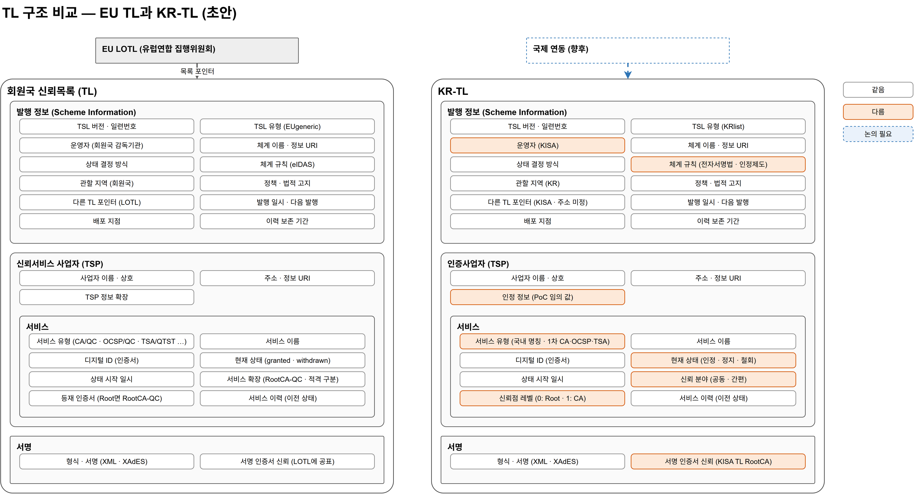

# 10. TL 구조 (D3-1) — EU TL 참조 초안

> 구현 상세는 [26 EU 기준 이력·버전 모델](26-EU-기준-이력-버전-모델.md)을 따른다. 아래 정상 발행 규칙은 PoC 관리 화면의 차단 조건이 아니다. 순번·시각 오류 발행을 허용하고 검증 모듈에서 확인한다. 새 상태 소급 금지는 해당 변경이 처음 실리는 발행본 기준이며, 변경 없는 재발행에서 기존 상태 시작 시각은 유지한다.

> EU 신뢰목록 구조(ETSI TS 119 612 v2.4.1)를 기준으로 KR-TL 구조 초안을 만든다.
> **같은 점은 EU 구조를 그대로 따르고, 차이점은 논의하면서 확정한다.** 이 문서의 차이점·논의 항목은 초안이다.
> 원문: `참조문서/01_원문/④ 표준/ETSI_TS119612_v2.4.1__83285a10.pdf` (5장 Trusted list format)
> 도식: [`diagrams/krtl-tl-structure.drawio`](diagrams/krtl-tl-structure.drawio)



## 1. 기본 방향

- KR-TL은 **EU TL의 골격(발행 정보 → TSP → 서비스 → 서비스 이력 → 서명)을 그대로 쓴다.** 국제 신뢰목록과 연동할 때 구조를 바꾸지 않기 위해서다.
- 한국의 제도(전자서명법·인정제도)와 체계(공동인증·간편인증)에서 생기는 차이는 **표준이 허용하는 확장 방식**으로 담는다.
  - TS 119 612는 EU 밖의 국가가 서비스 상태 값을 **자체 정의하고 체계 정보 URI로 공표**하는 것을 허용한다 (5.5.4).
  - 국가별 서비스 유형도 정의할 수 있다 (5.5.1.3).

## 2. EU TL 구조 요약

```
[EU LOTL]  유럽연합 집행위원회 — 회원국 TL 위치와 서명 인증서를 모은 목록
   │ 포인터
[회원국 TL]  TrustServiceStatusList
├── 발행 정보 (SchemeInformation)
│     TSL 버전 · 일련번호, TSL 유형, 운영자, 체계 이름 · 정보 URI, 상태 결정 방식,
│     체계 규칙, 관할 지역, 정책 · 법적 고지, 이력 보존 기간, 다른 TL 포인터,
│     발행 일시 · 다음 발행, 배포 지점
├── TSP 목록 (TrustServiceProviderList)
│   └── TSP
│       ├── TSP 정보: 이름 · 상호, 주소, 정보 URI, TSP 정보 확장
│       └── 서비스 목록
│           └── 서비스
│               ├── 서비스 정보: 서비스 유형, 서비스 이름, 디지털 ID(인증서),
│               │               현재 상태, 상태 시작 일시, 서비스 확장
│               └── 서비스 이력: 이전 상태들 (유형 · 이름 · 디지털 ID · 상태 · 시작 일시)
└── 서명 (XAdES)
```

EU TL의 주요 규칙

| 항목 | EU TL |
|---|---|
| 상태 값 | 적격 서비스: `granted` · `withdrawn` / 국가 정의 서비스: `recognisedatnationallevel` · `deprecatedatnationallevel` |
| 서비스 유형 | `CA/QC`, `Certstatus/OCSP/QC`, `TSA/QTST`, 비적격 `CA/PKC`, `Certstatus/OCSP`, `TSA` 등 |
| Root 등재 | `CA/QC` 서비스에 `RootCA-QC` 확장으로 표기 |
| OCSP 등재 | CA가 OCSP 응답 인증서를 서명했다면 별도 등재를 생략할 수 있음 |
| 서명 | XML 문서에 XAdES 서명 |
| 서명 인증서 신뢰 | 회원국 TL 서명 인증서를 LOTL에 공표하고, LOTL 서명 인증서는 EU 관보로 공표 |

## 3. KR-TL 구조 초안

```
[국제 연동]  (향후) 다른 TL 포인터로 연결
   ┆
[KR-TL]
├── 발행 정보
│     TSL 버전 · 일련번호, TSL 유형(KRlist), 운영자(KISA), 체계 이름 · 정보 URI,
│     상태 결정 방식, 체계 규칙(전자서명법 · 인정제도), 관할 지역(KR), 정책 · 법적 고지,
│     이력 보존 기간, 다른 TL 포인터(KISA · 주소 미정), 발행 일시 · 다음 발행, 배포 지점
├── TSP 목록
│   └── 인증사업자 (TSP) — KISA(공동인증 Root), 가상공동인증A·B, 가상간편인증A·B
│       ├── TSP 정보: 이름 · 상호, 주소 · 정보 URI, 인정 정보(PoC 임의 값)
│       └── 서비스 목록
│           └── 서비스 — 유형 CA · OCSP · TSA, 신뢰 분야(공동 · 간편). CA는 신뢰점 레벨(0: Root / 1: CA)에 따라 Root 또는 CA 인증서 등재
│               ├── 서비스 정보: 서비스 유형, 서비스 이름, 디지털 ID(인증서),
│               │               현재 상태(인정 · 정지 · 철회), 상태 시작 일시, 서비스 확장(Root 표기)
│               └── 서비스 이력: 이전 상태들
└── 서명 — XML · XAdES, 서명 인증서는 KISA TL RootCA 체인
```

### 3.1 신뢰점 레벨 (N-07 결정)

TL에 등재하는 인증서가 **검증의 끝**이 된다. 사업자(서비스)마다 Root를 담을지 그 아래 CA를 담을지 레벨로 정한다.

| 레벨 | 등재하는 인증서 | 검증 범위 | 의미 |
|---|---|---|---|
| **0** | Root 인증서 | 가입자 인증서 → … → **Root** 에서 종료 | Root가 검증의 끝. Root 아래 모든 CA를 신뢰 |
| **1** | CA 인증서 (Root 바로 아래) | 가입자 인증서 → **CA** 에서 종료 | 상위 Root가 있지만 CA까지만 검증하면 됨. 그 CA가 발급한 인증서만 신뢰 |

```
레벨 0                          레벨 1
Root   ★TL (검증 끝)             Root      (TL 미등재 · 검증 안 함)
 └ CA                            └ CA   ★TL (검증 끝)
    └ 가입자                         └ 가입자
```

- **레벨 0:** RootCA **하나만** 등재한다. Root 아래 CA · OCSP · TSA는 Root까지의 체인으로 확인한다.
- **레벨 1:** CA · OCSP · TSA를 각각 서비스로 등재한다.
- EU TL은 레벨을 따로 두지 않고, 등재 인증서가 Root인 경우 `RootCA-QC` 확장으로 표기한다. KR-TL은 레벨을 **명시 필드**로 둔다. 국제 연동 시 레벨 0은 `RootCA-QC` 표기와 대응한다.
- 사업자별 레벨 값은 실제 데이터 구체화(D3-8)에서 정한다. 이 결정에 따라 [07 인증체계](07-인증체계-설계.md) §7 등재 목록이 바뀐다.

### 3.2 신뢰 분야 (N-03)

| 코드 (안) | 신뢰 분야 |
|---|---|
| `joint` | 공동인증 |
| `simple` | 간편인증 |

- **위치: 서비스 단위** (결정). 한 사업자가 여러 분야의 서비스를 운영할 수 있다.
- 본인확인은 신뢰 분야가 아니라 서비스 유형으로 표현한다 (S-02, §3.4).
- 값 목록은 체계 정보 URI로 공표하고, 새 분야는 목록에 추가하는 방식으로 늘린다.
- **확장 예시** — 정의 목록에는 넣지 않는다: 법인확인(가칭), AI확인(가칭), 기기확인(가칭). 새 제도가 생기면 같은 방식으로 신뢰 분야나 서비스 유형에 추가할 수 있다.

### 3.2a 다국어 표기

- 국내 KR-TL은 **한글**로 작성한다.
- 국제 연동용 영문 표기는 **KISA 변환기**가 만든다. 표준은 영문 표기를 요구하므로(§5.1.4), 국제 연동 시 KISA가 한글 TL을 변환해 제공한다.

### 3.3 TSL 유형과 형식 · 서명 (N-01 · N-08)

**TSL 유형은 파일 형식(XML · JSON)이 아니다.** 목록의 종류를 나타낸다 (TS 119 612 §5.3.3).

| TSL 유형 | 의미 | 적용 |
|---|---|---|
| `…/TSLType/EUgeneric` | EU 회원국 신뢰목록 | EU 전용 |
| `…/TSLType/EUlistofthelists` | EU 목록의 목록 (LOTL) | EU 전용 |
| `…/TSLType/CClist` | EU 밖 국가의 신뢰목록 (`CC` = 국가 코드) | **KR-TL: `…/TSLType/KRlist`** |
| `…/TSLType/CClistofthelists` | EU 밖 국가의 목록의 목록 | 향후 여러 목록을 묶을 때 |

- TS 119 612는 EU 밖 국가를 위해 `CClist` 유형을 미리 정해 두었다. KR-TL은 이를 그대로 쓴다 → N-01 결정.

**형식과 서명은 TSL 유형과 별개다.** KR-TL의 형식은 **XML 하나로 한다** → N-08 결정 (2026-10-05).

| 형식 | 서명 | 근거 |
|---|---|---|
| XML | XAdES (enveloped) | TS 119 612 표준 형식 |

- JSON 형식은 두지 않는다. 기존 `kr-tl-builder`의 JWS 출력은 정리 대상이다 (D3-7).

### 3.4 서비스 유형 (N-05 · S-01 · S-02 · S-03)

EU TL은 적격(Q) / 비적격을 서비스 유형으로 나눈다. 국내는 인정 여부를 **상태**로 나타내므로 서비스 유형은 **기능**만 나타낸다. 유형 이름은 **국내 법령·제도의 명칭에 최대한 맞춘다** (S-01).

| 코드 (안) | KR-TL 서비스 유형 | 국내 근거 · 주체 | EU 대응 | 구분 |
|---|---|---|---|---|
| `CA` | 인증서 발급 | 전자서명법 · 인정 (KISA) | `CA/QC` · `CA/PKC` · `NationalRootCA-QC` | **1차** |
| `OCSP` | 인증서 상태 확인 | 전자서명법 · 인정 (KISA) | `Certstatus/OCSP` | **1차** |
| `CRL` | 인증서 폐지 목록 | 전자서명법 · 인정 (KISA) | `Certstatus/CRL` | 정의 |
| `TSA` | 시점확인 | 전자서명법 · 인정 (KISA) | `TSA` · `TSA/QTST` | **1차** |
| `RemoteSign` | 원격서명 | 전자서명법 · 인정 (KISA) | `RemoteQSigCDManagement` | 예약 |
| `IdCheck` | 본인확인 | 정보통신망법 · 본인확인기관 (방통위 지정) | `IdV` | 예약 (S-02) |
| `DocArchive` | 전자문서 보관 | 전자문서법 · 공인전자문서센터 (과기정통부 지정) | `ElectronicArchiving` · `PSES` | 예약 |
| `DocRelay` | 전자문서 중계 | 전자문서법 · 공인전자문서중계자 (과기정통부 지정) | `EDS` · `EDS/REM` | 예약 |
| `Digitization` | 전자화 | 전자문서법 · 전자화작업장 | 해당 없음 | 예약 |
| `DocVerify` | 진본확인 | 전자정부법 · 전자문서진본확인센터 (행안부) | `AdESValidation` · `TSTValidation` | 예약 |
| `eCert` | 전자증명서 | 전자정부법 · 행정기관 (행안부) | `EAA/Pub-EAA` | 예약 |
| `MobileID` | 모바일 신분증 | 전자정부법 등 · 행안부 | `EAA` (신원 정보) | 예약 |

- 국내 신뢰서비스 조사와 상세 대응: [11 신뢰서비스 유형 조사](11-신뢰서비스-유형-조사.md)
- Root 전용 유형은 두지 않는다. Root는 **CA 유형 + 신뢰점 레벨 0**으로 나타낸다 (EU의 `RootCA-QC` 표기와 같은 방식).
- 코드와 URI 주소는 미정이다. EU 유형과의 대응표를 체계 정보 URI로 공표한다.
- **PoC 범위 (S-03):** PoC에서 실제로 만들고 돌리는 것은 **1차 유형(CA · OCSP · TSA)** 이다. 예약 유형은 "KR-TL 구조에 포함할 수 있다"는 개념으로만 정리하며, PoC에서 등재하거나 실행하지 않는다. 다른 기관 소관 서비스의 등재 절차는 지금 정하지 않는다.

### 3.5 인정 정보 (N-04)

PoC에서는 **임의 값**을 넣는다.

| 항목 (안) | PoC 값 |
|---|---|
| 인정 번호 | 임의 (예: `KR-ACC-0001`) |
| 인정 일자 | 임의 |
| 인정 분야 | 신뢰 분야 값과 같음 |
| 인정 정보 URI | 임의 |

### 3.6 다른 TL 포인터 (N-02)

- 포인터 대상 운영자: **KISA**
- 주소(URI): **미정** — PoC 단계이므로 구조만 두고 값은 비우거나 임의 주소를 쓴다.

## 4. 같은 점과 차이점

구분: **같음** = EU 구조를 그대로 따름 / **다름** = 한국 제도·체계 때문에 값이나 규칙이 다름 / **논의** = 방향을 정해야 함

### 4.1 발행 정보

| 요소 | EU TL | KR-TL (초안) | 구분 |
|---|---|---|---|
| TSL 버전 · 일련번호 | 버전 6, 발행마다 증가 | 같은 방식 | 같음 |
| TSL 유형 | `EUgeneric` | `KRlist` (표준이 정한 EU 밖 국가용 유형) | 같음 — 값만 다름 |
| 운영자 | 회원국 감독기관 | KISA | 다름 |
| 체계 이름 · 정보 URI | 회원국 체계 | KR-TL 체계 | 같음 (값만 다름) |
| 상태 결정 방식 | 감독·적격 평가 결과 반영 | 인정평가 결과 반영 | 같음 (근거 제도만 다름) |
| 체계 규칙 | eIDAS | 전자서명법 · 인정제도 | 다름 |
| 관할 지역 | 회원국 코드 | KR | 같음 |
| 정책 · 법적 고지 | 회원국 고지 | KISA 고지 | 같음 (값만 다름) |
| 이력 보존 기간 | 지정 | 지정 (값은 향후 결정) | 같음 |
| 다른 TL 포인터 | LOTL 포인터 | KISA, 주소 미정 | 같음 — 값만 다름 |
| 발행 일시 · 다음 발행 | 필수 | 같음 (주기는 향후 결정) | 같음 |
| 배포 지점 | URI | 배포 시스템 URI | 같음 |

### 4.2 TSP · 서비스

| 요소 | EU TL | KR-TL (초안) | 구분 |
|---|---|---|---|
| TSP 정보 | 이름 · 상호 · 주소 · URI | 같음 | 같음 |
| 신뢰 분야 | 없음 | 공동인증 · 간편인증 (서비스 단위) | 다름 (N-03) |
| 인정 정보 | 적격 여부는 서비스 유형·상태로 표현 | 인정 번호 · 일자 · 분야 (PoC 임의 값) | 다름 |
| 서비스 유형 | 기능 + 적격 구분 (`CA/QC` · `CA/PKC` …) | 기능만, 국내 명칭 기준. 1차 CA · OCSP · TSA, 예약 9종 (본인확인 포함) | 다름 |
| 디지털 ID | 인증서 | 인증서 | 같음 |
| 현재 상태 | `granted` · `withdrawn` · `setbynationallaw` | 인정 · **정지** · 철회 · 국가 지정 (EU 대응표: [12](12-상태-이력-모델.md)) | 다름 (N-06) |
| 상태 시작 일시 | 필수 | 같음 | 같음 |
| Root 표기 | `RootCA-QC` 확장 | 같은 방식으로 표기 | 같음 |
| 신뢰점 레벨 | 명시 필드 없음 (등재 인증서가 Root면 `RootCA-QC`로 표기) | **0 = Root / 1 = CA** 를 명시 | 다름 (N-07) |
| 서비스 이력 | 이전 상태 누적 | 같음 — 시점 판정의 근거 | 같음 |

### 4.3 서명

| 요소 | EU TL | KR-TL (초안) | 구분 |
|---|---|---|---|
| 형식 · 서명 | XML + XAdES | XML + XAdES | 같음 |
| 서명 인증서 신뢰 | LOTL·관보 공표 | KISA TL RootCA 체인 | 다름 |
| 상위 목록 | LOTL (집행위원회) | 없음 (단일 국가 TL) | 다름 |

## 5. 논의 항목

| ID | 항목 | 쟁점 | 초안 의견 |
|---|---|---|---|
| N-01 | TSL 유형 | 목록 종류를 나타내는 값 (파일 형식 아님) | **결정** — `KRlist` (§3.3) |
| N-02 | 다른 TL 포인터 | 대상과 주소 | **결정** — KISA, 주소 미정 (§3.6) |
| N-03 | 신뢰 분야 | 값과 위치 | **결정** — 공동인증 · 간편인증, 서비스 단위. 법인확인 등은 확장 예시 (§3.2) |
| N-04 | 인정 정보 | 어떤 값을 담을지 | **결정** — PoC 임의 값 (§3.5) |
| N-05 | 서비스 유형 | EU 유형과 국내 체계 대응 | **초안** — 비교표 (§3.4). 1차 유형 CA · OCSP · TSA |
| N-06 | 상태 값 | EU 체계와 대응 | **결정** — 인정(`granted`) · 정지(변환 시 `withdrawn` + 정지 표시) · 철회(`withdrawn`) · 국가 지정(`setbynationallaw`). [12](12-상태-이력-모델.md) §1 |
| N-07 | 신뢰점 레벨 | Root만 담을지 하위 CA를 담을지 | **결정** (§3.1) — 0 = Root, 1 = CA. 사업자(서비스)별로 지정 |
| N-08 | 형식 · 서명 | 형식과 서명 방식 | **결정** — XML · XAdES 하나 (§3.3) |

## 6. 기존 설계와의 연결

- 등재 대상: [14 메타데이터·실제 데이터](14-메타데이터-실제데이터.md) §4.3 (TSP 4 · 서비스 10)
- 상태 이력으로 시점 판정: [08 신뢰 흐름](08-신뢰-흐름-설계.md) 단계 4
- 현재 코드: `kr-tl-model`은 서비스마다 현재 상태 하나와 인증서 하나만 갖는다. 서비스 이력, 신뢰 분야, 신뢰점 레벨이 빠져 있다 ([05 설계 검토](05-설계-검토.md) R-1).
- 현재 코드: `KrTrustListXml`은 TSL 버전과 일련번호에 같은 값(`version`)을 넣는다. TS 119 612는 TSL 버전을 "6"으로 고정하고 일련번호만 발행마다 올린다.

## 7. TL 버전 모델 — EU 기준 (확정)

> 근거: TS 119 612 §5.3.1 · §5.3.2 · §5.3.12 · §5.3.14 · §5.3.15 · §5.3.16 · §5.5.5, 부속서 G.5 · G.6 · I

### 7.1 EU 규칙과 KR-TL 적용

| 항목 | EU 규칙 | KR-TL (안) |
|---|---|---|
| **TSL 버전** | 형식 버전. "6" 고정, 파싱 규칙이 바뀔 때만 올림 (§5.3.1) | 같음 |
| **일련번호** | 첫 발행 1, 발행할 때마다 증가. **어떤 경우에도 되돌리거나 현재보다 작은 값으로 재사용하지 않음** (§5.3.2) | 같음. 이용기관은 보유본보다 작은 일련번호를 거부 (되돌리기 방지) |
| **발행 일시** | TL을 발행한 UTC 시각 (§5.3.14) | 같음. 표기 · 입력은 KST(`+09:00`), TL XML에는 UTC로 기록 |
| **다음 발행 예정 (NextUpdate)** | 늦어도 이 시각까지 새 TL을 발행. 변경이 없어도 이 시각 전에 재발행. **NextUpdate가 지난 TL은 만료로 보고 버림**. 발행 일시와의 차이는 최대 6개월 (§5.3.15) | 같음. **PoC 값: 발행 + 7일** |
| **정기 발행** | 변경이 없어도 NextUpdate 전에 재발행 — 서명 값이 주기적으로 바뀌어 오래된 TL 재사용 공격을 막음 (G.6) | 같음 |
| **수시(긴급) 발행** | 상태 변경이 효력을 가지면 바로 재발행. 4업무시간 이내 권고, 모든 변경은 24시간 이내 (G.5) | 같음. **PoC 값: 승인 후 1시간 이내** |
| **상태 시작 일시와 발행** | 새 상태의 시작 일시는 **그 TL의 발행 일시보다 앞서면 안 됨** — 소급 변경은 이미 끝난 검증에 영향을 주므로 금지 (§5.5.5) | 같음 → **소급 금지** |
| **이력 보존 기간** | "65535" = **이력을 절대 지우지 않음** (§5.3.12) | 같음 → **지우지 않음 (65535)** |
| **배포 지점** | 여러 주소를 둘 수 있고 모두 같은 최신 TL을 제공 (§5.3.16) | 같음. 배포 시스템 주소 (미정) |
| **TL 종료** | 운영을 멈추면 마지막 TL을 발행: 모든 서비스를 만료로, NextUpdate는 비움 (§5.3.15) | 같음 |
| **이용 측 캐시** | 캐시를 쓰더라도 NextUpdate 전에 새 TL이 나올 수 있음을 고려해 주기적으로 확인 (§5.3.15, 부속서 I) | 같음. **PoC 값: 이용기관 수신 확인 10분 간격**, 기한 지난 TL은 버림 |

### 7.2 확정 사항 (2026-10-05)

- **EU 기준으로 고정한다.** 위 규칙은 모두 EU와 같다.
- **효력 시각 소급: 금지.** 상태 변경의 효력 시각은 TL 발행 시각보다 앞설 수 없다.
- **이력 보존 기간: 지우지 않음** (`65535`).
- **기한 지난 TL: 버린다.** 이용기관은 NextUpdate가 지난 TL로 검증하지 않는다 → 유효한 TL이 없으면 판단 보류(INDETERMINATE).
- 정해지지 않은 값은 PoC 값으로 **임의 설정**한다:

| 값 | PoC 값 | EU 기준 |
|---|---|---|
| 정기 발행 간격 (NextUpdate − 발행 일시) | 7일 | 최대 6개월 |
| 긴급 발행 반영 시간 | 승인 후 1시간 이내 | 4업무시간 이내 권고 |
| 이용기관 수신 확인 간격 | 10분 | 규정 없음 (주기적 확인) |
| 사업자 정기 갱신 제출 간격 (IF-01) | 30일 | 규정 없음 |

### 7.3 버전 관리 항목

| 항목 | 내용 | 관련 |
|---|---|---|
| 직전 버전과의 차이 | 발행할 때 직전 TL과 비교해 추가 · 상태 변경 · 철회 항목을 관리 화면에 표시 | 02 M-05 |
| 버전 보관 | 발행한 모든 TL을 일련번호별로 보관 (`krtl/published/<seq>/`) | 07 §8.3 |
| 버전 조회 | 특정 일련번호의 TL 조회 | 06 IF-07 |

## 8. 다음 단계

- D3-2 상태·이력 모델 → [12 상태 · 이력 모델](12-상태-이력-모델.md)
- 오래된 서명 판정 원칙 — 향후 결정 (PQC 연계)
