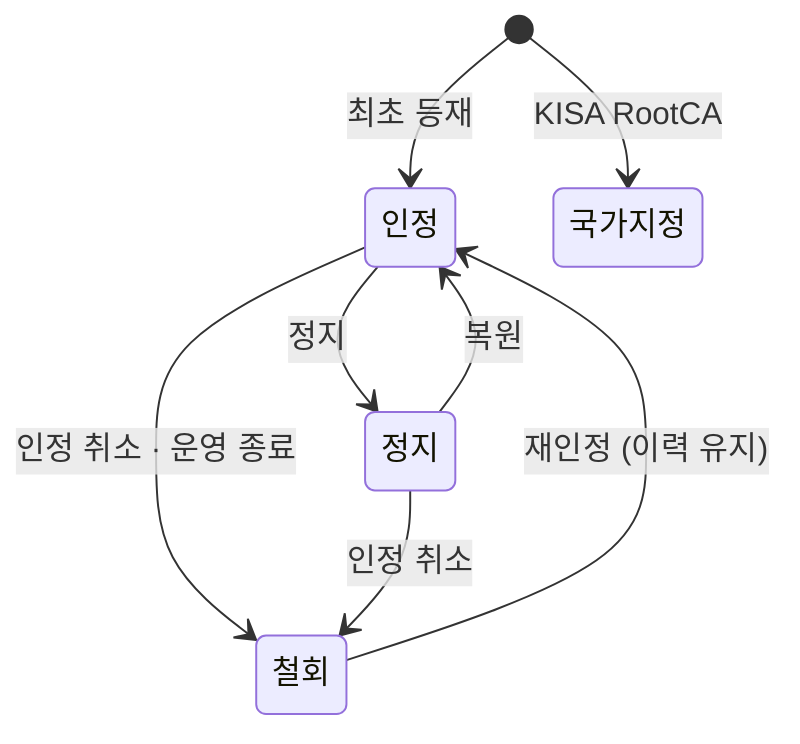

# 12. 상태 · 이력 모델 (N-06 · D3-2) — EU 체계 매핑

> 구현 상세는 [26 EU 기준 이력·버전 모델](26-EU-기준-이력-버전-모델.md)을 따른다. 이력 XML의 디지털 ID는 X509SKI를 포함하며 인증서는 포함하지 않는다. 새 상태 소급 검사는 최초 반영 발행본 기준이다. PoC 관리 화면에서는 오류 시각도 입력·발행할 수 있고 검증 모듈에서 이를 거부한다. 기존 표본·시나리오는 향후 결정 대상이다.

> KR-TL의 서비스 상태 값과 이력 규칙을 **EU TL(ETSI TS 119 612 v2.4.1) 규칙에 대응**시켜 정한다.
> 근거 조항: §5.5.3 서비스 디지털 ID, §5.5.4 현재 상태, §5.5.5 상태 시작 일시, §5.5.9.4 추가 서비스 정보, §5.5.10 서비스 이력, §5.6 이력 인스턴스, 부속서 D.5 상태 정의, 부속서 G.3·G.4 변경 처리
> 원문: `참조문서/01_원문/④ 표준/ETSI_TS119612_v2.4.1__83285a10.pdf`

## 1. 상태 값 (N-06)

### 1.1 EU 상태 값

| EU 상태 | 의미 | 적용 |
|---|---|---|
| `granted` | 감독기관이 적격 지위를 부여 | 적격(Q) 서비스 |
| `withdrawn` | 적격 지위가 처음부터 없거나 철회됨 | 적격(Q) 서비스 |
| `recognisedatnationallevel` | 국가 차원에서 승인 | 비적격·국가 정의 서비스 |
| `deprecatedatnationallevel` | 국가 차원 승인이 철회됨 | 비적격·국가 정의 서비스 |
| `setbynationallaw` | 국가 법률로 지정된 기관 (국가 루트 CA) | `NationalRootCA-QC` |

- EU 밖 국가는 상태 값을 직접 정의하고 체계 정보 URI로 공표한다 (§5.5.4).
- EU에는 **정지 상태가 없다.** 운영을 멈추는 서비스는 `withdrawn`으로 바꾸고, 이전 상태는 이력으로 넘긴다 (G.3).

### 1.2 KR 상태 값과 EU 대응

| KR 상태 | 코드 (안) | 의미 | EU 대응 | 국제 변환 시 (KISA 변환기) |
|---|---|---|---|---|
| **인정** | `accredited` | 인정평가를 거쳐 KISA가 인정 | `granted` | `recognisedatnationallevel` 또는 상호인정 시 `granted` 상당 |
| **정지** | `suspended` | 인정 효력을 일시 정지 (복원 가능) | 없음 → `withdrawn` | `withdrawn` + 추가 정보 "정지" (§3.2) |
| **철회** | `withdrawn` | 인정 취소, 운영 종료 | `withdrawn` | `withdrawn` (또는 `deprecatedatnationallevel`) |
| **국가 지정** | `setbynationallaw` | 법률로 지정된 최상위 인증기관 (KISA RootCA) | `setbynationallaw` | 같음 |

- 상태 URI 주소는 미정. KR 상태 목록은 체계 정보 URI로 공표한다.
- 정지는 KR에만 있는 상태다. EU 쪽으로 변환할 때는 **효력이 없는 상태(`withdrawn`)** 로 보내고, 정지라는 사실은 추가 정보로 남긴다. 복원되면 다시 인정(`granted` 상당)으로 바뀌고 정지 구간은 이력에 남는다.

### 1.3 상태 전이

| 전이 | 허용 | EU 대응 |
|---|---|---|
| (최초) → 인정 | ○ | 최초 등재 시 `granted` |
| 인정 → 정지 → 인정 | ○ | `granted` → `withdrawn` → `granted` |
| 인정 · 정지 → 철회 | ○ | → `withdrawn` |
| 철회 → 인정 | ○ (재인정) | `withdrawn` → `granted` (새 상태, 이전은 이력) |
| 국가 지정 | 고정 | `setbynationallaw` |

## 2. 이력 모델 (D3-2)

### 2.1 이력을 남기는 규칙 — EU와 같음

| 규칙 | 내용 | EU 근거 |
|---|---|---|
| 상태가 바뀌면 | 이전 상태를 이력에 넣고, 현재 상태를 새 상태로 바꾼 뒤 TL을 다시 발행 | G.3 |
| 이력 순서 | 최신 변경이 먼저 (상태 변경 시각 내림차순) | §5.5.10 |
| 이력 삭제 | **하지 않는다.** 보존 기간 동안 유지 (운영 기간에 제공된 서비스를 나중에 확인해야 하므로) | G.3 |
| 첫 등재 | 이력 없음 | §5.5.10 |
| 이름 변경 | 새 상태로 기록할 수 있음 (이력 발생) | §5.6.2 NOTE |
| 상태 시작 일시 | 상태가 **효력을 가진 시각** — 시점 판정의 기준 | §5.5.5 |

### 2.2 이력 인스턴스 항목 — EU와 같음

| 항목 | 내용 |
|---|---|
| 서비스 유형 | 그때의 서비스 유형 |
| 서비스 이름 | 그때의 이름 |
| 디지털 ID | 공개키 식별자 (SKI 이상) |
| 이전 상태 | 인정 · 정지 · 철회 |
| 이전 상태 시작 일시 | 그 상태가 효력을 가진 시각 |
| 서비스 확장 | 그때의 신뢰 분야 · 신뢰점 레벨 등 (선택) |

### 2.3 디지털 ID(인증서) 변경 — EU와 같음 (G.4)

| 경우 | 처리 | 이력 |
|---|---|---|
| **새 공개키** (CA 키 교체, 재발급) | **새 서비스 항목**으로 추가 | 새 항목은 이력 없음. 기존 항목은 그대로 유지(운영 종료 시 철회) |
| **같은 공개키, 새 인증서** (인증서만 갱신) | 같은 서비스에 인증서를 **추가** (주체 이름이 같을 때만) | 이력 생기지 않음 |
| 같은 공개키를 같은 유형에 두 번 | 금지 | — |

- 앞서 검토한 "CA 키 교체를 어떻게 표현할지"는 이 규칙으로 정한다. **키가 바뀌면 새 서비스, 인증서만 바뀌면 같은 서비스.** 시나리오 SC-02(서비스 인증서 갱신)는 이 기준으로 다시 정리한다.

### 2.4 신뢰점 레벨과 OCSP · TSA

| 대상 | 검증 근거 | EU 대응 |
|---|---|---|
| 가입자 인증서 | 등재된 CA 서비스의 공개키 (레벨 0이면 Root, 1이면 CA) | `CA/…` 디지털 ID |
| OCSP 응답 | 레벨 1: **등재된 OCSP 서비스의 공개키**로 직접 확인 / 레벨 0: 등재 Root까지 체인으로 확인 | 별도 등재 / CA 체인으로 확인 (EU 두 방식 모두 허용) |
| 타임스탬프 (PoC 미사용) | 레벨 1: **등재된 TSA 서비스의 공개키**로 직접 확인 / 레벨 0: 등재 Root까지 체인으로 확인 | `TSA/…` 디지털 ID |

- EU는 OCSP 응답이 등재 CA의 키나 체인으로 확인되면 OCSP를 따로 싣지 않아도 된다. KR-TL은 레벨 1이면 OCSP · TSA를 따로 싣고, 레벨 0이면 Root 하나만 싣고 체인으로 확인한다.

### 2.5 판정 시각 규칙 (PoC)

| 규칙 | 내용 |
|---|---|
| 기준 시각 | 서명에 기록된 서명 시각 (KST, TSA 미사용) |
| 경계 | 서명 시각 = 상태 효력 시각이면 **새 상태** 적용 |
| 최초 인정 이전 | 판단 보류 (`NOT_ACCREDITED_AT_TIME`) |
| 서명 시각 없음 | 판단 보류 (`NO_SIGNING_TIME`) |

표본별 판정은 [18 신뢰 경로 판정표](18-신뢰경로-판정표.md) §5.

## 3. KR 확장 항목의 표현 — EU 확장 방식 사용

KR에만 있는 항목은 EU의 **추가 서비스 정보 확장**(additionalServiceInformation, §5.5.9.4)으로 싣는다. 이 확장은 등록한 URI로 서비스를 더 구체적으로 나타낼 수 있다.

| KR 항목 | 표현 | EU 대응 |
|---|---|---|
| 신뢰 분야 (공동인증 · 간편인증) | 추가 서비스 정보 — KR 정의 URI | `ForeSignatures` 등과 같은 방식 |
| 신뢰점 레벨 0 (Root) | 추가 서비스 정보 — KR 정의 URI | `RootCA-QC` 표기와 대응 |
| 신뢰점 레벨 1 (CA) | 추가 서비스 정보 — KR 정의 URI | 표기 없음 (등재 CA가 곧 발급 CA) |
| 정지 사유 | 추가 서비스 정보 — KR 정의 URI | 없음 (변환 시 `withdrawn`과 함께 전달) |

## 4. 향후 결정

| 항목 | 메모 |
|---|---|
| **오래된 서명을 판정하는 원칙** | 향후 결정. **PQC 연계 필요** — 알고리즘 전환과 장기 검증(장기간 지난 서명의 유효성 유지)을 함께 다룬다 |
| 상태 반영 시간 | EU 기준(G.5). **PoC 값: 승인 후 1시간 이내** — [10](10-TL-구조.md) §7.2 |
| 효력 시각 소급 | **금지** (상태 시작 일시 ≥ TL 발행 일시) — 확정 |
| 이력 보존 기간 | **지우지 않음** (65535) — 확정 |
| URI 주소 | 상태 · 확장 URI 주소 미정 |

## 5. 기존 설계에 주는 영향

- [03 시나리오](03-이용-시나리오.md) SC-02: CA 키를 바꾸면 새 서비스로 등재 (기존 "같은 서비스에 인증서 여러 장" 표현을 고친다)
- [10 TL 구조](10-TL-구조.md): N-06 결정, 서비스 확장 항목 정리
- `kr-tl-model`: 상태 값에 정지·국가 지정 추가, 이력 인스턴스, 추가 서비스 정보 확장 (D3-7)
