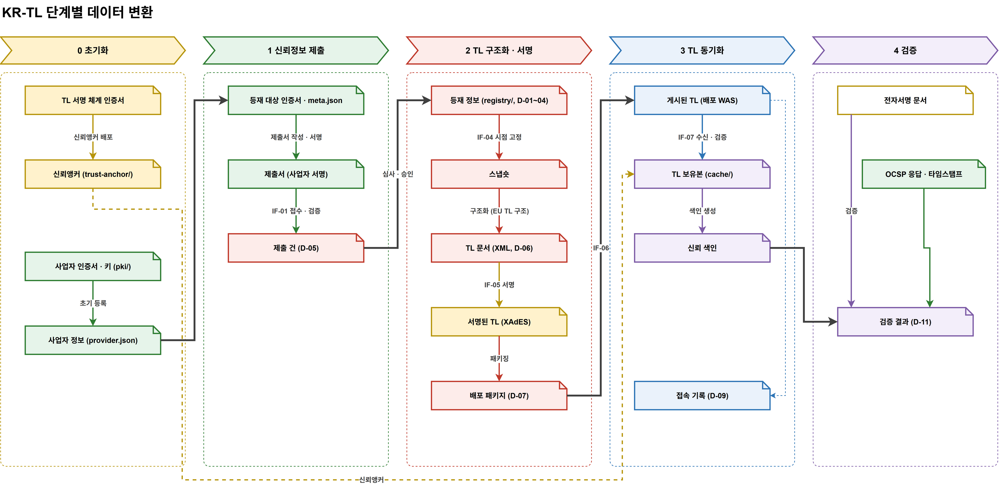

# 13. 단계별 데이터 변환 설계 (D3-4)

> [08 신뢰 흐름](08-신뢰-흐름-설계.md)의 단계 0~4에서 **데이터가 어떤 모양으로 바뀌며 흘러가는지**를 정리한다.
> 필드 단위 스키마는 다루지 않고, 데이터 단위(입력 → 변환 → 출력)와 변환 규칙의 요지를 정한다.
> 도식: [`diagrams/krtl-dataflow.drawio`](diagrams/krtl-dataflow.drawio)



## 1. 한눈에 보기

```
0 초기화      인증서·키(pki/) ─▶ 사업자 정보 · 신뢰앵커
1 제출        등재 대상 인증서 ─▶ 제출서(사업자 서명) ─▶ 제출 건
2 구조화·서명  등재 정보(registry/) ─▶ 스냅숏 ─▶ TL 문서(XML) ─▶ 서명된 TL(XAdES) ─▶ 배포 패키지
3 동기화      게시된 TL ─▶ TL 보유본(cache/) ─▶ 신뢰 색인     (+ 접속 기록)
4 검증        전자서명 문서 + 신뢰 색인 + OCSP·타임스탬프 ─▶ 검증 결과
```

데이터의 **신뢰 근거가 바뀌는 지점**은 세 곳이다.

| 지점 | 전 | 후 |
|---|---|---|
| 1 → 2 심사·승인 | 사업자 서명 (사업자의 주장) | KISA 심사 결과 (KISA 확인) |
| 2 TL 서명 | 등재 정보 (관리 시스템 내부 데이터) | 서명된 TL (KISA 보증, 밖으로 나갈 수 있음) |
| 3 수신·검증 | 배포된 파일 (출처 불명) | TL 보유본 (구심점까지 검증된 보증) |

## 2. 단계별 변환

### 단계 0 — 초기화

| 변환 | 입력 | 출력 | 규칙 |
|---|---|---|---|
| 신뢰앵커 배포 | TL 서명 체계 인증서 (`pki/tl-signer/`) | 신뢰앵커 (`krtl-client/trust-anchor/`) | KISA TL RootCA 인증서만 복사. 키는 복사하지 않음. 지문으로 대조 |
| 초기 등록 | 사업자 인증서 · 키 (`pki/providers/<ID>/`) | 사업자 정보 (`provider.json`) | 사업자 식별, 신뢰 분야, 신뢰점 레벨, 인정 정보(PoC 임의 값) 기록 |

### 단계 1 — 신뢰정보 제출 (인증사업자 → 관리 시스템)

| 변환 | 입력 | 출력 | 규칙 |
|---|---|---|---|
| 제출서 작성 · 서명 | 등재 대상 인증서 (`meta.json`의 TL 등재 = 예) | 제출서 | 신뢰점 레벨에 따라 Root 또는 CA 인증서 선택 + OCSP · TSA 인증서. 사업자 키로 서명. **개인키는 포함하지 않음** |
| 접수 · 검증 (IF-01) | 제출서 | 제출 건 (D-05) | 사업자 인증, 제출서 서명 확인, 형식 확인. 실패 시 반려 |

### 단계 2 — TL 구조화 · 서명 (관리 시스템 내부)

| 변환 | 입력 | 출력 | 규칙 |
|---|---|---|---|
| 심사 · 승인 | 제출 건 | 등재 정보 (`krtl/registry/`, D-01~04) | 승인된 내용만 반영. 상태 변경은 이력으로 누적 (12 §2.1). 키가 바뀌면 새 서비스 항목 (12 §2.3) |
| 시점 고정 (IF-04) | 등재 정보 | 스냅숏 | 발행 시점의 등재 정보를 고정. 이후 변경은 다음 TL로 |
| 구조화 | 스냅숏 | TL 문서 (XML, D-06) | EU TL 구조로 변환 (§3 대응표). 일련번호 +1, 발행 일시, NextUpdate = 발행 + 7일 (PoC) |
| 서명 (IF-05) | TL 문서 | 서명된 TL (XAdES) | TL 서명 인증서로 XAdES enveloped 서명. 서명 인증서 체인(T-02 → T-01) 수록 |
| 패키징 | 서명된 TL | 배포 패키지 (D-07) | 서명된 TL + 매니페스트(일련번호 · 발행 일시 · NextUpdate · 해시). `krtl/published/<seq>/`에 보관 |

### 단계 3 — TL 동기화 (관리 → 배포 → 이용기관)

| 변환 | 입력 | 출력 | 규칙 |
|---|---|---|---|
| 게시 (IF-06) | 배포 패키지 | 게시된 TL | 배포 WAS가 매니페스트 서명 · 해시 확인, 일련번호가 현재보다 커야 게시 |
| 수신 · 검증 (IF-07) | 게시된 TL | TL 보유본 (`krtl-client/cache/`) | ① 서명을 신뢰앵커까지 검증 ② 일련번호 > 보유본 ③ NextUpdate 이내. 실패 시 버리고 보유본 유지. 기한 지난 보유본은 버림 |
| 색인 생성 | TL 보유본 | 신뢰 색인 | 검증에 쓰기 쉬운 형태로 정리: 공개키(SKI) → 사업자 · 서비스 유형 · 신뢰 분야 · 신뢰점 레벨 · 상태 이력 |
| 기록 | 수신 요청 | 접속 기록 (D-09) | 수신 시각, 요청자, 요청 일련번호, 결과 |

- **신뢰 색인**은 트러스트 스토어가 아니다. TL 보유본에서 매번 다시 만들 수 있는 파생 데이터이며, TL이 바뀌면 함께 바뀐다.

### 단계 4 — 검증 (이용기관)

| 변환 | 입력 | 출력 | 규칙 |
|---|---|---|---|
| 검증 | 전자서명 문서, 신뢰 색인, OCSP 응답 · 타임스탬프 | 검증 결과 (D-11) | ① 서명자 인증서 체인을 신뢰점(등재 Root 또는 CA)까지 구성 ② 서명 시각(타임스탬프)의 서비스 상태를 상태 이력에서 조회 ③ OCSP · TSA는 등재된 각 서비스의 공개키로 확인 ④ 판정 + 사유 + **사용한 TL 일련번호** 기록 |

## 3. 등재 정보 → TL 문서 대응표 (단계 2 구조화)

| 등재 정보 (`krtl/registry/`) | TL 문서 (EU TL 요소) |
|---|---|
| 발행 설정 (운영자 KISA, 체계 이름, 관할 KR …) | 발행 정보 `SchemeInformation` |
| — (발행 시 생성) | 일련번호 `TSLSequenceNumber`, 발행 일시 `ListIssueDateTime`, 다음 발행 `NextUpdate`, TSL 유형 `KRlist` |
| `provider.json` | TSP 정보 `TSPInformation` (이름 · 주소 · 정보 URI, 인정 정보는 TSP 정보 확장) |
| 서비스 폴더 (`<ID>-ca/` 등) | 서비스 `TSPService` |
| `service.json` 서비스 유형 | 서비스 유형 `ServiceTypeIdentifier` (KR 유형 URI) |
| `cert.pem` | 디지털 ID `ServiceDigitalIdentity` (인증서 · SKI) |
| `service.json` 현재 상태 · 효력 시각 | 현재 상태 `ServiceStatus` · 상태 시작 일시 `StatusStartingTime` |
| `service.json` 상태 이력 | 서비스 이력 `ServiceHistory` / `ServiceHistoryInstance` |
| `service.json` 신뢰 분야 · 신뢰점 레벨 · 정지 사유 | 추가 서비스 정보 `additionalServiceInformation` (KR 정의 URI) |
| TL 서명 인증서 체인 (`krtl/signer/chain/`) | 서명 `ds:Signature` (XAdES, `KeyInfo`에 체인) |

- 개인키는 어느 단계에서도 등재 정보 · TL · 배포 패키지에 들어가지 않는다.
- XML로 바꾸는 것은 단계 2 구조화 한 곳뿐이다. 그 앞은 폴더 · 메타데이터, 그 뒤는 서명된 XML을 그대로 전달한다.

## 4. 데이터 보관 위치

| 데이터 | 보관 위치 | 보관 기간 |
|---|---|---|
| 인증서 · 키 | `pki/` (인증기관 PoC) | — |
| 제출 건 | 관리 시스템 | 지우지 않음 (감사) |
| 등재 정보 | `krtl/registry/` | 현재 상태 + 이력 (이력은 지우지 않음) |
| 발행한 TL · 배포 패키지 | `krtl/published/<seq>/` | 지우지 않음 (버전 보관) |
| 게시된 TL | 배포 WAS | 최신 + 버전별 |
| TL 보유본 · 신뢰 색인 | `krtl-client/cache/` | 최신 1개 (기한 지난 것은 버림) |
| 접속 기록 | 배포 WAS | 향후 결정 |
| 검증 결과 | 이용기관 | 이용기관 정책 |

## 5. 다음 단계

- D3-6 · D3-8: `meta.json` · `provider.json` · `service.json` 항목을 §3 대응표 기준으로 정의하고 사업자 4곳 실제 값 작성
- D3-7: `kr-tl-model` · `kr-tl-builder` 변경 범위 (EU 구조 · 이력 · 확장 · XML 단일)
- D7: 신뢰 색인과 검증 절차 상세
