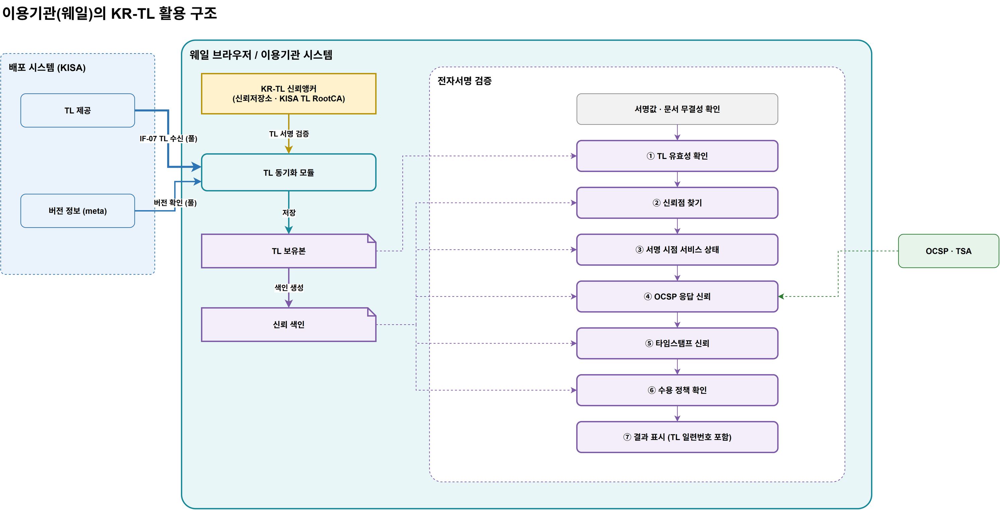

# 17. 이용기관 TL 활용 가이드 (D7) — 웨일 연동 기준

> **대상 독자:** 웨일 브라우저 및 이용기관 시스템 개발자
> **범위:** TL을 **사용하는 관점**만 다룬다. 전자서명 검증 알고리즘의 상세(서명값 계산, 체인 구성 규칙 등)는 다루지 않는다.
> **관점:** KISA가 이용기관(웨일)에게 "TL을 이렇게 쓰면 된다"고 안내하는 가이드
> 도식: [`diagrams/krtl-rp-tl-usage.drawio`](diagrams/krtl-rp-tl-usage.drawio)

## 1. 한눈에 보기

웨일이 할 일은 세 가지다.

| # | 할 일 | 요지 |
|---|---|---|
| 1 | **신뢰앵커 탑재** | KISA TL RootCA 인증서를 신뢰저장소에 KR-TL 전용으로 넣는다 |
| 2 | **실시간 TL 동기화** | 웨일이 주기적으로 가져오는 **풀(pull) 방식**으로 최신 TL을 받아 서명을 검증하고 보유한다 |
| 3 | **검증 시 TL 활용** | 전자서명을 검증할 때 정해진 7개 지점에서 TL을 참조한다 |

## 2. 신뢰앵커 탑재 (신뢰저장소 이용)

### 2.1 무엇을 탑재하는가 (확정)

| 항목 | 내용 |
|---|---|
| 탑재 인증서 | **KISA TL RootCA** 인증서 — 확정 |
| 이유 | TL 서명 인증서와 KISA TL CA가 교체되어도 웨일 쪽 작업이 없다 |
| 탑재하지 않는 것 | KISA TL CA · TL 서명 인증서(TL 서명에 체인으로 들어 있음), 각 사업자의 RootCA · CA (TL이 대신 알려 줌) |

### 2.2 어디에 탑재하는가

- 웨일의 **신뢰저장소**에 탑재한다.
- 단, **KR-TL 전용 항목**으로 구분한다. 웹사이트(TLS) 인증용 루트 인증서와 섞지 않고, "TL 서명 검증에만 쓴다"는 용도를 둔다.
- 신뢰저장소의 다른 루트로 TL 서명을 검증하지 않는다. TL 서명은 KR-TL 전용 항목으로만 검증한다.

### 2.3 어떻게 탑재하는가

| 단계 | 내용 |
|---|---|
| 배포 | 웨일 설치본(또는 업데이트)에 포함. TL 배포 경로(IF-07)로는 바꾸지 않는다 |
| 확인 | KISA가 공표한 인증서 지문(SHA-256)과 대조 |
| 교체 | RootCA 교체는 웨일 업데이트로만 한다 (TL 서명 인증서 교체는 웨일 작업 없음) |

> 이전 설계(07 §8.4)에서 이용기관 SDK는 `trust-anchor/` 폴더를 쓰도록 했다. 웨일은 **신뢰저장소**를 쓰고, SDK는 폴더 방식도 허용한다. 두 방식 모두 "KR-TL 전용, 앵커 1개" 원칙은 같다.

## 3. 실시간 TL 동기화

### 3.1 동기화 방식 — 풀(pull) 방식 (확정)

배포 시스템은 웨일에 먼저 연락하지 않는다. **웨일이 가져간다.**

| 시점 | 동작 |
|---|---|
| **주기 확인** | 10분마다 버전 정보(`/tl/v1/latest/meta`) 또는 `If-None-Match`로 확인. 변경 없으면 `304`, 있으면 새 TL 수신 |
| **웨일 시작 시** | 바로 버전 확인 |
| **검증 직전** | 마지막 확인 후 10분이 지났으면 버전 확인 후 검증 |

- **실시간의 의미:** KISA가 긴급 발행하면(승인 후 1시간 이내, PoC 값) 웨일은 다음 확인 때, 늦어도 **10분 안에** 새 TL을 쓴다. 검증 직전 확인으로 오래된 TL로 검증하는 일을 줄인다.
- 버전 확인은 작은 응답(일련번호 · 발행 일시 · NextUpdate · 해시)만 주고받으므로 자주 해도 부담이 적다.
- 기존 IF-07(TL 수신)의 `latest/meta`와 `ETag`/`304`로 처리하므로 인터페이스를 새로 만들지 않는다.
- 풀 방식은 배포 시스템이 이용기관 목록을 관리하거나 연결을 유지할 필요가 없어, 배포 시스템을 단순하게 둘 수 있다.

### 3.2 받은 TL을 받아들이는 조건

| 순서 | 확인 | 실패 시 |
|---|---|---|
| 1 | TL 서명을 신뢰앵커(KISA CA 인증서)까지 검증 | 버리고 보유본 유지 + 경보 |
| 2 | 일련번호가 보유본보다 큼 | 버리고 보유본 유지 (되돌리기 차단) |
| 3 | NextUpdate가 지나지 않음 | 버림 |
| 4 | 위를 통과하면 보유본 교체 → 신뢰 색인 다시 생성 | — |

- 보유본의 NextUpdate가 지났는데 새 TL을 받지 못하면 **보유본도 버린다**. 이때 검증은 판단 보류(INDETERMINATE)다.

### 3.3 신뢰 색인

TL 보유본에서 만드는 검증용 정리 데이터다. TL이 바뀔 때마다 다시 만든다.

| 키 | 값 |
|---|---|
| 공개키 식별자 (SKI) | TSP, 서비스 ID, 서비스 유형, 신뢰 분야, 신뢰점 레벨, 현재 상태, 상태 이력 |

## 4. 전자서명 검증 시 TL 활용 지점

전자서명 검증 절차 중 **TL을 참조하는 지점**만 정리한다. 서명값 · 문서 무결성 확인과 인증서 체인 구성 자체는 TL을 쓰지 않는다.

| 지점 | 하는 일 | TL에서 쓰는 것 | 결과 |
|---|---|---|---|
| **① TL 유효성** | 지금 쓸 수 있는 TL이 있는가 | 보유본의 서명 검증 여부 · NextUpdate | 없으면 `NO_VALID_TL` (판단 보류) |
| **② 신뢰점 찾기** | 서명자 인증서 체인에서 TL에 등재된 인증서를 찾는다 | 신뢰 색인의 SKI · 신뢰점 레벨 (0: Root, 1: CA) | 못 찾으면 `NOT_IN_TL` (판단 보류) |
| **③ 서명 시점 서비스 상태** | 서명한 시각에 그 서비스가 인정 상태였는가 | 상태 이력 + 서명 시각(타임스탬프) | 정지 · 철회면 `SERVICE_SUSPENDED/WITHDRAWN_AT_TIME` (실패) |
| **④ OCSP 응답 신뢰** | OCSP 응답 서명자를 믿을 수 있는가 | 레벨 1: 등재된 OCSP 서비스 / 레벨 0: 등재 Root까지 체인 | 못 믿으면 폐지 확인 불가 (판단 보류) |
| **⑤ 타임스탬프 신뢰 (PoC 미사용)** | 타임스탬프 발급자를 믿을 수 있는가 | 레벨 1: 등재된 TSA 서비스 / 레벨 0: 등재 Root까지 체인 | 못 믿으면 서명 시각 근거 없음 |
| **⑥ 수용 정책** | 이 서비스에서 이 신뢰 분야를 받아들이는가 | 신뢰 분야 (공동인증 · 간편인증), 서비스 유형 | 정책에 맞지 않으면 거부 (이용기관이 정함) |
| **⑦ 결과 표시** | 판정과 근거를 보여 준다 | TSP 이름, 서비스 이름, **TL 일련번호 · 발행 일시** | 검증 결과(D-11) |

- ③의 기준 시각은 **서명에 기록된 서명 시각(KST)** 이다. PoC는 TSA로 증명하지 않으므로 ⑤는 쓰지 않는다. 경계 · 최초 인정 이전 · 서명 시각 없음 규칙은 [18 판정표](18-신뢰경로-판정표.md) §1.
- ⑥은 이용기관마다 다를 수 있다. 예: 공동인증만 받는 서비스. TL은 판단 재료(신뢰 분야)를 줄 뿐이다.

## 5. 웨일 화면 표시 (권장)

| 상황 | 표시 |
|---|---|
| 정상 | "KR-TL로 확인됨 — [TSP 이름] · TL #[일련번호] ([발행 일시])" |
| 서명 시점에 정지 · 철회 | "서명 당시 [TSP 이름]의 서비스가 [정지/철회] 상태였습니다" |
| TL에 없음 | "KR-TL에 등재되지 않은 인증서입니다" |
| 유효한 TL 없음 | "신뢰목록을 확인할 수 없습니다 — 네트워크 연결 후 다시 시도" |

## 6. 웨일 연동 확인 항목

| # | 확인 항목 |
|---|---|
| 1 | KR-TL 신뢰앵커가 전용 항목으로 탑재되어 있고 지문이 KISA 공표값과 같다 |
| 2 | TLS 루트로 TL 서명을 검증하지 않는다 |
| 3 | 10분마다 버전을 확인하고 새 TL이 있으면 받는다 (`304` 처리 포함) |
| 4 | 시작 시와 검증 직전(마지막 확인 후 10분 경과 시)에 버전을 확인한다 |
| 5 | 서명이 맞지 않거나 일련번호가 작은 TL을 거부하고 보유본을 유지한다 |
| 6 | NextUpdate가 지난 TL로 검증하지 않는다 |
| 7 | 검증 결과에 사용한 TL 일련번호를 남긴다 |
| 8 | 같은 서명 · 같은 TL 일련번호로 이용기관 시스템과 웨일의 판정이 같다 |

## 7. 기존 설계와의 관계

| 항목 | 관계 |
|---|---|
| 신뢰앵커 | 07 §10 신뢰앵커 배포 — 웨일은 신뢰저장소에 KISA TL RootCA |
| 동기화 | 06 IF-07 TL 수신 — 풀 방식 그대로 사용 (변경 없음) |
| 수용 조건 | 10 §7 TL 버전 모델 (EU 기준) |
| 활용 지점 ②~⑤ | 12 §2.4 신뢰점 레벨과 OCSP · TSA, 14 §4.3 등재 결과 |
| 결과 | 15 §4.1 검증 결과(D-11) 사유 코드 |
| 시나리오 | 03 SC-03 · SC-06 · SC-07 · SC-08 |

## 8. 결정 사항 (2026-10-05)

| 항목 | 결정 |
|---|---|
| 탑재 인증서 | **KISA TL RootCA** |
| 동기화 방식 | **풀 방식** (10분 주기 + 시작 시 + 검증 직전) |
| 웨일 화면 문구 | §5 권장안 (변경 가능) |
