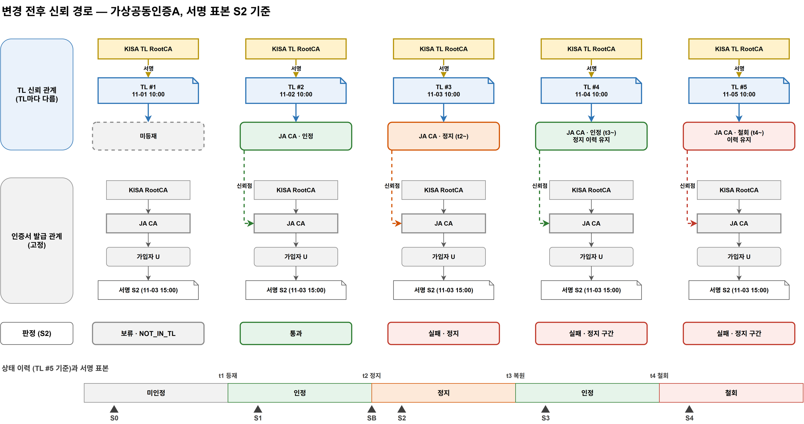

# 18. 변경 전후 신뢰 경로와 시간축 판정표

> 1차 설계 검토([16](16-설계-보완사항-조치목록.md))의 우선 작업 1번. D3 · D4+ · D7 · D9를 하나로 잇는다.
> **증명할 명제:** 인증서 체인은 그대로인데, **TL의 등재 · 상태와 이용환경이 가진 TL 버전**에 따라 같은 서명의 판정이 달라진다.
> **PoC 구현:** 웨일은 **크롬 확장**으로 우선 대체한다 ([21](21-시연-운영-절차.md) · [22](22-구현-작업-계획.md) W-10). 이 문서의 "웨일"은 브라우저 이용환경을 뜻한다.
> 도식: [`diagrams/krtl-trustpath.drawio`](diagrams/krtl-trustpath.drawio)

## 1. PoC 판정 규칙

| 규칙 | 내용 |
|---|---|
| **기준 시각** | 서명에 기록된 **서명 시각**. PoC는 TSA(타임스탬프)로 증명하지 않는다 |
| **시각 표기** | 한국 시간, ISO 8601 `+09:00` (예: `2026-11-03T10:00:00+09:00`). TL XML 내부는 표준에 따라 같은 시각을 UTC로 기록 |
| **경계 시각** | 서명 시각이 상태 효력 시각과 **같으면 새 상태**를 적용한다 (상태 시작 일시 기준) |
| **최초 인정 이전** | 서명 시각이 최초 인정 효력 시각보다 앞서면 **판단 보류** (`NOT_ACCREDITED_AT_TIME`) |
| **서명 시각 없음** | 판단 보류 (`NO_SIGNING_TIME`) |
| **소급 금지** | 상태 효력 시각 ≥ 그 상태를 처음 담은 TL의 발행 시각 |
| **그 밖의 조건** | 서명값 · 인증서 체인 · 폐지 상태는 정상이라고 전제한다 (판정표는 TL 요인만 본다) |

## 2. 고정 조건

| 항목 | 값 |
|---|---|
| 인증서 체인 (레벨 1 대표) | KISA RootCA → **가상공동인증A CA (JA-01)** → 가입자 U |
| 인증서 체인 (레벨 0 대표) | **가상간편인증A RootCA (SA-00)** → SA CA → 가입자 V |
| 신뢰앵커 | KISA TL RootCA |
| 검증 정책 | §1 규칙, 신뢰 분야 제한 없음 |
| 문서 | 같은 시험 문서 |

인증서 체인은 시연 내내 **바꾸지 않는다.** 바뀌는 것은 TL과 이용환경이 가진 TL 버전뿐이다. CA 키 교체로 체인 자체가 바뀌는 SC-02는 확장 사례로 둔다.

## 3. 시간축 — TL 버전과 상태 변경 (가상공동인증A CA 기준)

| TL | 발행 시각 | 변경 | 상태 효력 시각 | TL에 담긴 상태 이력 |
|---|---|---|---|---|
| **#1** | 2026-11-01T10:00+09:00 | 초기 — JA 미등재 | — | (JA 없음) |
| **#2** | 2026-11-02T10:00+09:00 | JA 등재 | t1 = 11-02T10:00 | 인정(t1~) |
| **#3** | 2026-11-03T10:00+09:00 | JA 정지 | t2 = 11-03T10:00 | 인정(t1~t2) · **정지(t2~)** |
| **#4** | 2026-11-04T10:00+09:00 | JA 복원 | t3 = 11-04T10:00 | 인정(t1~t2) · 정지(t2~t3) · **인정(t3~)** |
| **#5** | 2026-11-05T10:00+09:00 | JA 철회 | t4 = 11-05T10:00 | … · 인정(t3~t4) · **철회(t4~)** |

- PoC는 효력 시각을 발행 시각과 같게 둔다 (소급 금지 규칙을 만족하는 가장 단순한 형태).
- 날짜는 시험 데이터용 임의 값이다.

## 4. 서명 표본

| 표본 | 서명 시각 | 위치 |
|---|---|---|
| **S0** | 11-01T15:00+09:00 | 최초 인정(t1) 이전 |
| **S1** | 11-02T15:00+09:00 | 인정 구간 |
| **SB** | 11-03T10:00+09:00 | 정지 효력 시각과 **같음** (경계) |
| **S2** | 11-03T15:00+09:00 | 정지 구간 |
| **S3** | 11-04T15:00+09:00 | 복원 후 인정 구간 |
| **S4** | 11-05T15:00+09:00 | 철회 이후 |

모두 가입자 U(가상공동인증A 발급)가 같은 문서에 서명한 것이다. 서명 시각만 다르다.

## 5. 시간축 판정표 (핵심)

**행 = 서명 표본(시간축), 열 = 이용환경이 가진 TL 버전(변경 전후).** 칸: 판정 · 사유. 신뢰점은 TL #2 이후 모두 JA-01(레벨 1).

| 표본 \ TL | #1 (미등재) | #2 (등재) | #3 (정지) | #4 (복원) | #5 (철회) |
|---|---|---|---|---|---|
| **S0** 최초 인정 전 | 보류 · `NOT_IN_TL` | 보류 · `NOT_ACCREDITED_AT_TIME` | 보류 · `NOT_ACCREDITED_AT_TIME` | 보류 · `NOT_ACCREDITED_AT_TIME` | 보류 · `NOT_ACCREDITED_AT_TIME` |
| **S1** 인정 구간 | 보류 · `NOT_IN_TL` | **통과** | **통과** | **통과** | **통과** |
| **SB** 정지 경계 | 보류 · `NOT_IN_TL` | **통과** | 실패 · `SERVICE_SUSPENDED_AT_TIME` | 실패 · `SERVICE_SUSPENDED_AT_TIME` | 실패 · `SERVICE_SUSPENDED_AT_TIME` |
| **S2** 정지 구간 | 보류 · `NOT_IN_TL` | **통과** | 실패 · `SERVICE_SUSPENDED_AT_TIME` | 실패 · `SERVICE_SUSPENDED_AT_TIME` | 실패 · `SERVICE_SUSPENDED_AT_TIME` |
| **S3** 복원 후 | 보류 · `NOT_IN_TL` | **통과** | 실패 · `SERVICE_SUSPENDED_AT_TIME` | **통과** | **통과** |
| **S4** 철회 후 | 보류 · `NOT_IN_TL` | **통과** | 실패 · `SERVICE_SUSPENDED_AT_TIME` | **통과** | 실패 · `SERVICE_WITHDRAWN_AT_TIME` |

### 5.1 읽는 법

- **가로로 읽기 — 같은 서명, TL 변경 전후:**
  - S1은 TL #1에서 보류, #2부터 통과 → **TL 등재가 신뢰 경로를 만든다** (SC-01).
  - S2는 #2에서 통과, #3부터 실패 → **정지 정보가 담긴 TL을 받아야 판정이 바뀐다** (SC-03, SC-06).
  - S3은 #3에서 실패, #4에서 다시 통과 → **복원은 그 뒤 구간만 되살린다** (SC-04).
- **세로로 읽기 — 같은 TL, 서명 시각별:**
  - TL #5 열: S1 · S3 통과, SB · S2 · S4 실패, S0 보류 → **이력이 남아 있어 구간별로 판정한다** (SC-05).
  - 철회해도 철회 전 인정 구간(S1 · S3)의 서명은 통과로 남는다.
- **TL #2 열의 S2 · S4 통과**는 오류가 아니다. TL #2는 정지 · 철회를 모르는 버전이다. 이용환경이 낡은 TL을 쓰면 이렇게 된다 → 동기화의 필요성 (§7).

## 6. 변경 전후 신뢰 경로

도식(위)은 두 층으로 그린다.

| 층 | 내용 | 시연 중 |
|---|---|---|
| **아래층 — 인증서 발급 관계** | KISA RootCA → JA CA → 가입자 U → 서명 | 고정 (회색) |
| **위층 — TL이 주는 신뢰 관계** | KISA TL RootCA → TL #n → TL 신뢰점(JA CA)과 그 상태 | TL 버전마다 다름 |

| TL | 위층 신뢰 관계 | 결과 (S2 기준) |
|---|---|---|
| #1 | TL → JA 연결 **없음** | 경로 미성립 → 보류 |
| #2 | TL → JA **인정** | 경로 성립 → 통과 |
| #3 | TL → JA **정지 (t2~)** | 서명 시각에 정지 → 실패 |
| #4 | TL → JA **인정 (t3~), 정지 이력 유지** | S2는 정지 구간 → 실패 |
| #5 | TL → JA **철회 (t4~), 이력 유지** | S2는 정지 구간 → 실패 |

**TL의 변경은 인증서 발급 관계를 다시 만들지 않는다.** 위층의 연결과 상태만 바뀐다.

### 6.1 비교 화면 (M-08)

| 영역 | 표시 |
|---|---|
| 변경 조건 | 대상 사업자 · 서비스 · 신뢰점, 변경 상태 · 효력 시각, 발행 TL 버전 |
| 변경 전후 신뢰 경로 | 고정 인증서 체인 + TL 신뢰점 · 기준 시각의 상태, 경로가 성립 · 끊기는 지점 |
| 이용환경 결과 | 사용한 TL 버전, 서명 표본과 서명 시각, 판정 · 사유 |

## 7. 함께 보는 비교

### 7.1 신뢰점 레벨 비교

| 비교 | 레벨 1 (가상공동인증A) | 레벨 0 (가상간편인증A) |
|---|---|---|
| TL 신뢰점 | JA CA | SA RootCA |
| 정지 단위 | CA 하나 (JA만 정지, JB 영향 없음) | Root 전체 (그 아래 모든 CA의 서명이 함께 정지) |
| 같은 체계의 다른 CA | 각자 등재 · 각자 상태 | Root 하나로 묶임 |

### 7.2 동기화 비교 (SC-06)

| 상황 | 이용기관 시스템 | 웨일 브라우저 | 표본 S2 판정 |
|---|---|---|---|
| 한쪽만 갱신 | TL #3 | TL #2 | 이용기관 **실패** / 웨일 **통과** — 결과 차이는 체인이 아니라 TL 버전에서 생긴다 |
| 양쪽 갱신 후 | TL #3 | TL #3 | 둘 다 **실패** — 같은 서명 · 같은 TL · 같은 정책이면 같은 판정 |

### 7.3 TL 출처 · 무결성 (SC-08, 보조)

| 조작 | 이용환경 동작 | 표본 S4 판정 (보유 TL #5) |
|---|---|---|
| JA를 인정으로 고친 위조 TL #6 제공 | TL 서명 검증 실패 → 버리고 #5 유지 | 그대로 실패 |
| 이전 버전 TL #2 재게시 | 일련번호 역행 → 거부, #5 유지 | 그대로 실패 |
| 보유 TL #5의 NextUpdate 경과, 새 TL 없음 | #5를 버림 | 보류 · `NO_VALID_TL` |

## 8. 시험 기록 (최소 증거)

같은 **시험 실행 ID**로 다음을 묶는다: 변경 내용 · 효력 시각 → 발행 TL 버전 → 이용환경별 사용 TL 버전 → 표본별 신뢰점 · 판정 · 사유. 접속 기록은 전달 확인을 보조한다.

## 9. 관련 문서 반영

| 문서 | 반영 |
|---|---|
| [03 시나리오](03-이용-시나리오.md) | SC-01 · 03 · 04 · 05 · 06 기대 결과를 이 판정표로 맞춤, SC-11 핵심 제외, SC-08 보조 |
| [12 상태 · 이력](12-상태-이력-모델.md) | 경계 시각 · 최초 인정 이전 규칙 |
| [15 논리 모델](15-논리데이터모델-코드범위.md) | 사유 코드 `NOT_ACCREDITED_AT_TIME` · `NO_SIGNING_TIME`, 서명 시각 근거 |
| [17 TL 활용 가이드](17-이용기관-TL-활용-가이드.md) | 활용 지점 ③ 기준 시각, ⑤ PoC 미사용 |
