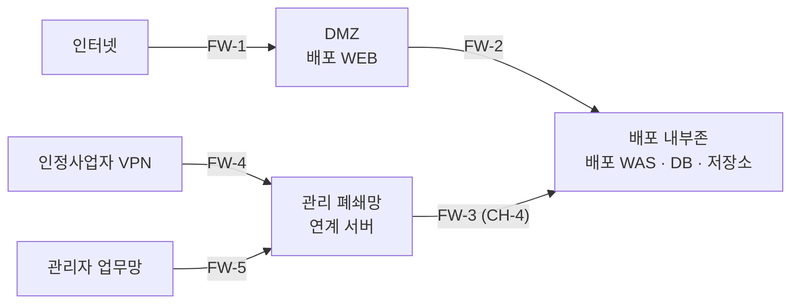
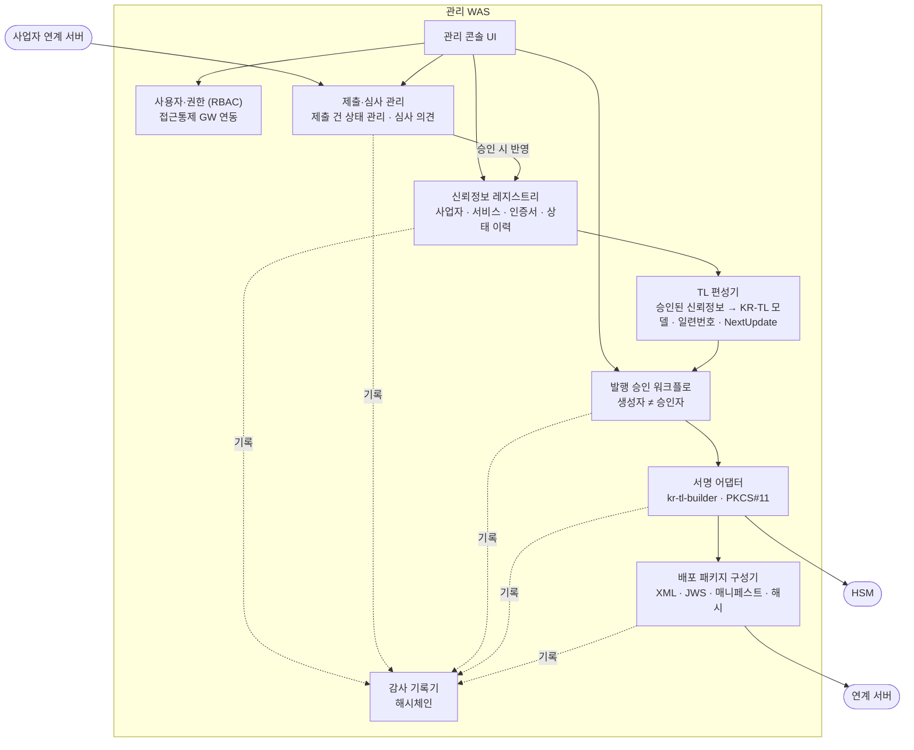
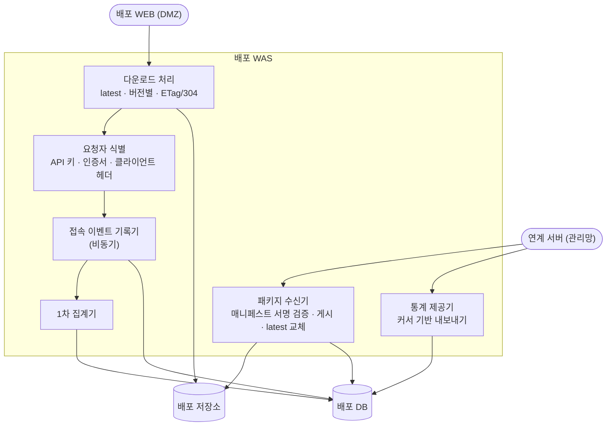

> **부록** — 인프라 상세 참고 자료. 개념 설계의 기준 문서는 [01 시스템 구성도](../01-시스템-구성도.md)이다. 채널 번호(CH-1~4)는 본문 인터페이스(IF-01~14)와 대응: CH-1=IF-11, CH-2=IF-03, CH-3=IF-01·02, CH-4=IF-08·09.

# 04. 시스템 구성 상세 (기본 설계)

> 근거: [01 설계 브리프](A-아키텍처-결정기록.md) AD-1 ~ AD-8, [02 시스템 구성도](C-망구성-상세.md)
> 이 문서는 **서버 구성 → 방화벽 정책 → 시스템별 내부 컴포넌트 → 데이터 배치 → 공통 인프라** 순으로 구성을 구체화한다.
> 포트 번호·제품명은 **예시**이며, 실제 값은 구축 환경에 맞춰 정한다.

## 1. 서버 구성 목록

| 구역 | 서버(논리) | 역할 | 소프트웨어 구성(안) | 비고 |
|---|---|---|---|---|
| DMZ | **배포 WEB** | TLS 종단, WAF·속도 제한, 배포 WAS로 리버스 프록시 | 웹서버(Nginx/Apache 등 기관 표준), WAF | DMZ의 유일한 서버. 데이터·키 보관 없음 |
| 배포 내부존 | **배포 WAS** | 다운로드 처리, 요청자 식별, 접속 이벤트 기록, 연계 API(CH-4 수신), 통계 제공 | Java 21, Spring Boot 3 | |
| 배포 내부존 | **배포 DB** | 배포 이력, 접속 이벤트, 1차 집계, (보류) 이용기관 등록 | RDBMS (기관 표준) | |
| 배포 내부존 | **배포 저장소** | 버전별 배포 패키지 사본 | 파일 스토리지 (WAS 로컬 디스크 또는 NAS) | 배포 WAS만 접근 |
| 관리 폐쇄망 · 연계 세그먼트 | VPN 게이트웨이 | 인정사업자 VPN 종단 | 기존 VPN 장비 | 기존 자산 활용 |
| 관리 폐쇄망 · 연계 세그먼트 | **사업자 연계 서버** | 제출 접수, 사업자 인증, 제출물 서명 검증, 인증서 자동 수집 | Java 21, Spring Boot 3 | VPN 구간에 노출되는 유일한 서버 |
| 관리 폐쇄망 · 연계 세그먼트 | **연계 서버** | 배포 패키지 반출, 배포 결과·통계 회수 (CH-4 유일 사용자) | Java 21, Spring Boot 3 (배치) | 배포 내부존으로 나가는 유일한 서버 |
| 관리 폐쇄망 · 코어 세그먼트 | **관리 WAS** | 사업자·서비스 관리, 심사, TL 편성·승인, 서명 요청, 패키지 구성, 관리 콘솔 | Java 21, Spring Boot 3, `kr-tl-builder`, EU DSS | |
| 관리 폐쇄망 · 코어 세그먼트 | **관리 DB** | 신뢰정보 원천 데이터, TL 버전, 사용자·권한 | RDBMS (기관 표준) | |
| 관리 폐쇄망 · 코어 세그먼트 | **HSM** | TL·매니페스트 서명키 생성·보관·서명 | 네트워크 HSM (PKCS#11) | 키 반출 불가 |
| 관리 폐쇄망 · 코어 세그먼트 | **감사로그 저장소** | 해시체인 감사 이벤트 | 별도 DB 또는 추가 전용(append-only) 스토리지 | 관리 WAS도 삭제·수정 권한 없음 |
| 관리 폐쇄망 · 통계 세그먼트 | **통계관리 서버** | 통계 적재·집계, 통계 조회 화면 | Java 21, Spring Boot 3 | |
| 관리 폐쇄망 · 통계 세그먼트 | **통계 DB** | 장기 통계 | RDBMS (기관 표준) | |
| 관리 폐쇄망 · 접근 세그먼트 | **접근통제 게이트웨이** | 관리자 인증(MFA), 접속 허용, 세션 기록 | 기관 보유 접근통제 솔루션 | CH-2 진입점 |
| 관리자 업무망 | 관리자 전용 단말 | 관리 콘솔·통계 화면 접속 | 망분리 단말 | |

> 서버는 **논리 단위**다. 물리 서버 수, 이중화(O-6) 여부는 구축 규모가 정해진 뒤 결정한다. 예를 들어 사업자 연계 서버와 연계 서버를 한 장비에 올릴 수 있으나, 방화벽 규칙은 논리 단위 그대로 적용한다.

### 1.1 관리 폐쇄망 내부 세그먼트 (권고)

관리 폐쇄망 안에서도 외부와 맞닿는 서버와 핵심 자산을 나눈다. 외부 연결 지점(VPN, CH-4)이 침해되더라도 HSM·관리 DB로 바로 넘어가지 못하게 하기 위해서다.

| 세그먼트 | 소속 | 외부와의 접점 |
|---|---|---|
| 연계 세그먼트 | VPN 게이트웨이, 사업자 연계 서버, 연계 서버 | CH-3(VPN), CH-4(배포 내부존) |
| 코어 세그먼트 | 관리 WAS, 관리 DB, HSM, 감사로그 | 없음 |
| 통계 세그먼트 | 통계관리 서버, 통계 DB | 없음 |
| 접근 세그먼트 | 접근통제 게이트웨이 | CH-2(관리자 업무망) |

## 2. 방화벽 정책

### 2.1 방화벽 위치

### 2.2 허용 규칙 (그 외 전부 차단)

방화벽은 상태 기반(stateful)으로 가정한다. 허용된 세션의 응답은 자동으로 통과하며, 아래 표는 **세션을 시작하는 방향**만 적는다.

| 규칙 | 방화벽 | 출발 | 도착 | 프로토콜/포트(예시) | 용도 | 채널 |
|---|---|---|---|---|---|---|
| R-01 | FW-1 | 인터넷(any) | 배포 WEB | TCP 443 (HTTPS) | TL 다운로드, 이용기관 API | CH-1 |
| R-02 | FW-2 | 배포 WEB | 배포 WAS | TCP 8443 (HTTPS) | 리버스 프록시 | CH-1 |
| R-03 | FW-3 | 연계 서버 | 배포 WAS | TCP 9443 (HTTPS, mTLS) | 패키지 반출, 배포 결과·통계 회수 | CH-4 |
| R-04 | FW-4 | 인정사업자 VPN 대역 | 사업자 연계 서버 | TCP 443 (HTTPS, mTLS) | 신뢰정보 제출·조회 | CH-3 |
| R-05 | FW-4 | 사업자 연계 서버 | 인정사업자 수집 엔드포인트 | TCP 443 (HTTPS) | 인증서 자동 수집 | CH-3 |
| R-06 | FW-5 | 관리자 전용 단말 | 접근통제 게이트웨이 | TCP 443 | 관리자 인증·접속 | CH-2 |
| R-07 | 내부 | 접근통제 게이트웨이 | 관리 WAS(콘솔), 통계관리 서버 | TCP 443 | 관리 콘솔, 통계 조회 | CH-2 |
| R-08 | 내부 | 사업자 연계 서버 | 관리 WAS | TCP 8443 | 제출 건 전달 | — |
| R-09 | 내부 | 관리 WAS | 연계 서버 | TCP 8443 | 서명된 패키지 등록 | — |
| R-10 | 내부 | 연계 서버 | 통계관리 서버 | TCP 8443 | 회수한 통계 적재 | — |
| R-11 | 내부 | 관리 WAS | HSM | HSM 벤더 포트 | 서명 요청 | — |
| R-12 | 내부 | 관리 WAS | 관리 DB, 감사로그 | DB 포트 | 데이터 저장 | — |

### 2.3 명시적 차단 (점검 항목)

| 차단 | 이유 |
|---|---|
| 배포 내부존·DMZ → 관리 폐쇄망 **전부** | AD-2·AD-8. 배포측 침해가 관리망으로 번지지 않게 함 |
| DMZ → 배포 DB·저장소 직접 접근 | DMZ에는 WEB만 둔다 (AD-4) |
| 인정사업자 VPN → 사업자 연계 서버 외 모든 관리망 서버 | 공격면을 연계 서버 하나로 한정 |
| 연계 세그먼트 → HSM·관리 DB 직접 접근 | 코어 자산은 관리 WAS를 통해서만 접근 |
| 관리자 단말 → 접근통제 게이트웨이 외 서버 직접 접속 | 모든 관리 행위를 세션 기록 대상에 포함 |
| 관리 폐쇄망 → 인터넷 | 폐쇄망 원칙. 업데이트·NTP는 내부 소스 사용 (§5) |

## 3. 시스템별 내부 컴포넌트 (C4 Level 3)

### 3.1 관리 WAS

| 컴포넌트 | 책임 | 비고 |
|---|---|---|
| 사용자·권한 | 역할 4종(운영자·심사자·서명승인자·감사자), 메뉴·기능 권한 | 인증은 접근통제 GW, 인가는 WAS |
| 신뢰정보 레지스트리 | TL에 실릴 원천 데이터. 상태 변경은 이력으로만 남김(덮어쓰기 금지) | ETSI TS 119 612 서비스 이력 구조와 대응 |
| 제출·심사 관리 | 사업자 제출과 자동 수집 결과를 심사 대기열로 관리 | 자동 수집 결과도 사람 승인 후 반영 |
| TL 편성기 | 레지스트리 스냅숏으로 TL 초안 생성, 직전 버전과 차이 표시 | |
| 발행 승인 워크플로 | 초안 → 검토 → 승인 → 서명. 생성자와 승인자가 같으면 거부 | |
| 서명 어댑터 | XML(XAdES)·JWS 서명, 매니페스트 서명. HSM 연결을 감춤 | 데모에서는 소프트 키스토어로 교체 |
| 배포 패키지 구성기 | 패키지 파일·매니페스트 생성 후 연계 서버에 등록 | |
| 감사 기록기 | 모든 변경·승인·서명 이벤트를 해시체인으로 기록 | |

### 3.2 사업자 연계 서버

| 컴포넌트 | 책임 |
|---|---|
| 사업자 인증 | mTLS 클라이언트 인증서로 사업자 식별, 등록된 사업자만 허용 |
| 제출 API | 신뢰정보 제출, 상태 변경 신고, 처리 결과 조회 |
| 제출물 검증 | 제출물 전자서명·형식 검증, 실패 시 즉시 반려 |
| 자동 수집기 | 주기적으로 사업자 엔드포인트 조회, 기준값과 차이 비교 → 변경 후보 생성 |
| 전달기 | 검증된 제출 건·변경 후보를 관리 WAS로 전달 (재시도·중복 방지) |

### 3.3 연계 서버 (CH-4 유일 사용자)

| 컴포넌트 | 책임 |
|---|---|
| 반출 대기열 | 관리 WAS가 등록한 패키지를 순서대로 보관 |
| 반출기 | 배포 WAS 연계 API로 push. 같은 버전 재전송은 멱등, 실패 시 재시도 |
| 배포 결과 확인 | 게시 성공 여부를 받아 관리 WAS에 반영 |
| 통계 회수기 | 커서 기반으로 접속 이벤트·집계를 pull해 통계관리 서버로 넘김 |

### 3.4 배포 WAS

| 컴포넌트 | 책임 | 비고 |
|---|---|---|
| 다운로드 처리 | 최신·버전별 파일 응답, `ETag`/`If-None-Match`로 304 응답 | |
| 요청자 식별 | 기관·클라이언트 유형·버전 식별 | 식별 정책(O-4)은 보류. 컴포넌트 자리만 둠 |
| 접속 이벤트 기록기 | 응답 경로를 막지 않도록 비동기 기록 | |
| 1차 집계기 | 시간 단위 집계 (기관·유형·버전·결과) | |
| 패키지 수신기 | **CH-4 수신 전용.** 사전 설치된 TL 서명 인증서로 매니페스트 검증 → 저장소 기록 → `latest` 원자적 교체 → 배포 이력 기록. 낮은 버전·검증 실패는 거부 | 배포측에 서명키 없음 |
| 통계 제공기 | 회수 요청에 커서 이후 데이터 응답. 회수가 확인된 구간만 삭제 대상 | |

> 연계 API(패키지 수신기·통계 제공기)는 R-03 포트로만 열고, 다운로드 처리는 R-02 포트로만 연다. **두 기능이 같은 WAS에 있어도 포트를 나눠** DMZ에서 연계 API에 닿지 못하게 한다.

### 3.5 통계관리 서버

| 컴포넌트 | 책임 |
|---|---|
| 적재기 | 연계 서버가 넘긴 이벤트·집계를 통계 DB에 저장 |
| 분석 집계 | 기관별 최종 수신 버전·시각, 클라이언트 유형·버전 분포, 일·월 추이 |
| 조회 화면 | CH-2로 접속한 관리자에게 제공 |

## 4. 데이터 배치

| 데이터 | 원천(authority) | 사본·파생 | 위치 |
|---|---|---|---|
| 사업자·서비스·인증서·상태 이력 | 관리 DB | TL에 포함되어 배포 | 코어 세그먼트 |
| 제출 건·심사 이력 | 관리 DB | — | 코어 세그먼트 |
| TL 버전·발행 승인 이력 | 관리 DB | — | 코어 세그먼트 |
| TL 서명키 | HSM | 없음 (반출 불가) | 코어 세그먼트 |
| 감사로그 | 감사로그 저장소 | — | 코어 세그먼트 |
| 서명된 배포 패키지 | 관리 WAS가 생성 | 배포 저장소 (사본) | 코어 → 배포 내부존 |
| 배포 이력 | 배포 DB | 관리 WAS에 결과 반영 | 배포 내부존 |
| 접속 이벤트 (원시) | 배포 DB (단기) | 통계 DB | 배포 내부존 → 통계 세그먼트 |
| 장기 통계 | 통계 DB | — | 통계 세그먼트 |
| TL 서명 인증서 (공개) | 관리 WAS | 배포 WAS 검증용·배포 패키지 | 양쪽 |

DMZ에는 어떤 데이터도 저장하지 않는다. 웹서버 접근로그만 남는다.

## 5. 공통 인프라 (구성 항목만, 세부는 구축 단계)

| 항목 | 내용 | 비고 |
|---|---|---|
| 시각 동기화 | TL 발행시각·NextUpdate·감사로그 시각의 기준. 관리 폐쇄망은 내부 NTP 사용 | 관리망→인터넷 차단 |
| 백업 | 관리 DB·감사로그·통계 DB는 폐쇄망 안에서 백업. HSM 키 백업은 HSM 벤더 절차 | O-6과 함께 결정 |
| 모니터링 | 망별 독립 모니터링. 배포측 상태를 관리망에서 보려면 CH-4 회수 데이터로 확인 | 배포→관리 경로를 만들지 않음 |
| 인증서 | 배포 WEB 서버 인증서(공인), CH-3·CH-4 mTLS 인증서(내부 CA), TL 서명 인증서 | 인증서 체계는 별도 정리 필요 |
| 소프트웨어 반입 | 폐쇄망 서버 패치·배포 파일은 반입 절차로 처리 | 운영 절차 단계 |

## 6. 이 문서에서 남은 항목

- 물리 서버 수·이중화·DR (O-6)
- 인증서 체계 (WEB 서버, mTLS, TL 서명 인증서의 발급 주체와 교체 주기)
- 포트·제품 확정 (구축 환경 조사 후)
