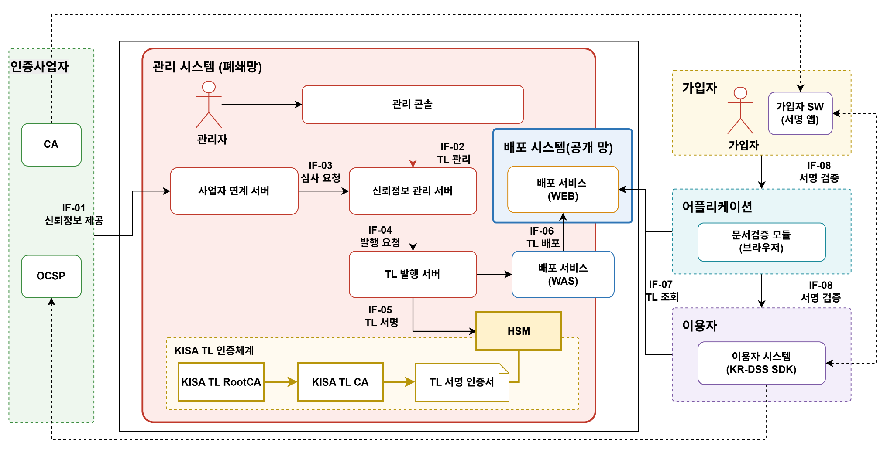

## 1 시스템 구성

### 1.1 시스템 구성

한국 신뢰서비스 목록(Korea Trust List, KR-TL) 관리체계는 국내 신뢰서비스의 인정 정보를 관리하고, 이를 신뢰목록으로 발행·배포하는 체계다. 인증사업자가 제출한 정보를 심사하여 서비스의 등재 여부와 인정 상태를 확정하고, 변경 이력을 관리한다. 사용자와 이용기관은 배포된 KR-TL을 통해 전자서명 검증에 필요한 신뢰서비스의 인정 상태를 확인한다.

관리 시스템은 폐쇄망에서 신뢰정보의 접수·심사·발행을 수행한다. 배포 시스템은 서명된 KR-TL을 공개망에 제공하며, 브라우저의 문서검증 모듈과 이용기관의 서버 검증모듈은 이를 조회하여 사용한다.

KR-TL의 서명은 KISA TL 인증체계를 기반으로 한다. TL 발행 서버는 HSM에 보관된 서명키로 TL을 서명하며, 검증모듈은 사전에 신뢰한 KISA TL RootCA를 기준으로 TL의 인증 체인과 서명을 검증한다.

그림 1 시스템 구성도

#### 1.1.1 구성 요소

| 영역 | 구성 요소 | 역할 |
| --- | --- | --- |
| 인증사업자 | CA | 가입자 인증서를 발급하고 신뢰 서비스 정보를 제공한다. |
| 인증사업자 | OCSP | 인증서의 폐지 상태를 제공한다. |
| 관리 시스템 | 관리 콘솔 | 신뢰정보, 심사 결과, 서비스 상태와 TL 발행을 관리한다. |
| 관리 시스템 | 사업자 연계 서버 | 제출 정보를 접수하고 심사를 요청한다. |
| 관리 시스템 | 신뢰정보 관리 서버 | 사업자·서비스 정보, 심사 결과와 상태 이력을 관리하고 TL 발행을 요청한다. |
| 관리 시스템 | TL 발행 서버 | 확정된 정보로 TL을 구성하고 서명된 발행본을 생성한다. |
| 관리 시스템 | HSM | TL 서명키를 보호하고 서명을 수행한다. |
| KISA TL 인증체계 | KISA TL RootCA · KISA TL CA · TL 서명 인증서 | TL 서명 인증서의 인증 체인을 구성한다. KISA TL RootCA는 TL 검증의 신뢰앵커다. |
| 배포 서비스 | WAS | 관리 영역에서 발행본을 받아 보관하고 배포 WEB에 전달한다. |
| 배포 시스템 | WEB | 공개망에서 KR-TL 조회와 다운로드를 제공한다. |
| 가입자 | 가입자 SW(서명 앱) | 가입자의 인증서와 서명키로 전자서명을 생성한다. |
| 어플리케이션 | 문서검증 모듈(브라우저) | 사용자가 전달받은 전자서명을 브라우저에서 검증한다. |
| 이용기관 | 이용자 시스템(KR-DSS SDK) | 이용기관 서비스에서 전자서명을 생성하거나 전달받은 서명을 서버에서 검증한다. |

#### 1.1.2 인터페이스

**1) 신뢰정보 제공(IF-01)**

인증사업자는 가입자 인증서를 발급하고, 자신의 신뢰 서비스에 대한 정보를 관리 시스템에 제출한다. 사업자 연계 서버는 사업자·서비스 정보, 인증서·공개키 정보와 변경 신청을 접수한다.

**2) 신뢰목록 관리(IF-02)**

관리자는 관리 콘솔에서 신뢰정보와 심사 결과를 확인하고, 등재 정보와 서비스 상태를 관리한다. 확정된 내용은 신뢰정보 관리 서버에 반영한다.

**3) 심사 요청(IF-03)**

사업자 연계 서버는 접수한 신뢰정보를 신뢰정보 관리 서버에 전달하여 심사를 요청한다. 제출 정보는 심사·보완을 거쳐 등재 여부와 적용 상태가 확정된다.

**4) 발행 요청(IF-04)**

신뢰정보 관리 서버는 확정된 사업자·서비스 정보와 상태 이력을 TL 발행 서버에 전달하고 발행을 요청한다. TL 발행 서버는 이를 바탕으로 새로운 발행본을 구성한다.

**5) TL 서명(IF-05)**

TL 발행 서버는 HSM에 TL 서명을 요청한다. HSM은 보호된 서명키로 서명을 수행하고, TL 발행 서버는 서명된 발행본을 배포 서비스(WAS)에 전달한다.

**6) TL 배포(IF-06)**

배포 서비스(WAS)는 서명된 TL 발행본을 배포 서비스(WEB)에 전달한다. 배포 WEB은 외부에서 조회·다운로드할 수 있도록 발행본을 제공한다.

**7) TL 조회(IF-07)**

브라우저의 문서검증 모듈과 이용기관의 서버 검증모듈은 배포 WEB에서 KR-TL을 조회한다. 수신한 TL의 인증 체인·서명·사용 기한을 확인한 후, 등재 서비스와 상태 정보를 서명 검증에 활용한다.

**8) 서명 검증(IF-08)**

서명 검증은 사용자와 이용기관 양쪽에서 수행할 수 있다.

- 이용기관 검증: 사용자가 서명 앱으로 서명한 내용을 이용기관 서비스에 전달하면, 이용기관은 서버 검증모듈로 서명을 검증한다.
- 사용자 검증: 이용기관이 서명한 내용을 사용자에게 전달하면, 사용자는 브라우저의 문서검증 모듈로 서명을 검증한다.

두 검증모듈은 KR-TL을 이용하여 서명자의 인증 체인에 연결된 신뢰 서비스와 해당 시각의 인정 상태를 확인한다.

### 1.2 관리 시스템

신뢰목록 관리 시스템은 인증사업자가 제출한 신뢰정보를 접수하고, 인정심사 결과에 따라 서비스의 등재 정보와 상태 이력을 관리한다. 확정된 정보는 KISA의 전자서명이 포함된 KR-TL로 발행하여 배포 시스템에 전달한다.

관리자는 폐쇄망의 관리 콘솔에서 접수·심사·상태 변경·발행 업무를 처리한다. 시스템은 각 처리 단계의 담당자, 처리 시각과 변경 사유를 기록한다.

#### 1.2.1 시스템 기능

| 기능 | 주요 내용 |
| --- | --- |
| 사업자 관리 | 사업자 식별 정보, 담당자와 제출 권한을 관리한다. |
| 서비스 관리 | 서비스 유형, 인증서·공개키와 관련 정보를 관리한다. |
| 접수 관리 | 신규 등재, 정보 변경, 인증서 갱신과 상태 변경 신청을 접수한다. |
| 심사 관리 | 제출 자료, 보완 요청과 심사 결과를 관리한다. |
| 상태 관리 | 서비스의 인정·정지·철회 상태와 효력 시각을 관리한다. |
| 이력 관리 | 서비스 정보, 인증서와 상태의 변경 이력을 보존한다. |
| TL 발행 | 확정된 신뢰정보로 TL을 구성하고 일련번호·발행 시각·다음 발행 시기를 설정한다. |
| TL 서명 | HSM으로 TL을 서명하고 서명된 발행본을 보관한다. |
| 배포 연계 | 서명된 발행본을 배포 서비스에 전달하고 처리 결과를 확인한다. |
| 권한·감사 | 담당자별 처리 권한과 주요 작업 기록을 관리한다. |

#### 1.2.2 관리 절차

관리 절차는 신뢰정보 접수 → 심사 → 등재·상태 확정 → TL 발행·서명 → 배포 전달 순서로 진행한다. 신규 등재와 기존 정보의 변경 모두 심사·확정된 내용을 발행본에 반영한다.

신뢰목록 관리 절차

**1) 신뢰정보 접수**

인증사업자가 사업자·서비스 정보와 신청 자료를 제출한다. 시스템은 필수 항목과 제출 형식을 확인하고 심사 대상으로 등록한다.

**2) 심사**

관리자는 제출 정보와 근거 자료를 검토한다. 보완이 필요하면 추가 자료를 요청하고 다시 심사한다. 반려된 신청은 사유를 통보하며 TL에 반영하지 않는다.

**3) 등재·상태 확정**

심사 결과에 따라 서비스의 등재 여부, 인정 상태와 효력 시각을 확정한다. 접수·보완·반려 등 신청 처리 상태는 TL에 등재하는 서비스 상태와 구분한다.

**4) 신뢰정보·이력 반영**

확정된 정보를 관리 시스템에 반영한다. 기존 정보가 변경되면 이전 인증서·공개키와 상태 이력을 보존하여 과거 시점의 검증에 사용할 수 있도록 한다.

**5) TL 발행·서명**

TL 발행 서버는 확정된 정보로 발행본을 구성하고 HSM에 서명을 요청한다. 서명이 완료된 TL은 일련번호와 함께 보관한다.

**6) 배포 전달**

서명된 발행본을 배포 서비스(WAS)에 전달하고 처리 결과를 확인한다. 전달에 실패하면 같은 일련번호의 발행본으로 재시도하며, 외부 제공과 이용환경의 동기화는 배포 시스템에서 이어진다.
