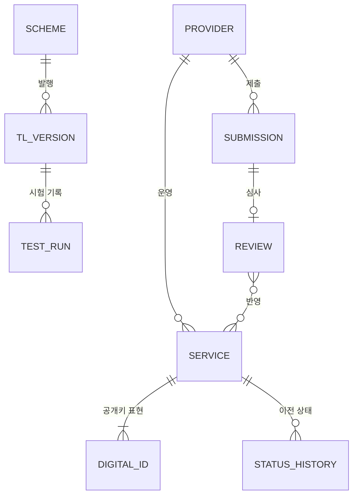

# 15. 논리 데이터 모델과 코드 변경 범위 (D3-6 · D3-7)

> 자료 분류: 기존 상세 설계·검토 자료. 현재 PoC 구현 범위는 [확정 범위](../scope.md)를 우선한다. 고정 시나리오·HSM·별도 WEB 등은 현재 필수 개발로 간주하지 않는다.

> D3의 마지막 단계. 관리 시스템 · 배포 시스템 · 이용기관이 갖는 데이터를 논리 모델로 정리하고, 검증 결과와 접속 기록 형식을 정한 뒤, 지금까지의 설계를 코드에 반영할 범위를 정한다.
> 저장 방식: TL 원천과 발행본은 **폴더**(07 §8), 그 밖의 운영 데이터(제출 건 · 시험 기록)는 각 시스템 내부 저장소(PoC: H2). 구성도에는 그리지 않는다.

## 1. 관리 시스템 논리 데이터 모델

| 개체 | 주요 속성 | 저장 | 대응 |
|---|---|---|---|
| **SCHEME** 발행 설정 | 운영자, 체계 이름, TSL 유형, 관할, 이력 보존 65535, NextUpdate 7일, 마지막 일련번호 | `krtl/scheme.json` | 14 §3.1 |
| **PROVIDER** 사업자 | ID, 이름 · 상호, 주소 · URI, 인정 정보, 신뢰점 레벨 | `krtl/registry/<ID>/provider.json` | 14 §3.2 |
| **SERVICE** 서비스 | ID, 유형, 이름, 신뢰 분야, 레벨(CA), 현재 상태 · 효력 시각, 정지 사유 | `…/<서비스>/service.json` | 14 §3.4 |
| **DIGITAL_ID** 디지털 ID | 인증서 파일, SKI (같은 공개키만) | `…/<서비스>/cert.pem` | 12 §2.3 |
| **STATUS_HISTORY** 상태 이력 | 상태, 시작 시각, 유형 · 이름 · SKI, 사유 — 최신순, 삭제 없음 | `service.json` `history[]` | 12 §2.1 |
| **SUBMISSION** 제출 건 | 접수 번호, 사업자, 유형, 제출 내용(JSON), 형식 확인 결과, 접수 시각, 처리 상태 | 내부 저장소 | 06 IF-01 · IF-03 |
| **REVIEW** 심사 | 결정(승인 · 반려), 의견, 심사자, 시각 | 내부 저장소 | 02 M-04 |
| **TL_VERSION** TL 버전 | 일련번호, 발행 일시, NextUpdate, 직전 대비 차이, 스냅숏 참조 | `krtl/published/<seq>/` | 10 §7 |
| **TEST_RUN** 시험 기록 | 시험 실행 ID, 변경 내용 · 효력 시각, 발행 TL 버전, 이용환경별 사용 TL 버전, 표본별 신뢰점 · 판정 · 사유 | 내부 저장소 | 18 §8 |

## 2. 배포 시스템 데이터

| 개체 | 주요 속성 |
|---|---|
| 게시 버전 | 일련번호, 발행 일시, NextUpdate, 파일 해시, 게시 시각, 최신 여부 |
| **접속 기록 (D-09)** | 아래 §4.2 |

## 3. 이용기관 데이터

| 개체 | 주요 속성 | 저장 |
|---|---|---|
| 신뢰앵커 | KISA TL RootCA 인증서 | `krtl-client/trust-anchor/` |
| TL 보유본 | 서명된 TL, 일련번호, 발행 일시, NextUpdate, 검증 시각 | `krtl-client/cache/` |
| **신뢰 색인** | SKI → { TSP, 서비스 ID, 유형, 신뢰 분야, 레벨, 현재 상태, 상태 이력 } | 메모리 (TL에서 매번 생성) |
| **검증 결과 (D-11)** | 아래 §4.1 | 이용기관 |

## 4. 형식 (D3-6)

### 4.1 검증 결과 (D-11)

판정은 기존 `kr-dss-api`의 `VerificationStatus`(ETSI EN 319 102-1의 세 가지 판정)를 따른다.

| 항목 | 내용 |
|---|---|
| `indication` | `TOTAL_PASSED` · `TOTAL_FAILED` · `INDETERMINATE` |
| `reason` | 사유 코드 (아래 표) |
| `signer` | 서명자 인증서 주체 · 일련번호 |
| `trustPoint` | 신뢰점 — TSP, 서비스 ID, 신뢰점 레벨 |
| `signingTime` | 서명에 기록된 서명 시각 (KST). PoC는 TSA로 증명하지 않음 |
| `serviceStatusAtTime` | 서명 시각의 서비스 상태 (상태 이력 조회 결과) |
| `revocation` | OCSP 결과 |
| `tl` | 사용한 TL 일련번호 · 발행 일시 |
| `validatedAt` | 검증 시각 |

| 사유 코드 (안) | 판정 | 상황 |
|---|---|---|
| `OK` | TOTAL_PASSED | 모두 정상 |
| `SIGNATURE_INVALID` | TOTAL_FAILED | 서명값 · 문서 무결성 불일치 |
| `CERT_REVOKED` | TOTAL_FAILED | 서명자 인증서 폐지 (OCSP) |
| `SERVICE_SUSPENDED_AT_TIME` | TOTAL_FAILED | 서명 시각에 서비스 정지 |
| `SERVICE_WITHDRAWN_AT_TIME` | TOTAL_FAILED | 서명 시각에 서비스 철회 |
| `NOT_IN_TL` | INDETERMINATE | 체인이 TL 신뢰점에 닿지 않음 |
| `NO_VALID_TL` | INDETERMINATE | 유효한 TL 없음 (기한 경과 등) |
| `REVOCATION_UNAVAILABLE` | INDETERMINATE | OCSP 응답을 받지 못함 |
| `NOT_ACCREDITED_AT_TIME` | INDETERMINATE | 서명 시각이 최초 인정 이전 |
| `NO_SIGNING_TIME` | INDETERMINATE | 서명 시각 없음 |

- 사유 코드와 EN 319 102-1 하위 판정(sub-indication)의 대응은 D7에서 정리한다.

### 4.2 접속 기록 (D-09)

| 항목 | 내용 |
|---|---|
| `time` | 요청 시각 |
| `client` | 클라이언트 유형 · 버전 (`X-KRTL-Client`, 예: `sdk/1.0`, `whale/4.x`) |
| `org` | 이용기관 식별자 (식별 방식은 향후 결정 — 없으면 비움) |
| `request` | 요청 대상 (`latest` · 일련번호 · `meta`), 보유본 ETag |
| `result` | `200` (새 TL 전달) · `304` (변경 없음) · 오류 |
| `servedSeq` | 전달한 TL 일련번호 |
| `source` | 출발지 (마스킹 또는 해시) |
| 보관 | PoC 값: 90일 (임의) |

## 5. 코드 변경 범위 (D3-7)

설계 결과를 코드에 반영할 범위다. 실제 구현은 D10 구현 설계에서 작업 단위로 나눈다.

| 모듈 | 현재 | 바꿀 것 |
|---|---|---|
| `kr-tl-model` | 서비스마다 현재 상태 1개 + 인증서 1장, 상태 `GRANTED/WITHDRAWN/SUSPENDED` | EU TL 구조로 확장: 발행 정보 전 항목, TSP 정보 · 인정 정보, 서비스 유형 URI, **디지털 ID 여러 장(같은 키)**, **서비스 이력**, 상태 `accredited/suspended/withdrawn/setbynationallaw`, 추가 서비스 정보(신뢰 분야 · 레벨 · 정지 사유) |
| `kr-tl-builder` | JWS 서명, XML 직렬화(서명 없음), TSL 버전 = 일련번호 | **XML + XAdES 서명으로 단일화**, JWS 출력 제거, TSL 버전 "6" 고정, 일련번호 · NextUpdate 규칙, `registry/` 폴더 → TL 편성, 서명 인증서 체인 수록 |
| `kr-tl-client` | 인터페이스만 | 수신(ETag/304), XAdES 서명을 `trust-anchor/`까지 검증, 일련번호 역행 거부, 기한 지난 TL 버림, 보유본 저장, **신뢰 색인** 생성 |
| `kr-dss-trust` (`TrustServiceRegistry`) | 현재 상태만으로 판정 | 신뢰 색인 사용, **서명 시각 기준 상태 판정**, 신뢰점 레벨 처리, 사유 코드 · 사용 TL 일련번호 기록. Attestation 관련 부분은 이번 범위 밖 |
| `kr-dss-api` | `VerificationStatus` 3분류 | 검증 결과 형식(§4.1) 추가 |
| `tools/krdss-cli` | 한 줄 체인 · `.crt/.key` 출력 | Tree 구축(`pki-build.json`), OCSP · TSA · TL 서명 EKU 프로파일, 폴더 · `meta.json` 출력, 가입자 정책 OID (14 §5) |
| `poc-kisa-tl` | 하드코딩 화면 · API 2개 | 관리 시스템 역할: 사업자 연계(IF-01), 입력 확정, 상태 변경(소급 금지), TL 편성 · 서명 · 반출(IF-06), 결과 비교 화면, 시험 기록. **로그인 · 승인 분리 · 감사는 핵심 범위 밖** |
| `poc-krtl-dist` (신규) | 없음 | 배포: 서명된 TL 수신 · 검증 · 게시, TL 제공(ETag/304), 접속 기록, 수신 현황 |
| `poc-tsp-sim` | CA · RA · OCSP | 사업자 4곳 체계, 가입자 개인 · 법인 발급 화면, 서명 시각이 다른 서명 표본, TL 제출(IF-01). TSA는 PoC 범위 밖 |
| `poc-relying-party` | Mode1 검증 | `kr-tl-client` 연동, 검증 결과에 사용 TL 일련번호 표시 |

## 6. D3 완료 정리

| 작업 | 문서 | 상태 |
|---|---|---|
| TL 구조 (EU 기준) | [10](../../../common/kr-tl/10-TL-구조.md) · [11](../../../../research/trust-services/11-신뢰서비스-유형-조사.md) | ✅ |
| 상태 · 이력 모델 | [12](../../../common/kr-tl/12-상태-이력-모델.md) | ✅ |
| TL 버전 모델 | [10](../../../common/kr-tl/10-TL-구조.md) §7 | ✅ |
| 단계별 데이터 변환 | [13](../../../common/kr-tl/13-데이터-변환-설계.md) | ✅ |
| 메타데이터 · 실제 데이터 | [14](14-메타데이터-실제데이터.md) | ✅ |
| 논리 데이터 모델 · 형식 · 코드 범위 | 이 문서 | ✅ |

남은 향후 결정: 오래된 서명 판정(PQC 연계), 이용기관 식별 방식, URI 주소. 다음 설계 단계는 **D7 이용기관 검증 설계**다.
