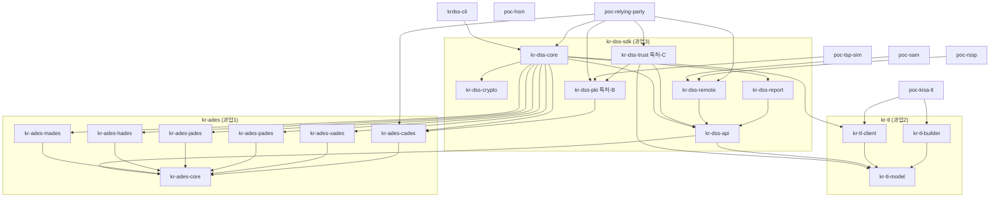

# KR-DSS 프로젝트 구조 명세서

> 본 문서는 KR-DSS 저장소의 **모듈 구조·책임·의존 관계**를 명세한다.
> 작업 분담(1 에이전트 = 1 모듈)과 신규 참여자의 온보딩 기준 문서로 사용한다.
> 작업 지침은 [AGENTS.md](../../AGENTS.md), 사업 배경은 [README.md](../../README.md) 참조.

- **최종 갱신 기준**: `main` 통합 브랜치 + `feat/claude-pki`(가상 인정사업자 CA/RA/OCSP 반영)
- **모듈 수**: 25개 서브프로젝트 · **Java 소스 154** (테스트 26 포함)

---

## 1. 개요

| 항목 | 값 |
| --- | --- |
| 언어 / 런타임 | Java 21 (Gradle toolchain 자동 프로비저닝) |
| 빌드 | Gradle 8.10.2 멀티모듈 (`build-logic` 컨벤션 플러그인) |
| Base 패키지 | `com.electcerti.krdss.*` |
| 서명 엔진 기반 | EU DSS 6.1, BouncyCastle 1.78.1 (`bcprov`/`bcpkix`) |
| PoC 프레임워크 | Spring Boot 3.3.2 |
| 의존성 관리 | `gradle/libs.versions.toml` 버전 카탈로그 단일 관리 |

**핵심 원칙**: 의존 방향은 항상 **상위(오케스트레이션·PoC) → 하위(api/core)**. 역방향 의존 금지.

---

## 2. 전체 모듈 지도

```
kr-dss/
├── kr-ades/                    [과업1] 전자서명 규격 — Core + 6종 포맷 어댑터
│   ├── kr-ades-core            공통 데이터 모델·레벨·패키징
│   ├── kr-ades-cades           CMS 어댑터 + 특허-A 서명 결속부 + WebAuthn CMS
│   ├── kr-ades-xades           XML  어댑터
│   ├── kr-ades-pades           PDF  어댑터
│   ├── kr-ades-jades           JSON 어댑터
│   ├── kr-ades-hades           HWP  어댑터
│   └── kr-ades-mades           Markdown 어댑터
│
├── kr-tl/                      [과업2] 신뢰목록(Trust List)
│   ├── kr-tl-model             KR-TrustList 스키마 모델
│   ├── kr-tl-builder           TL 생성·전자서명
│   └── kr-tl-client            TL 수집·동기화
│
├── kr-dss-sdk/                 [과업3] 통합 SDK + 특허 확장
│   ├── kr-dss-api              공통 계약(Service·DTO·상태)
│   ├── kr-dss-crypto           암호 프리미티브
│   ├── kr-dss-core             구현부 — 검증 라우터(A/B/C 종합)·원격서명 코디네이터
│   ├── kr-dss-report           ETSI 검증 보고서
│   ├── kr-dss-pki              [특허-B] 인증서 발급 인프라 + RFC 6960 OCSP 응답부
│   ├── kr-dss-trust            [특허-C] 통합 신뢰목록 + HSM Attestation
│   └── kr-dss-remote           원격전자서명 클라이언트 (CSC v2 / EN 419 241)
│
├── poc/                        전 과정 실증 테스트베드 (Spring Boot)
│   ├── poc-tsp-sim             가상 인정사업자 — CA/RA/OCSP        (:8082)
│   ├── poc-kisa-tl             KISA 신뢰목록 서버                 (:8081)
│   ├── poc-relying-party       이용사 서비스(전자서명·검증 UI)     (:8080)
│   ├── poc-rssp                원격서명 서비스 제공자(RSSP)         (:8090)
│   ├── poc-sam                 서명활성화모듈(SAM)                 (:8091)
│   └── poc-hsm                 소프트 HSM                          (:8092)
│
├── tools/krdss-cli             CLI (인증서 체인·p12 발급 등)
├── build-logic/                공통 빌드 컨벤션 플러그인
└── gradle/libs.versions.toml   의존성 버전 카탈로그
```

---

## 3. 모듈 의존 그래프



**허브 모듈**: `kr-dss-core`는 6종 어댑터·검증 라우터·원격서명을 모아 이용사 PoC에 제공한다.
`kr-dss-trust`(특허-C)만이 유일하게 `kr-dss-pki`(특허-B)에 의존하여 A/B/C를 연계한다.

---

## 4. 과업별 상세

### 4.1 과업1 · KR-AdES — 전자서명 규격 (`kr-ades/`)

Core 공통모델을 6종 포맷 프로파일이 상속하는 구조. 레벨 B/T/LT/LTA, 패키징 Enveloped/Enveloping/Detached/ASiC.

| 모듈 | 의존 | 주요 타입 |
| --- | --- | --- |
| **kr-ades-core** | — | `KrAdesCore`, `KrAdesFormat`, `KrAdesLevel`, `PackagingType`, `SignatureProfileAdapter` |
| **kr-ades-cades** | core | `CAdesProfileAdapter`, `KrAdesOids` · `bind/`(`SignatureBindingService`, `SignedAttrsBuilder`/`Parser`, `HashSuite`) · `container/`(`WebAuthnCmsAssembler`, `WebAuthnCmsSignedData`, `WebAuthnAssertionAttr`) |
| kr-ades-xades/pades/jades/hades/mades | core | 각 `*ProfileAdapter` (골격) |

> `kr-ades-cades`가 최다(14파일) — **특허-A 서명 결속부**와 WebAuthn CMS 결속을 담당.

### 4.2 과업2 · KR-TL — 신뢰목록 (`kr-tl/`)

ETSI TS 119 612 골격 + 국내 인정제도 확장. 운영 5단계(제출→수집·검토→생성·서명→갱신→검증).

| 모듈 | 의존 | 주요 타입 |
| --- | --- | --- |
| **kr-tl-model** | — | `KrTrustList` (SchemeInformation / TSPList / ServiceInformation) |
| **kr-tl-builder** | model | `KrTrustListBuilder` |
| **kr-tl-client** | model | `KrTrustListClient` |

> 3모듈 모두 골격 단계(각 1파일).

### 4.3 과업3 · KR-DSS SDK (`kr-dss-sdk/`)

**공통 API 4모듈** — 생성·추출·검증·신뢰연동 + ETSI 검증보고서.

| 모듈 | 의존 | 주요 타입 |
| --- | --- | --- |
| **kr-dss-api** | ades-core, tl-model | `KrDssService`, `Dtos`, `TrustListEvaluator`, `VerificationStatus` |
| **kr-dss-crypto** | — | `CryptoService` |
| **kr-dss-report** | api | `ReportGenerator`, `ReportType` |
| **kr-dss-core** | api·crypto·report·tl-client·6종 어댑터 | `KrDssServiceImpl` · `verify/`(`VerificationRouter`, `HsmVerificationPath`, `WebAuthnVerificationPath`, `CertPolicyResolver`, `WebAuthnCredentialStore`) · `remote/`(`RemoteSignCoordinator`, `RemoteSignVerifier`, `RemoteSigner`) |

**특허-B · kr-dss-pki** — WebAuthn 기반 인증서 발급 인프라 (의존: `kr-ades-cades`)

- 발급/등록: `CertificateAuthority`(발급·`fromKeyStore`·**AIA/CDP 삽입** `withEndpoints`), `RegistrationAuthority`, `RegistrationBindingService`, `MultiRaCertificateService`
- 생명주기: `CertificateLifecycleManager`, `CertificateStatus`, `IssuedCertificate`, `RenewalOutcome`, `RegistrationResult`
- HSM: `HsmCertificateIssuer`, `HsmAttestation(+Verifier/Result)`, `HsmDeviceRegistry`, `HsmGrade`, `HsmIssuedCertificate`
- 메타/등급: `AuthenticatorMetadataRegistry`(+InMemory), `AuthenticatorGrade`, `KrPkiOids`
- **`ocsp/`** (신규): `OcspResponder`(RFC 6960), `OcspStatusSource`, `OcspCertStatus`

**특허-C · kr-dss-trust** — 통합 신뢰목록 + HSM Attestation (의존: `kr-tl-model`, `kr-dss-api`, `kr-dss-pki`)

- 통합 TL 코어(C-1): `KrIntegratedTrustList`, `IntegratedTrustEvaluator`, `IntegratedTrustVerifier`, `TrustServiceRegistry`, `TrustPolicy`, `PolicyAutoUpdater`
- 장치/인증기 신뢰: `DeviceTrustList`, `HsmTrustEntry`, `AuthenticatorTrustEntry`, `TrustListHsmRegistry`, `TrustListAuthenticatorRegistry`
- HSM Attestation(C-2) **`hsm/`**: `HsmAttestationGenerator`/`Verifier`/`Codec`, `HsmAttestationBridge`(B-4 브리지), `HsmKeyGenStatement`, `HsmSecurityLevel`, `HsmAttestationPolicy`

**원격서명 · kr-dss-remote** — CSC v2 / EN 419 241 (의존: `kr-dss-api`)

- `RemoteSignClient`, `CscModels`, `SignatureActivationData`, `Jws`, `Totp`

### 4.4 PoC 테스트베드 (`poc/`)

전 과정 실증. 각 서비스는 독립 Spring Boot 애플리케이션.

| 모듈 | 포트 | 역할 | 의존 |
| --- | --- | --- | --- |
| **poc-tsp-sim** | 8082 | **가상 인정사업자 CA/RA/OCSP** | pki |
| **poc-kisa-tl** | 8081 | KISA 신뢰목록 서버 | tl-builder, tl-client |
| **poc-relying-party** | 8080 | 이용사 서비스(서명·검증 UI) | core, remote, cades, pki, trust |
| **poc-rssp** | 8090 | 원격서명 서비스 제공자 | remote |
| **poc-sam** | 8091 | 서명활성화모듈 | remote |
| **poc-hsm** | 8092 | 소프트 HSM | — |

**poc-tsp-sim 엔드포인트 (신규)**
- **CA**: `GET /ca/certificate`·`/chain`·`/certs` — CA 인증서·체인·발급 대장
- **RA**: `POST /ra/enroll`(서버 키생성) · `POST /ra/enroll-csr`(PKCS#10 CSR)
- **OCSP**: `POST /ocsp`(RFC 6960) · `POST /ocsp/admin/{revoke,suspend,resume}` · `GET /ocsp/admin/status`
- 배선: `TspPkiConfig`(joint-ca.p12 로드) → `TspCaService`(발급·생명주기·`OcspStatusSource`) + `OcspResponder`

**poc-relying-party 주요 구성**
- `local/` — 특허-A Mode 1 WebAuthn 로컬 서명(`Mode1LocalSignService`, `Mode1WebAuthnController`, `WebAuthnDemoCa`)
- `pki/` — 특허-B Multi-RA 데모(`MultiRaRegistrationService`, `PatentBController`)
- `trust/` — 특허-C 신뢰목록 데모(`DemoTrustListConfig`, `TrustDemoController`)
- `RpRemoteSignController` — 원격서명 연동

**원격서명 데모 체인**: `poc-relying-party` → `poc-rssp` → `poc-sam` → `poc-hsm`

### 4.5 Tools (`tools/krdss-cli`)

`KrDssCli`, `CertCommand` — PKI 체인 구성(New-KISA RootCA → 공동인증CA)·PKCS#12 발급. 의존: `kr-dss-core`.

---

## 5. 빌드 · 실행

```bash
./gradlew build                              # 전체 빌드 + 테스트 (커밋 전 필수)
./gradlew classes                            # 컴파일만
./gradlew printModules                       # 모듈 목록
./gradlew :poc:poc-relying-party:bootRun     # 이용사 PoC (:8080)
./gradlew :poc:poc-tsp-sim:bootRun           # 가상 인정사업자 CA/RA/OCSP (:8082)
./gradlew :tools:krdss-cli:run --args="..."  # CLI
```
- Windows `gradlew.bat`, Unix/CI `./gradlew`. 로컬 JDK 21 미만이어도 toolchain이 자동 프로비저닝.

---

## 6. 규약

| 구분 | 규칙 |
| --- | --- |
| 패키지 | `com.electcerti.krdss.<모듈>` (예: `dss.pki`, `dss.pki.ocsp`, `ades.cades.bind`) |
| 들여쓰기/인코딩 | 스페이스 4칸, UTF-8, `gradlew`는 LF 고정(`.gitattributes`) |
| 의존성 추가 | 반드시 `gradle/libs.versions.toml` 카탈로그 경유 (모듈 build에 버전 하드코딩 금지) |
| 사설 OID 아크 | `1.3.6.1.4.1.99999.*` (임시 — 특허-A `KrAdesOids.KRDSS_ARC`, 특허-B `KrPkiOids.PKI_ARC=.3`). 정식 PEN 배정 후 교체 |
| 언어 | 주석·문서 한국어 허용, 식별자는 영어 |
| 커밋 | `<type>(<scope>): <요약> [<agent>]` — `feat|fix|chore|docs|refactor|test` |
| 브랜치 | 1 에이전트 = 1 브랜치 `feat/<agent>-<topic>`, `main` 직접 커밋 금지 |

---

## 7. 표준 정합 요약

| 산출물 | 정합 표준 |
| --- | --- |
| KR-AdES | ETSI EN 319 122·132·142, TS 119 182, EN 319 162(ASiC), EN 319 102(검증) |
| KR-TL | ETSI TS 119 612 (+ 국내 인정제도 확장) |
| KR-DSS OCSP | RFC 6960 (BouncyCastle `OCSPReq`/`BasicOCSPResp`) |
| 원격서명 | CSC API v2, ETSI EN 419 241 |

---

## 8. 파일 통계 (모듈별 Java 소스, 테스트 포함)

| 모듈 | 파일 | 비고 |
| --- | ---: | --- |
| kr-dss-trust | 31 | 특허-C, 최다 |
| kr-dss-pki | 28→ | 특허-B + OCSP 응답부 신규 |
| poc-relying-party | 15 | 이용사 UI |
| kr-dss-core | 15 | 검증 라우터 허브 |
| kr-ades-cades | 14 | 특허-A 결속부 |
| poc-tsp-sim | 신규 | CA/RA/OCSP 배선 |
| 기타 | — | api·crypto·report·remote·tl·poc 등 골격~중간 |

> 정확한 최신 수치는 `git ls-files '**/*.java' | wc -l` (현재 154) 및
> `./gradlew printModules` 로 확인한다.
