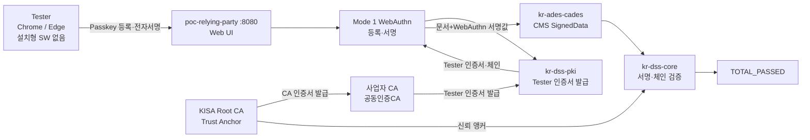
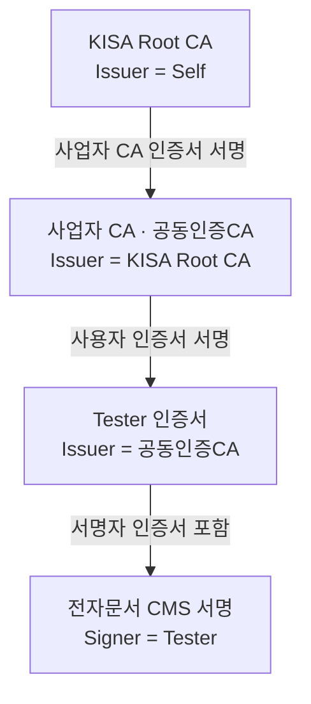
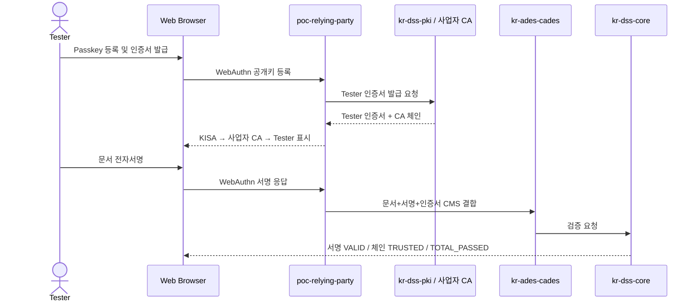

# Web 전자서명 PoC 시연자료 참조

## 1. 시연의 단일 메시지

> 별도 설치형 SW 없이 표준 웹 브라우저에서 인증서를 발급받고 전자문서에 서명하며, KISA Root CA까지 인증서 체인을 검증한다.

## 2. 시연 범위

1. Tester가 웹에서 Passkey/WebAuthn을 등록한다.
2. 사업자 CA가 Tester 사용자 인증서를 발급한다.
3. `KISA Root CA → 사업자 CA(공동인증CA) → Tester` 인증서 체인을 표시한다.
4. Tester가 브라우저에서 문서 전자서명을 수행한다.
5. 문서 무결성, 서명값, 인증서 체인을 검증한다.
6. 최종 결과 `TOTAL_PASSED`를 표시한다.

내일 실제 시연에서는 KR-TL 운영, 인증서 폐지·복원, Multi-RA, HSM Attestation, LT/LTA 및 6종 포맷 비교를 제외한다.

## 3. 실제 사용 서브모듈

| 구분 | 모듈·구성요소 | 시연 역할 |
| --- | --- | --- |
| 웹 UI·오케스트레이션 | `poc/poc-relying-party` (`:8080`) | 브라우저 UI, 등록·서명·검증 API 제공 |
| WebAuthn 진입점 | `Mode1WebAuthnController` | `/api/local/register`, `/sign/begin`, `/sign/finish`, `/verify` |
| Mode 1 서비스 | `Mode1LocalSignService` | challenge, 서명 결속, CMS 생성 및 검증 흐름 |
| 데모 CA 연결 | `WebAuthnDemoCa` | 사업자 CA 키스토어를 로드하고 Tester 인증서 발급을 위임 |
| PKI 코어 | `kr-dss-sdk/kr-dss-pki` | 사용자 인증서 발급 및 Root→사업자→Tester 체인 구성 |
| 서명 컨테이너 | `kr-ades/kr-ades-cades` | RFC 5652 CMS SignedData, 문서·서명값·인증서 결합 |
| 검증 | `kr-dss-sdk/kr-dss-core` | 정책 기반 검증 라우터 및 WebAuthn/전자서명 검증 |
| 신뢰 평가 | `kr-dss-sdk/kr-dss-trust` | CA 신뢰 평가 연결. KR-TL 운영 자체는 이번 시연에서 제외 |
| 보조 PKI 서비스 | `poc/poc-tsp-sim` (`:8082`) | KISA Root/사업자 CA, CA·RA·OCSP 역할 설명 |

`poc-kisa-tl`, `poc-rssp`, `poc-sam`, `poc-hsm`은 내일 핵심 경로가 아니므로 자료에서는 회색의 “향후 확장” 영역으로 분리한다.

> 확인 필요: `poc-tsp-sim`이 시연 발급 시 실시간 호출되는지, 아니면 사전에 생성된 `joint-ca.p12` 체인을 제공하는지 코드 기준으로 구분해 표기한다.

## 4. 한 장 구성도

## 5. 인증서 체인

## 6. 시연 시퀀스

## 7. 설명 시 반드시 구분할 역할

- 브라우저 Passkey/WebAuthn: 설치 없는 사용자 확인 및 서명 UX
- 사업자 CA: Tester 사용자 인증서 발급
- CMS: 문서, 서명값, 서명자 인증서 결합
- KR-DSS 검증: 문서 무결성, 서명값, `Tester → 사업자 CA → KISA Root CA` 체인 종합 검증
- 개인키 저장 위치: 실제 구현에서 보장되는 범위만 설명하고 “개인키가 서버에 절대 저장되지 않는다”와 같은 표현은 구현 확인 없이 사용하지 않는다.
- `joint-ca.p12`: 설정 주석에는 New-KISA RootCA가 발급한 공동인증CA 키스토어로 설명되어 있다. 발표 자료의 Subject·Issuer 명칭은 실제 인증서를 확인한 뒤 확정한다.

## 8. 발표자 스크립트

> 사용자는 별도 프로그램을 설치하지 않습니다. 브라우저의 표준 WebAuthn 기능으로 본인을 확인하고 전자서명을 수행합니다. 사업자 CA가 발급한 Tester 인증서는 KISA Root CA까지 이어지는 신뢰체인을 가지며, 생성된 전자문서는 서명값과 전체 인증서 체인을 독립적으로 검증해 TOTAL_PASSED를 반환합니다.

## 9. 사전 점검 체크리스트

- [ ] Chrome 또는 Edge에서 `localhost` WebAuthn 등록과 서명이 정상 동작한다.
- [ ] 시연 초기화 후 `Tester` 등록을 반복할 수 있다.
- [ ] Tester 인증서 Subject와 Issuer가 화면에 표시된다.
- [ ] 사업자 CA 인증서 Issuer가 KISA Root CA로 표시된다.
- [ ] KISA Root CA가 self-signed 신뢰 앵커로 표시된다.
- [ ] 전자서명 결과에 문서 해시와 서명 검증 결과가 표시된다.
- [ ] 전체 체인이 `VALID` 또는 `TRUSTED`로 표시된다.
- [ ] 최종 판정이 `TOTAL_PASSED`로 표시된다.
- [ ] 시연에 필요한 서비스와 정적 자원이 외부 네트워크 없이 동작한다.
- [ ] 실제 호출 서비스와 설명용 보조 서비스를 발표자가 구분해 설명할 수 있다.

## 10. 자료 작성 권고

- 첫 슬라이드: “설치 없이 웹에서 인증서 발급과 전자서명” 메시지
- 두 번째 슬라이드: 한 장 구성도
- 세 번째 슬라이드: KISA Root → 사업자 CA → Tester 인증서 체인
- 네 번째 슬라이드: 등록·발급·서명·검증 시퀀스
- 다섯 번째 슬라이드: 실제 시연 화면과 `TOTAL_PASSED`
- 부록: 사용 모듈과 향후 확장 모듈
