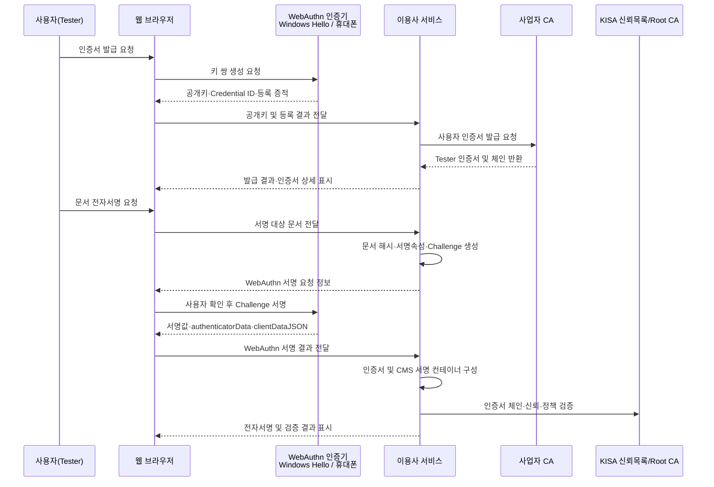

# 핵심 데이터 및 결속 방식 — 발표자료 작성 참조

## 1. 발표 핵심 메시지

본 PoC는 별도 설치형 전자서명 프로그램 없이 웹 브라우저에서 인증서를 발급하고 전자서명을 수행한다.

핵심은 다음 데이터가 서로 분리되지 않도록 암호학적으로 결속하는 것이다.

- 서명 대상 문서의 해시
- 서명 시각
- 사용자 인증서 및 인증서 정책
- WebAuthn 인증기가 생성한 전자서명
- `KISA Root CA → 사업자 CA → 사용자(Tester)` 인증서 체인

사용자의 개인키는 서버에 전달하거나 저장하지 않는다. 브라우저가 WebAuthn을 통해 Windows Hello 또는 휴대폰과 같은 인증기에 서명을 요청하고, 서버는 공개키·인증서·검증 자료를 이용해 결과를 검증한다.

## 2. 전체 처리 흐름



## 3. 핵심 데이터와 저장 위치

| 데이터 | 역할 | 주요 저장/처리 위치 | 발표 시 강조점 |
| --- | --- | --- | --- |
| 원문 문서 | 전자서명의 대상 | 이용사 서비스 또는 업무 시스템 | 원문 전체가 아니라 해시가 서명속성에 결속됨 |
| 문서 해시 | 원문 무결성 증명 | Signed Attributes | 문서가 한 글자라도 바뀌면 검증 실패 |
| Credential ID | 인증기에 있는 키를 식별 | 서버의 사용자·인증서 등록정보 | 개인키 자체가 아닌 키 식별자 |
| 개인키 | 실제 전자서명 생성 | Windows Hello 또는 휴대폰 인증기 | 비반출을 전제로 하며 서버에 저장하지 않음 |
| 공개키 | 서명 검증 및 인증서 발급 | 사용자 인증서·CA 서버 | 개인키와 대응하는 검증용 정보 |
| 사용자 인증서 | 사용자·공개키·발급자를 결속 | CMS 및 인증서 저장소 | Tester와 공개키, 정책 OID를 연결 |
| 인증서 체인 | 발급 관계와 신뢰 근거 | CMS·CA·신뢰목록 | KISA Root → 사업자 CA → Tester |
| 정책 OID | 인증서의 발급·사용 정책 식별 | 사용자 인증서 확장 필드 | PoC OID: `1.3.6.1.4.1.99999.2.1` |
| 서명 시각 | 서명 행위의 시점 정보 | Signed Attributes | PoC 서명시각과 공인 타임스탬프는 구분해서 설명 |
| WebAuthn 결과 | 인증기가 생성한 서명 증적 | CMS 또는 검증용 부가정보 | signature, authenticatorData, clientDataJSON 등 |
| CMS 서명물 | 데이터와 증적을 묶은 전자서명 컨테이너 | 업무 시스템·문서 저장소 | 문서, 인증서, 정책, 서명값을 하나의 검증 단위로 구성 |

### 저장 위치를 한 장으로 설명하는 도식

```text
[Windows Hello / 휴대폰 인증기]
  ├─ 개인키 (비반출)
  └─ Credential ID에 대응하는 키 사용

[이용사·CA 서버]
  ├─ Credential ID와 사용자 연결정보
  ├─ 공개키 및 Tester 인증서
  ├─ 사업자 CA 인증서
  └─ PoC 현재 구현은 일부 등록정보를 메모리에 보관

[전자서명 결과물]
  ├─ 문서 해시
  ├─ Signed Attributes
  ├─ WebAuthn 서명값과 검증 자료
  ├─ Tester 인증서
  └─ 인증서 체인·정책 OID
```

## 4. 데이터 결속 방식

발표에서는 아래 3단계를 순서대로 보여주면 이해하기 쉽다.

### 4.1 문서와 인증서 정책을 서명속성에 결속

```text
SignedAttrs =
    DocumentHash
  + SigningTime
  + SignerCertificateHash
  + SignaturePolicy
```

- `DocumentHash`: 현재 문서의 내용과 서명값을 연결한다.
- `SignerCertificateHash`: 서명에 사용한 Tester 인증서를 연결한다.
- `SignaturePolicy`: 정책 OID가 나타내는 발급·서명 정책을 연결한다.
- `SigningTime`: 서명이 생성된 시각 정보를 포함한다.

### 4.2 서명속성에서 WebAuthn Challenge 생성

```text
Challenge = Base64URL(SHA-256(DER(SignedAttrs)))
```

브라우저 인증기에 전달되는 Challenge가 Signed Attributes의 해시에서 파생되므로, 인증기의 서명은 문서·인증서·정책과 간접적으로 결속된다.

### 4.3 인증기 내부 개인키로 Challenge 서명

```text
WebAuthnSignature = AuthenticatorPrivateKey.Sign(Challenge context)
```

실제 WebAuthn 검증에서는 단순 Challenge 바이트만 검사하는 것이 아니라 `clientDataJSON`, `authenticatorData`, RP ID, origin, 사용자 확인 결과와 서명값을 함께 검증한다.

> 발표 표현: “문서 자체를 Windows Hello가 직접 서명한다”보다는 “문서와 인증서 정책을 결속한 서명속성에서 Challenge를 만들고, 인증기 내부 개인키가 그 WebAuthn 요청에 서명한다”가 정확하다.

## 5. 전자서명 결과물의 논리 구조

```text
CMS / KR-AdES 전자서명
├─ 서명 대상 문서 또는 문서 참조
├─ Signed Attributes
│  ├─ 문서 해시
│  ├─ 서명 시각
│  ├─ Tester 인증서 해시
│  └─ 서명 정책 OID: 1.3.6.1.4.1.99999.2.1
├─ WebAuthn 기반 서명값
├─ WebAuthn 검증 자료
│  ├─ Credential ID
│  ├─ clientDataJSON
│  ├─ authenticatorData
│  └─ AAGUID 등 인증기 정보
├─ Tester 사용자 인증서
└─ 인증서 체인
   ├─ Tester
   ├─ 사업자 CA
   └─ KISA Root CA 역할의 PoC Root
```

## 6. 인증서 체인과 정책 OID

```text
KISA Root CA 역할의 PoC Root
          │ 발급·서명
          ▼
      사업자 CA
          │ 발급·서명
          ▼
 사용자 인증서(Tester)
          │
          └─ Certificate Policies
             └─ 1.3.6.1.4.1.99999.2.1
```

- 화면에서 Tester 인증서의 Subject, Issuer, Serial Number, 유효기간, 공개키 알고리즘, 정책 OID를 보여준다.
- 서명 검증 화면에서도 동일한 인증서 정보와 정책 OID를 확인할 수 있게 구성한다.
- `1.3.6.1.4.1.99999.2.1`은 PoC에서 사용하는 사설 정책 OID다. 실제 서비스에서는 정식으로 할당·관리되는 OID와 인증정책 문서로 교체해야 한다.
- PoC Root는 시연에서 KISA 신뢰기준점 역할을 모사한다. 실제 KISA 운영 Root가 발급한 인증서라고 표현하지 않는다.

## 7. 검증 화면에서 보여줄 항목

검증 결과는 단순히 “성공”만 표시하지 말고 아래 근거를 함께 보여준다.

1. 문서 무결성
   - 원문에서 계산한 해시와 Signed Attributes의 해시가 일치하는가
2. WebAuthn 검증
   - Challenge, origin, RP ID, clientDataJSON, authenticatorData가 일치하는가
   - 등록된 공개키로 서명값이 검증되는가
3. 인증서 유효성
   - Tester 인증서가 유효기간 내에 있는가
   - 인증서의 공개키가 등록된 Credential과 일치하는가
4. 인증서 체인
   - Tester → 사업자 CA → KISA Root 역할의 PoC Root 경로가 완성되는가
5. 인증서 정책
   - 요구 정책 OID `1.3.6.1.4.1.99999.2.1`이 존재하고 허용 정책과 일치하는가
6. 최종 판정
   - `TOTAL_PASSED`: 모든 필수 검증 성공
   - `INDETERMINATE`: 검증 자료 부족 또는 상태 확인 불가
   - `TOTAL_FAILED`: 서명·문서·인증서·정책 중 필수 검증 실패

## 8. 발표자료 권장 구성

### 슬라이드 1 — 시연 목표

- 설치형 SW 없이 웹에서 인증서 발급과 전자서명 수행
- Edge와 Chrome에서 동일한 업무 흐름 시연
- 인증서 체인과 정책 OID까지 검증

### 슬라이드 2 — 참여 모듈

- 브라우저 UI / 이용사 서비스
- WebAuthn 인증기: Windows Hello 또는 휴대폰
- 사업자 CA
- KISA Root CA 역할의 PoC 신뢰기준점
- KR-AdES·KR-DSS 검증 모듈

### 슬라이드 3 — 인증서 발급

- 인증기 내부 키 생성
- 공개키와 Credential ID 등록
- 사업자 CA가 Tester 인증서 발급
- 인증서 상세와 체인 표시

### 슬라이드 4 — 핵심 데이터와 저장 위치

- 개인키는 인증기에만 존재
- 공개키·인증서·Credential ID 연결정보는 서버가 관리
- 서명 결과물은 문서 해시, 인증서, 정책, 서명 증적을 포함

### 슬라이드 5 — 결속 방식

- SignedAttrs 구성
- SignedAttrs 해시에서 Challenge 생성
- 인증기 내부 개인키로 WebAuthn 서명

### 슬라이드 6 — 전자서명 컨테이너

- CMS/KR-AdES 구조를 트리 형태로 표시
- Tester 인증서와 정책 OID 위치 강조

### 슬라이드 7 — 검증

- 문서 무결성 → WebAuthn → 인증서 → 체인 → 정책 순서
- 최종 판정과 실패 원인 표시

### 슬라이드 8 — PoC 범위와 실서비스 전환

- 현재 PoC의 메모리 기반 등록정보는 재기동 시 초기화될 수 있음
- 실서비스에서는 DB 영속화, 키 수명주기, 폐지상태, 감사로그, 정식 OID·CP/CPS, 운영 Root 연계가 필요

## 9. 발표자 설명 문안

> 사용자가 웹 화면에서 인증서 발급을 요청하면 브라우저는 Windows Hello 또는 휴대폰 인증기에 키 생성을 요청합니다. 개인키는 인증기 밖으로 나오지 않고, 공개키와 Credential ID만 이용사 서비스에 등록됩니다. 사업자 CA는 이 공개키를 Tester 사용자와 결속한 인증서를 발급하며, 인증서는 KISA Root 역할의 신뢰기준점까지 이어지는 체인을 구성합니다.
>
> 전자서명 시에는 문서 해시, 서명 시각, Tester 인증서 해시와 정책 OID를 Signed Attributes로 구성합니다. 이 데이터의 해시에서 WebAuthn Challenge를 만들고, 인증기 내부 개인키가 사용자 확인 후 서명합니다. 따라서 문서·사용자 인증서·정책·인증기 서명 증적이 하나의 검증 가능한 결과로 결속됩니다.
>
> 검증 단계에서는 문서 무결성, WebAuthn 응답, Tester 인증서, 인증서 체인과 정책 OID를 각각 확인한 후 종합 판정을 제공합니다.

## 10. 표현상 주의사항

### 사용해도 되는 표현

- “개인키는 WebAuthn 인증기 내부에서 생성·사용되며 서버로 전달하지 않는다.”
- “Tester 인증서의 정책 OID와 인증서 체인을 전자서명 검증 과정에서 확인한다.”
- “PoC Root가 시연 환경에서 KISA 신뢰기준점의 역할을 모사한다.”
- “전용 시연 PC 정책을 통해 Edge·Chrome의 비밀번호 관리자 패스키 저장을 제한하고 Windows Hello 사용을 유도한다.”

### 구현·증적 확인 전 단정하면 안 되는 표현

- “모든 개인키가 반드시 TPM 하드웨어에 저장된다.”
- “실제 KISA 운영 Root가 이 Tester 인증서를 발급했다.”
- “브라우저와 운영체제 종류와 무관하게 Windows Hello를 웹 코드만으로 강제한다.”
- “CA 서버를 재시작해도 모든 등록정보가 보존된다.”

Windows Hello 사용 여부와 하드웨어 보호 수준은 단말 정책, TPM 상태, 인증기 종류와 attestation 검증 결과로 판단해야 한다. CA가 요구 정책을 만족하지 못한 등록 요청을 거부하려면 attestation 허용목록과 정책 판정 로직이 별도로 필요하다.

## 11. 발표 화면 캡처 체크리스트

- 인증서 발급 화면: PC 저장 / 휴대폰 저장 선택
- Windows Hello 사용자 확인 화면
- 휴대폰 저장 흐름의 QR 연결 화면
- 다중 Credential ID 및 인증서 목록
- Tester 인증서 상세: Subject, Issuer, 유효기간, 정책 OID
- 인증서 체인: Root → 사업자 CA → Tester
- 서명 대상 문서 및 서명 실행 화면
- 서명 검증 화면: Tester 인증서 정보와 정책 OID
- 최종 검증 판정과 세부 검증 결과

## 12. PoC와 실서비스의 경계

| 구분 | 현재 PoC | 실서비스 보완 방향 |
| --- | --- | --- |
| 사용자·인증서 등록정보 | 일부 메모리 기반 | DB 영속화와 백업·복구 |
| 신뢰기준점 | KISA 역할의 PoC Root | 실제 운영 신뢰체계·신뢰목록 연계 |
| 정책 OID | PoC 사설 OID | 정식 OID 및 CP/CPS 승인·관리 |
| 키 보호 정책 | 브라우저·Windows 정책으로 Windows Hello 유도 | attestation 기반 인증기 허용·차단과 수명주기 관리 |
| 인증서 상태 | 시연 중심 | OCSP/CRL, 폐지·정지·갱신 |
| 감사성 | 화면과 애플리케이션 로그 중심 | 위변조 방지 감사로그와 장기 보존 |
| 시간 신뢰 | 서명 시각 중심 | 신뢰할 수 있는 TSA와 장기검증 자료 |

---

이 문서는 발표 슬라이드의 원문 자료다. 화면 명칭과 실제 구현 상태가 달라지면 캡처 전에 반드시 최신 동작과 용어를 대조한다.
