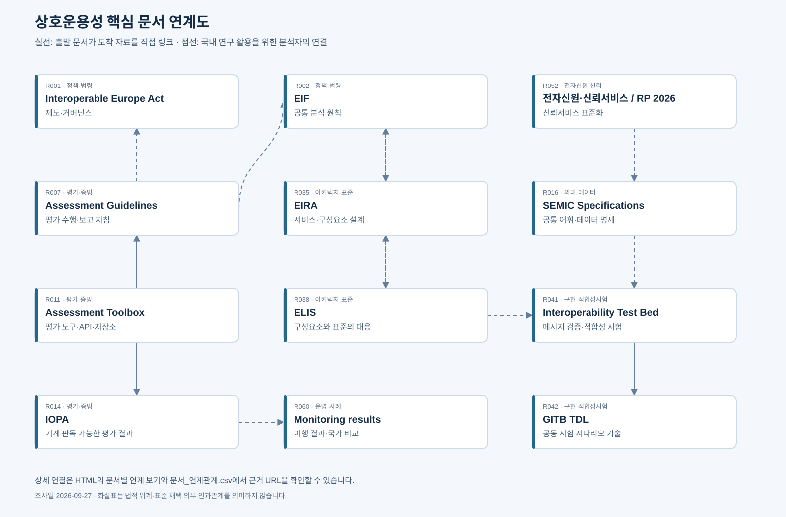

# 문서 연계도

[상호작용형 목록·연계도 열기](F:/kr-dss-works/kr-dss/_backup/2026-10-08-layout-133204/originals/참조문서/05_기존산출물_보존/Interoperable_Europe_영문자료조사_20260927/자료목록_및_연계도.html) · [SVG 원본](문서_연계도.svg)

실선은 출발 문서의 본문에서 도착 자료를 링크한 관계다. 점선은 국내 연구를 위해 제안한 연결이며 법적 종속이나 규범적 의무를 의미하지 않는다. 모든 연계는 두 문서 사이의 상관계수를 측정한 결과가 아니다.

## 도식의 관계와 근거

| 출발 | 도착 | 구분 | 근거 |
|---|---|---|---|
| R007 | R001 | 연구 활용상 연결(분석) | 분석자가 제안한 문헌 활용 흐름; 법적 종속 아님 |
| R007 | R002 | 연구 활용상 연결(분석) | 분석자가 제안한 문헌 활용 흐름; 법적 종속 아님 |
| R035 | R002 | 연구 활용상 연결(분석) | 분석자가 제안한 문헌 활용 흐름; 법적 종속 아님 |
| R011 | R007 | 직접 링크 | https://interoperable-europe.ec.europa.eu/collection/assessments/assessment-toolbox |
| R011 | R014 | 직접 링크 | https://interoperable-europe.ec.europa.eu/collection/assessments/assessment-toolbox |
| R038 | R035 | 연구 활용상 연결(분석) | 분석자가 제안한 문헌 활용 흐름; 법적 종속 아님 |
| R041 | R042 | 직접 링크 | https://interoperable-europe.ec.europa.eu/collection/interoperability-test-bed-repository/solution/interoperability-test-bed/faq |
| R002 | R035 | 연구 활용상 연결(분석) | 분석자가 제안한 문헌 활용 흐름; 법적 종속 아님 |
| R052 | R016 | 연구 활용상 연결(분석) | 분석자가 제안한 문헌 활용 흐름; 법적 종속 아님 |
| R016 | R041 | 연구 활용상 연결(분석) | 분석자가 제안한 문헌 활용 흐름; 법적 종속 아님 |
| R035 | R038 | 연구 활용상 연결(분석) | 분석자가 제안한 문헌 활용 흐름; 법적 종속 아님 |
| R014 | R060 | 연구 활용상 연결(분석) | 분석자가 제안한 문헌 활용 흐름; 법적 종속 아님 |
| R038 | R041 | 연구 활용상 연결(분석) | 분석자가 제안한 문헌 활용 흐름; 법적 종속 아님 |

전체 직접참조 관계는 [문서_연계관계.csv](문서_연계관계.csv)에 저장했다. 자료 ID는 [참고자료 목록](영문_참고자료_목록.md)과 동일하다.