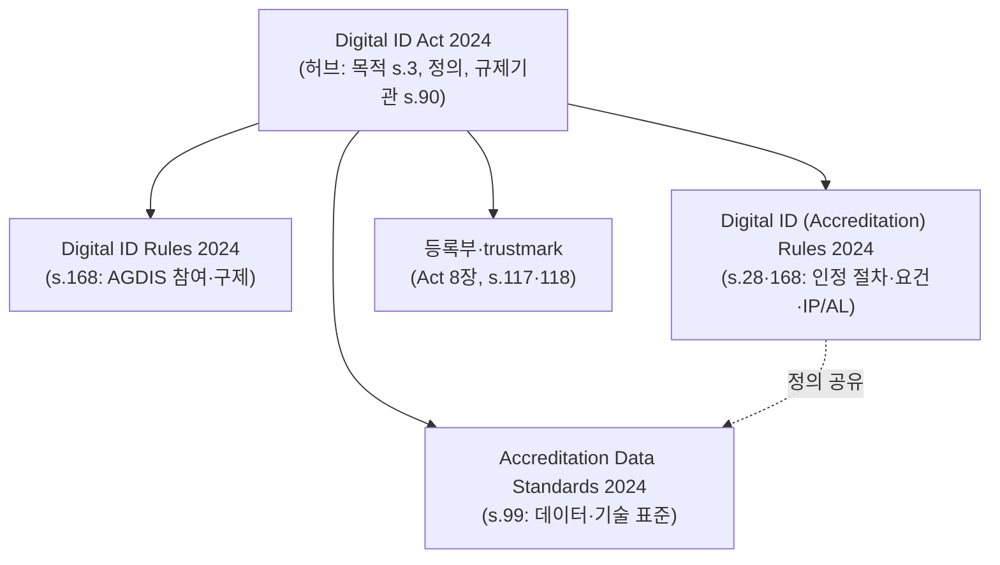
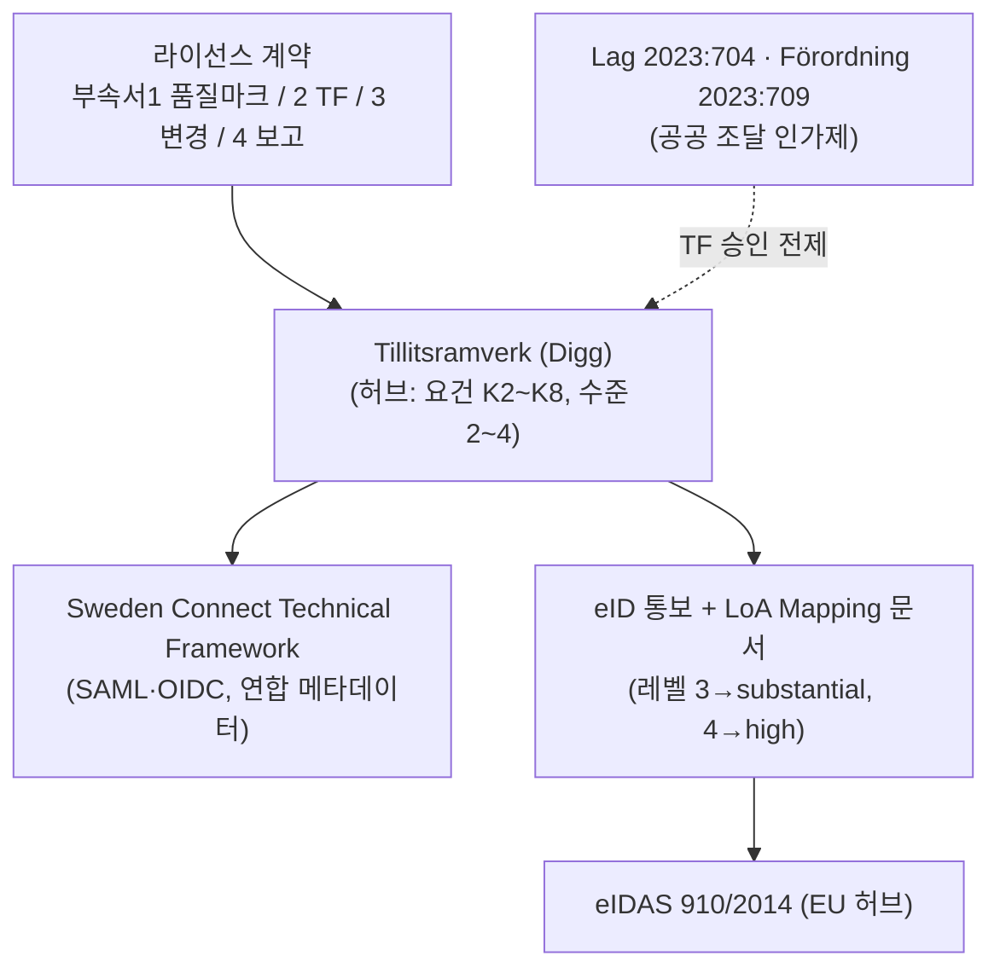
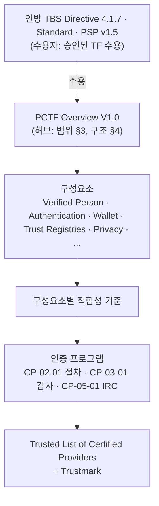
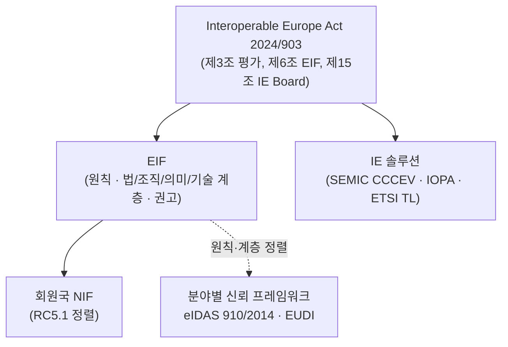
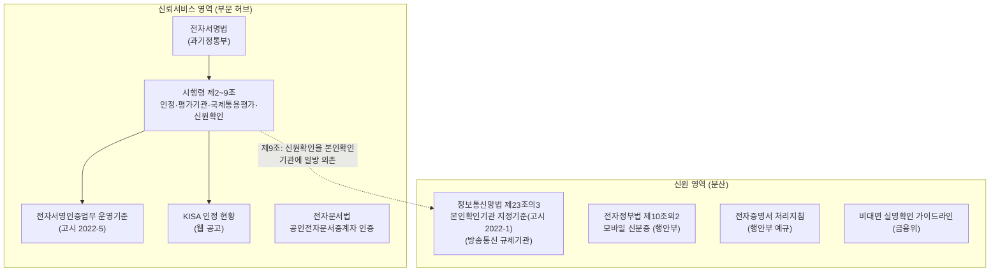

# 00 부속2 — 국가별 신뢰체계 구조 분류와 매핑 구조(샘플)

작성일: 2026-09-29. [00 부속1](00_부속1_신뢰체계_구조와_매핑방법_조사.md) 2.0절의 분류 기준으로 조사 대상 국가를 목록화하고, 유형마다 한 나라씩 신뢰체계 매핑 구조 샘플을 만들었다.

- 분류 근거는 [03 부속3](03_부속3_국가별_원문_심층조사_기록.md)(원문 심층조사), [03 부속1](03_부속1_해외_국가별_신뢰프레임워크_조사.md)(1차 조사), [03 부속2](03_부속2_국내_신뢰프레임워크_관련자료_조사.md)(국내), 저장소 원문이다.
- 매핑의 기준선은 **EU**(eIDAS + EIF)다.

---

## 1. 분류 기준 요약

- **허브 요건(모두 충족)**
  - H1: 공통 목적·범위를 정한다.
  - H2: 거버넌스 주체를 지정한다.
  - H3: 나머지 요소를 위임 조항이나 명시적 참조로 연결한다.
  - H4: 하위 문서가 용어 정의를 공유한다.
- **판정 순서**
  - Q1: 허브가 있는가? 없으면 분산형이다.
  - Q2: 허브가 사업자·서비스를 규율하는가? 다른 프레임워크를 규율하면 메타 허브다.
  - Q3: 구속력의 근거는 무엇인가? 법률이면 법률형, 공공 소유 계약이면 계약형, 비정부 단체 소유이면 민간형이다.
- **영역별 판정**: 신뢰 영역을 먼저 정한다. 0번 문서 결정에 따라 **신원 영역**(신원확인·인증·속성)과 **신뢰서비스 영역**(전자서명·인장·타임스탬프·전자등기 등)을 각각 판정한다. 그다음 두 영역이 한 허브로 묶였는지 보고 **종합 판정**을 한다.

**종합 판정 규칙**

| 상황 | 종합 판정 |
|---|---|
| 한 허브가 두 영역을 모두 덮는다 | **통합 허브**(법률·계약·민간) |
| EU 회원국: 두 영역의 허브는 eIDAS이고, 국가 신원 체계는 eIDAS 통보(LoA 매핑)로 연결된다 | **EU 허브 편입**(국가 신원 체계 유형 병기) |
| 영역마다 허브가 있으나 서로 연결되지 않는다 | **영역별 허브(비통합)** |
| 한 영역에만 허브가 있고 다른 영역은 흩어져 있다. 또는 어느 영역에도 허브가 없다 | **분산형**(부문 허브 표기) |
| 한 영역이 조사되지 않았다 | 종합 판정 **보류**, 조사된 영역만 표기 |
| 국가가 단일 플랫폼을 직접 운영해 규율할 참여자 체계가 없다 | **국가 단일 운영**(구조 분류 대상 아님) |

**표기**: 허브(법)=허브형(법률), 허브(계)=허브형(계약), 허브(민)=허브형(민간), 부문 허브=영역 일부만 덮는 허브, 미조사=해당 영역 원문 미조사, 초안=허브 문서가 시행 전.

---

## 2. 국가별 목록

### 2.1 기준선

| 체계 | 신원 영역 | 신뢰서비스 영역 | 영역 간 연결 | 종합 | 허브 문서 | 판정 근거 |
|---|---|---|---|---|---|---|
| EU eIDAS | 허브(법) | 허브(법) | 규정 하나가 통보 eID·신뢰서비스·EUDI 지갑을 모두 규율 | **통합 허브(법률)** | Reg. 910/2014(2024/1183 개정) | H1 제1조, H2 집행위·감독기관·협력그룹, H3 시행규칙 위임(제8·12·20·22조 등)·ETSI 참조, H4 제3조 정의 |
| EIF | — | — | 사업자가 아니라 국가·분야 프레임워크를 규율 | **메타 허브** | IEA(2024/903) 제6조 + EIF | Q2: 규율 대상이 NIF·분야 프레임워크(RC5.1) |

### 2.2 허브형 후보 (신원 영역에 허브가 있는 나라)

| 국가·체계 | 신원 영역 | 신뢰서비스 영역 | 영역 간 연결 | 종합 | 허브 문서(구속력) | 판정 근거 | 확인 수준 |
|---|---|---|---|---|---|---|---|
| 영국 | 허브(법) | 미조사 | — | 보류 | Data (Use and Access) Act 2025 Part 2 → DVS TF 1.0 | s.28(TF), s.29(보충코드), s.32(등록부), s.50(신뢰표시) | 원문 |
| 뉴질랜드 | 허브(법) | 미조사 | — | 보류 | DISTF Act 2023 → Rules 2024 | s.18(Rules), s.43·58(Board·Authority) | Rules 원문(Act 조문은 Rules 인용 범위) |
| 호주 | 허브(법) | 미조사(Gatekeeper PKI 등) | — | 보류 | Digital ID Act 2024 → Rules·인정 Rules·데이터 표준 | s.28·99·168 위임, s.90 규제기관, s.117·118 신뢰표시 | 원문 |
| 캐나다 | 허브(민) | 미조사 | — | 보류 | DIACC PCTF(Overview → 구성요소 → 적합성 기준 → 인증 프로그램) | 소유자 DIACC(비정부). 연방 TBS Directive 제4.1.7조는 **수용자** | 원문 |
| 미국 | 허브(민): Kantara / 연방은 지침만 | 미조사 | — | 보류(연방은 분산) | Kantara IAF·인증 프로그램 | 연방 NIST 800-63-4는 지침이라 허브 요건 미충족. AAMVA VICAL은 신뢰목록 구성요소 | 웹 원문 |
| 스웨덴 | 허브(계) | eIDAS 직접 적용 | eID 통보(레벨 3·4 → substantial·high) | **EU 허브 편입**(신원: 계약형) | Digg 신뢰 프레임워크 = 라이선스 계약 부속서 2 | 구속력이 계약. Lag 2023:704는 조달 인가제 | 원문 |
| 네덜란드 | 허브(계) | eIDAS 직접 적용 | eID 통보(EH3·EH4) | **EU 허브 편입**(신원: 계약형) | Afsprakenstelsel eTD AS1.24e + 참여자 계약 | Wdo 인정조항 미시행 → 계약형 | 원문 |
| 핀란드 | 허브(법) | eIDAS 직접 적용(법 4a장은 2026-10-01 삭제) | eID 통보 | **EU 허브 편입**(신원: 법률형) | 법 617/2009 → Traficom M72B | §12a~12e 신뢰 네트워크, 규정 위임 | 원문 |
| 이탈리아 | 허브(법) | eIDAS 직접 적용 | eID 통보(SPID 1~3) | **EU 허브 편입**(신원: 법률형) | CAD 제64조 → DPCM 2014 → AgID 규정 | 제64조 인정·명부, 제32-bis조 제재 | 원문 |
| 덴마크 | 허브(법, 잠정) | eIDAS 직접 적용 | eID 통보(MitID) | **EU 허브 편입**(신원: 법률형 잠정) | NSIS v2.1(표준). MitID·NemLog-in법이 참조 | 허브 문서는 표준이고 구속력은 법률 참조. 법 조문 원문은 미확인 | NSIS 원문 |
| 노르웨이 | 허브(법) | eIDAS(EEA) | 자기선언 → Nkom 목록 | **EU 허브 편입**(신원: 법률형) | Selvdeklarasjonsforskriften | 규정 단일 문서(2015/1502 재사용) | 원문 |
| 벨기에 | 허브(법, 공공앱 한정) | eIDAS 직접 적용 | eID 통보(FAS) | **EU 허브 편입**(신원: 법률형, 범위 한정) | 법률 2017-07-18 → 왕령 2017-10-22 | 법 제10조 §2 위임 | 원문 |
| 프랑스 | 부문 허브(법): 수단 인증 | eIDAS 직접 적용 | — | **EU 허브 편입**(신원: 부문 허브) | CPCE L.102 → 데크레 2022-1004 → ANSSI 레퍼런셜 | 범위가 MIE 인증에 한정 | 원문 |
| 스위스 | 허브(법, 미시행) | 미조사(ZertES) | — | 보류 | BGEID → VEID(초안) | 발급자·검증자 등록 규율. 시행 전 | 원문 |
| 태국 | 허브(법) | 미조사 | — | 보류 | ETA → 왕령 B.E.2565 → 고시 → ETS 11 | s.34/3·34/4 → 왕령 → 고시 | 영문 번역 원문 |
| 우루과이 | 허브(법) | 허브(법) | Decreto 70/018이 신원확인·중앙보관 서명을 함께 규율 | **통합 허브(법률)** | Ley 18.600 → Decreto 70/018 → Política de Identificación Digital | 제5~6조(보안수준), 제10조(인정), 제28조(등록부) | 원문 |
| UAE | 허브(법, 하위규정 미비) | 허브(법) | 법 하나가 eID 보증수준(제33조)과 신뢰서비스를 규율 | **통합 허브(법률)**, 신원 하위규정 미확인 | Decree-Law 46/2021 → 시행령 28/2023 → TDRA 결정 51~55 | 제52조 위임 | 원문 |
| 콜롬비아 | 허브(법, 정부 플랫폼형) | 부문 허브(법): Ley 527 ECD·ONAC | 연결 없음 | **영역별 허브(비통합)** | Decreto 620/2020 → Res. 2160/2020 | Articulador가 제공자를 조정 | 원문 |

### 2.3 신뢰서비스 영역에만 허브가 있는 나라

| 국가 | 신원 영역 | 신뢰서비스 영역 | 종합 | 비고 |
|---|---|---|---|---|
| 카타르 | 미조사 | 허브(법): CRA 결정 3/2025 규정 + QA-TSF | 보류 | eIDAS형 신뢰서비스 |
| 모로코 | 미조사(CNIE 활용만) | 허브(법): Loi 43-20 → Décret 2-22-687 → DGSSI 레퍼런셜 | 보류 | eIDAS형 신뢰서비스 |
| 사우디 | 미조사 | 초안: DGA 디지털 신뢰 면허 프레임워크 | 보류 | 의견수렴 초안 |

### 2.4 분산형

| 국가 | 신원 영역 | 신뢰서비스 영역 | 종합 | 판정 근거 |
|---|---|---|---|---|
| **한국** | 분산(본인확인기관·모바일 신분증·전자증명서가 서로 다른 법·부처) | 부문 허브(법): 전자서명법 → 시행령 → 운영기준 고시 | **분산형(전자서명 부문 허브)** | 공통 목적 조항·단일 거버넌스 없음(H1·H2 불충족). 시행령 제9조의 일방향 의존만 있음 |
| 독일 | 분산(BSI TR·PAuswG·EUDI 시행법안) | eIDAS + VDG | **분산형**(eIDAS 편입 부분 제외) | 기관 5곳, 공통 목적 조항 없음, 법안 미시행 |
| 베트남 | 국가 운영(Decree 69, 공안부) | 부문 허브(법): Decree 23 | **분산형(신뢰서비스 부문 허브)** | 두 축이 Decree 23 제34·36조로만 연결, 관할 부처 상이 |
| 인도 | Aadhaar 규정(UIDAI) | 부문 허브(법): IT Act → CCA 가이드라인 | **분산형(PKI 부문 허브)** | eSign만이 두 체계를 연결 |
| 브라질 | gov.br 등급(웹 안내, 법령 근거 미확인) | 부문 허브(법): MP 2.200-2 → ICP-Brasil 결의 | **분산형(PKI 부문 허브)** | Lei 14.063은 서명 수준만 규정 |
| 대만 | 정책 사업(TW DIW, 법적 근거 없음) | 부문 허브(법): 電子簽章法 → 細則 | **분산형(PKI 부문 허브)** | 지갑은 이용약관·코드만 존재 |
| 싱가포르 | 국가 IdP(Singpass, 계약) | 부문 허브(법): ETA → CA Regulations | **분산형(PKI 부문 허브)** | 신원 영역에 사업자 체계 없음 |
| 일본(잠정) | 정책 검토(Trusted Web·VC/DIW 보고서, 별지 3 초안) | 미조사(전자서명법 인정·총무대신 e시일 인정) | **분산형(잠정)** | 신원 영역 허브 없음. 신뢰서비스 영역은 조사 필요 |
| 페루 | 국가 플랫폼(RENIEC·ID GOB.PE) | 미조사(IOFE·INDECOPI) | **분산형(잠정)** | Marco de Confianza Digital은 사이버보안 거버넌스 |

### 2.5 분류 제외·보류

| 국가 | 사유 |
|---|---|
| 중국 | 국가 단일 운영(국가 인터넷 신원인증 공공서비스). 규율할 참여자 체계가 없다 |
| 나이지리아 | NIMC Act 2026 원문 미확보 |
| 체코·오스트리아·에스토니아·스페인·폴란드 | 1차 조사만 수행. 원문 심층조사 필요 |

### 2.6 목록에서 드러난 점

- 신뢰서비스까지 포함한 범위에서 **하나의 허브가 두 영역을 모두 덮는 체계**는 EU eIDAS, 우루과이, UAE뿐이다. UAE는 신원 쪽 하위규정이 확인되지 않았다.
- 영국·뉴질랜드·호주·캐나다는 **신원 영역의 허브**다. 신뢰서비스 영역이 조사되지 않아 종합 판정은 보류했다. 신뢰서비스 영역이 별도 체계라면 종합은 "영역별 허브(비통합)"가 된다.
- EU 회원국은 신원 체계가 법률·계약형이어도 **eIDAS 통보(LoA 매핑)**로 EU 허브에 연결된다. 이것이 분산형인 한국과 결정적으로 다른 점이다.
- **후속 조사**: 영국·뉴질랜드·호주·캐나다·태국·일본의 신뢰서비스(전자서명) 영역 원문.

---

## 3. 매핑 구조 템플릿

샘플은 모두 같은 틀을 쓴다.

| 부 | 내용 |
|---|---|
| A. 개요 | 유형, 허브 문서, 영역별 판정 |
| B. 구조도 | 허브와 하위 문서의 연결(위임·참조) |
| C. 구성 매트릭스 | E1~E8 → 담는 문서·조항 → 허브와의 연결 방식 |
| D. EU 기준 매핑표 | 요소 → EU 대응물 → 매핑 방법 → 매핑 단계 현황 → 판정 → 근거 |
| E. 핵심 매핑 상세 | 보증수준 대응, 신뢰목록 대응 등 |
| F. 매핑 경로와 과제 | 적용 가능한 EU 인정 경로, 공백 |

**D의 표기**

- 매핑 방법은 [00 부속1](00_부속1_신뢰체계_구조와_매핑방법_조사.md) 3장을 따른다. eID 통보·동료평가, 제14조, AdES LOTL(MRA), TR 103 684, M1~M15.
- 매핑 단계는 ①요건 비교 ②동등성 평가 ③인정 결정 ④공시·등재 ⑤감독 유지다. 완료 단계를 ✔로 표시한다.
- 판정은 네 가지다.
  - **동등**: 공식 매핑이 있다.
  - **부분**: 일부 요건만 대응한다.
  - **공백**: 대응물이 없다.
  - **가설**: 공식 매핑이 없어 본 조사가 제시한 대응안이다. 검증이 필요하다.

---

## 4. 샘플 ① 허브형(법률) — 호주

### A. 개요

| 항목 | 내용 |
|---|---|
| 유형 | 신원 영역: 허브형(법률). 신뢰서비스 영역: 미조사 |
| 허브 문서 | Digital ID Act 2024(Compilation No.2, 2025-02-21) |
| 대상 | 인정 디지털 ID 사업자(IdSP·ASP·IXP)와 AGDIS 참여자 |

### B. 구조도

### C. 구성 매트릭스

| 요소 | 담는 문서·조항 | 허브와의 연결 |
|---|---|---|
| E1 목적·원칙 | Act s.3 | 허브 본문 |
| E2 거버넌스 | Digital ID Regulator(ACCC, s.90), Information Commissioner(프라이버시), System Administrator, Data Standards Chair(s.101) | 허브 본문(5~7장) |
| E3 역할 | IdSP·ASP·IXP·신뢰당사자(Act 정의), 서비스별 의무(인정 Rules 5장) | 허브 정의 + s.28 위임 |
| E4 규칙 | 인정 Rules 4장(보호 보안, 부정 방지, 프라이버시, 접근성, 생체), 5장(서비스별), 데이터 표준 | s.28·99·168 위임 |
| E5 보증수준 | 인정 Rules r.5.10 IP Levels Table(IP1·IP1 Plus·IP2·IP2 Plus·IP3·IP4), AL1~AL3 | s.28 위임 |
| E6 평가·인정 | Act s.14·15(신청·결정), 인정 Rules 3장(보증평가·시스템 시험), 6장(연례 검토) | 허브 본문 + 위임 |
| E7 감독·집행 | Act 9장(준수·집행), 인정 Rules 7.3(신고 대상 사고), Act 4장 3부(책임·구제) | 허브 본문 |
| E8 신뢰공시 | Act s.117·118(trustmark), 8장 3부(Accredited Entities Register, AGDIS Register) | 허브 본문 |

### D. EU 기준 매핑표

| 요소 | EU 대응물 | 매핑 방법 | 단계 | 판정 | 근거 |
|---|---|---|---|---|---|
| E1 | eIDAS 제1조, EIF 원칙 | ToIP 서식(M14) 대조 | ① | 부분 | 목적은 유사. 호주는 국경 간 상호인정 조항이 없음(Act s.7은 국제법상 의무 준수만) |
| E2 | 회원국 감독기관, 집행위 | TR 103 684 ② 감독·감사 축 | ① | 동등(가설) | 독립 규제기관(ACCC)과 법정 권한 |
| E3 | eIDAS eID 발급자·신뢰당사자, EUDI PID 제공자 | 역할 대응(M8 Process Mapping) | ① | 부분 | IXP(교환 중개) 역할은 eIDAS 노드·브로커에 해당하며 EU 규정상 독립 역할이 없음 |
| E4 | 2015/1502 4영역, ETSI TS 119 461(원격 신원확인) | 요건–증거 대조(M4·M10) | ① | 부분(가설) | 생체 결합, 원본 서류 대면 확인, 부정 탐지 교육 등 요건 풍부 |
| E5 | eIDAS LoA low·substantial·high | LoA 대응(E 참조) | ① | 가설 | 공식 매핑 없음. G7 매핑에서 호주 제외 |
| E6 | CAB 적합성평가(765/2008 인정), eID 동료평가 | TR 103 684 ② 축 | ① | 부분 | 호주는 규제기관이 인정하고 평가는 평가자가 수행. EU형 인정기관 체계와 대조 필요 |
| E7 | 감독기관 권한, 제16조 제재 | ② 축 | ① | 동등(가설) | 법정 집행 수단 보유 |
| E8 | 국가 신뢰목록(TS 119 612), 통보 목록, EU 신뢰표시 | 신뢰 표현(TR 103 684 ④) | — | 부분 | 등록부는 있으나 TS 119 612/602 형식의 기계가독 목록은 확인 안 됨 |

### E. 핵심 매핑 — 보증수준 대응 가설

인정 Rules IP Levels Table의 판별 요건을 근거로 세운 **가설**이다. 공식 대응이 아니다.

| 호주 | 판별 요건(IP Levels Table 항목) | eIDAS 대응 가설 | 근거 |
|---|---|---|---|
| IP1 | 증거 요건 최소, 이름·생년월일 원천 검증 불요(항목 9) | low 미만 ~ low | 증거 확인이 약함 |
| IP1 Plus·IP2 | 원천·기술 검증 필수(항목 9), CoI·사진 ID 등 증거(항목 10~12) | low ~ substantial 경계 | 증거 검증은 있으나 생체 결합 없음 |
| IP2 Plus·IP3 | **생체 결합 필수**(항목 4), 번역 요건(IP3) | substantial | 2015/1502 substantial의 "증거 보유자 확인" 요건과 유사 |
| IP4 | 원본 서류 전부 제출 + **대면 확인**(항목 5), UitC 2개 | high | 대면·원본 검증 |
| AL1 / AL2 / AL3 | 인증수단 수준(IP4는 AL3만 결합, 항목 14) | low / substantial / high | 수준 명칭 대응(세부 요건 대조 필요) |

### F. 매핑 경로와 과제

- **신원 영역**: EU에는 제3국 eID·PID를 인정하는 법적 경로가 없다. 그래서 G7식 개념·보증수준 대조(M10)와 기술 실증(M13)이 현실적인 경로다.
- **신뢰서비스 영역**: 미조사(Gatekeeper PKI 등). 제14조나 AdES LOTL 경로를 쓰려면 TS 119 612 형식의 목록이 필요하다.
- **과제**: IP/AL과 2015/1502의 조항별 대조, 기계가독 등록부의 형식 확인.

---

## 5. 샘플 ② 허브형(계약) — 스웨덴

### A. 개요

| 항목 | 내용 |
|---|---|
| 유형 | 신원 영역: 허브형(계약). 신뢰서비스 영역: eIDAS 직접 적용. 종합: **EU 허브 편입** |
| 허브 문서 | Tillitsramverk för Svensk e-legitimation(Digg, 2018-158) = 라이선스 계약 부속서 2 |
| 대상 | Svensk e-legitimation 발급자(utfärdare), 신원 어설션 제공 기능 |

### B. 구조도

### C. 구성 매트릭스

| 요소 | 담는 문서·조항 | 허브와의 연결 |
|---|---|---|
| E1 | TF §1 배경·목적 | 허브 본문 |
| E2 | Digg | 계약 당사자 + TF 발행자 |
| E3 | 발급자, 신원 어설션 제공(§8), 신뢰당사자 언급 | 허브 본문 |
| E4 | K2(조직·거버넌스)~K8(어설션): ISMS, 기록 10년, 3년 주기 내부감사, HSM, 2요소, 유효기간 최대 5년 | 허브 본문 |
| E5 | 수준 2·3·4 | 허브 본문 |
| E6 | Digg 위험기반 심사(현장 방문), 수준 3·4 라이선스 계약, 수준 2 매년 갱신 | 계약 |
| E7 | 연례 내부감사 보고서, 사고·통계·변경 보고(부속서 4) | 계약 |
| E8 | 품질마크 "Svensk e-legitimation"(부속서 1), 승인 목록(HTML), 서명된 연합 메타데이터 | 계약 + 기술 프레임워크 |

### D. EU 기준 매핑표

| 요소 | EU 대응물 | 매핑 방법 | 단계 | 판정 | 근거 |
|---|---|---|---|---|---|
| E5 | eIDAS LoA | eID 통보 + LoA Mapping 문서 + 동료평가 | ①②③④⑤ ✔ | **동등**(3→substantial, 4→high) | 통보서 본문, 협력네트워크 의견 2021-09-27(조사 보고 기준) |
| E4 | 2015/1502 4영역 | LoA Mapping 문서(조항별 대조, 감사인의 통제 동등성 판단) | ①② ✔ | 동등(통보 범위) | 통보서가 각 항목에서 "LoA Mapping document"를 참조 |
| E3 | 통보 eID 발급자 | 통보서 | ③ ✔ | 동등 | BankID·Freja·EFOS 통보 |
| E6 | 동료평가(회원국), 감독 | 통보 절차 | ② ✔ | 동등 | — |
| E7 | eIDAS 제10조(보안침해 시 정지) | 통보 | ⑤ | 동등 | — |
| E8 | 통보 목록(OJ) | OJ 게재 | ④ ✔ | 동등 | 국내 품질마크는 EU 표시와 별개 |
| 신뢰서비스 | eIDAS 직접 적용(감독기관 PTS, 신뢰목록) | — | — | 동등(EU 법 직접 적용) | — |

### E. 핵심 매핑 — 이미 확정된 보증수준 대응

| 스웨덴 | eIDAS | 상태 |
|---|---|---|
| 수준 2 | (통보 대상 아님) | — |
| 수준 3 | substantial | 통보·게재 |
| 수준 4 | high | 통보·게재 |

### F. 시사점

- 계약형 허브도 **LoA Mapping 문서 하나**로 EU 허브에 연결됐다. 국가 체계가 결과 기반(outcome-based)이면, 감사인이 통제 동등성을 판단하는 방식으로 매핑한다.
- 한국이 참고할 점은 두 가지다. 국내 수준 정의를 먼저 두고, 조항별 대조 문서를 작성하는 것이다.

---

## 6. 샘플 ③ 허브형(민간) — 캐나다 DIACC PCTF

### A. 개요

| 항목 | 내용 |
|---|---|
| 유형 | 신원 영역: 허브형(민간). 연방 정부는 수용자. 신뢰서비스 영역: 미조사 |
| 허브 문서 | PCTF Overview V1.0(DIACC PCTF00) |
| 대상 | 디지털 ID 서비스 제공자(신원확인, 크리덴셜 관리, 속성, 교환, 지갑, 연합 운영자 등) |

### B. 구조도

### C. 구성 매트릭스

| 요소 | 담는 문서·조항 | 허브와의 연결 |
|---|---|---|
| E1 | Overview §2~3(목적·범위) | 허브 본문 |
| E2 | DIACC(TFEC, 공개 의견수렴, 회원 투표 비준) | 허브 본문 |
| E3 | 구성요소별 역할(예: Wallet Provider), 이해관계자 목록(Overview §3) | Overview가 구성요소 정의 |
| E4 | 구성요소별 적합성 기준 | Overview §4 |
| E5 | Verified Person 보증수준(3단계), AMM 초안 | 구성요소 문서 |
| E6 | 인증 프로그램(ISO/IEC 17065 기반 설계, 인정 감사인, 독립검토위원회) | Overview §3이 참조 |
| E7 | 인증계약, 불만처리(CP-04-01) | 계약 |
| E8 | Trusted List, Trustmark(인증계약에 사용 조건) | 인증 프로그램 |

### D. EU 기준 매핑표

| 요소 | EU 대응물 | 매핑 방법 | 단계 | 판정 | 근거 |
|---|---|---|---|---|---|
| E5(연방 수준) | eIDAS LoA | **G7/OECD 매핑(M10)** | ① ✔ | **동등(대조표)** | 표 2·3(아래 E) |
| E5(PCTF VP 수준) | eIDAS LoA | 연방 수준 경유 간접 대응(M11식 피벗) | ① | 가설 | PCTF VP 3단계와 연방 4단계의 대응 확인 필요 |
| E3·E4 | EUDI 역할, 2015/1502 | PSP 매핑 → 평가 → 수용(M8) | ① | 부분 | PSP는 UNCITRAL 정렬 예시를 둠 |
| E6 | CAB(765/2008), ETSI EN 319 403 | TR 103 684 ② 축 | ① | 부분 | 민간 인증이며 국가인정기구 기반이 아님 |
| E2·E7 | 감독기관·제재 | ② 축 | ① | 공백 | 법정 감독·제재 없음(계약 기반) |
| E8 | TS 119 612/602 | ④ 축 | — | 부분 | Trusted List는 웹 목록 |

### E. 핵심 매핑 — G7/OECD 공식 대조표(캐나다 연방 기준)

출처: OECD, *G7 Mapping Exercise of Digital Identity Approaches*(2024) 표 2·3.

| 기준 수준 | 캐나다 신원확인 | 캐나다 인증 | EU |
|---|---|---|---|
| LOA1(Low) | Level 1 | LOA 1·2 | Low |
| LOA2(Medium) | Level 2·3 | LOA 3 | Substantial |
| LOA3(High) | Level 4 | LOA 4 | High |

### F. 시사점

- 민간 허브는 **개념·보증수준 대조(M10)**로 EU와 비교할 수 있다. 그러나 법적 인정 경로가 없다. EU는 제3국 eID 인정 조항이 없고, 제14조는 신뢰서비스만 대상으로 한다.
- 캐나다는 **연방 수용(수용서)**으로 민간 허브를 공공에 연결한다. 한국의 민간 인증서·민간 지갑 공공 수용 기준 설계에 참고할 만하다.

---

## 7. 샘플 ④ 메타 허브 — EIF(기준선 구조)

### A. 개요

| 항목 | 내용 |
|---|---|
| 유형 | 메타 허브 |
| 허브 문서 | Interoperable Europe Act(2024/903) 제6조 + EIF(2017, Next EIF 초안 0.2) |
| 대상 | 회원국 NIF, 분야별 프레임워크(eIDAS 등), 상호운용 솔루션 |

### B. 구조도

### C. 구성 매트릭스

| 요소 | 담는 문서 | 비고 |
|---|---|---|
| E1 | EIF 원칙(Next EIF 원칙 10 Trustworthiness 포함) | — |
| E2 | IE Board(IEA 제15조), 집행위 | — |
| E3 | 공공기관·솔루션 제공자(사업자 역할 없음) | 메타 허브 |
| E4 | 권고(계층별), 솔루션 규격(CCCEV, IOPA 등) | 사업자 규칙이 아닌 설계 권고 |
| E5 | **없음** | 분야 프레임워크(eIDAS)에 위임 |
| E6 | **없음**(제3조 상호운용성 평가는 영향평가) | — |
| E7 | IEA 모니터링·보고 | — |
| E8 | IE 포털 솔루션 공시(IE solution 라벨) | — |

### D. 매핑 구조(다른 체계를 EIF에 올리는 방법)

| 대상 | 방법 | 산출물 |
|---|---|---|
| 국가 NIF | M1: 전략·법·아키텍처를 EIF 권고에 대응 → 공백·이탈 사유 문서화 → 성숙도 자체평가 | 정렬 보고서(NIFO) |
| 새 구속 요건 | M2: IEA 제3조 평가(법·조직·의미·기술·거버넌스 영향) | 기계가독 평가 보고서(IOPA) |
| 분야 신뢰 프레임워크 | EIF 계층별로 E1~E8 위치를 기록(0번 문서 1.5) | 계층 대응표 |

### E. 역할

EIF 자체는 동등성을 판정하지 않는다. 각국 신뢰체계를 **법·조직·의미·기술 계층에 놓고 비교하는 좌표계**를 제공한다. 이 문서의 모든 샘플 매핑표(D)는 이 좌표계 위에서 eIDAS 요소와 대조한 것이다.

---

## 8. 샘플 ⑤ 분산형 — 한국

### A. 개요

| 항목 | 내용 |
|---|---|
| 유형 | 신원 영역: 분산. 신뢰서비스 영역: 부문 허브(법률). 종합: **분산형(전자서명 부문 허브)** |
| 허브 문서 | 영역 전체 허브 없음. 전자서명 부문만 전자서명법 → 시행령 → 운영기준 고시 |
| 대상 | 전자서명인증사업자, 본인확인기관, 모바일 신분증 발급기관, 공인전자문서중계자 등(제도별) |

### B. 구조도

### C. 구성 매트릭스

| 요소 | 담는 문서·조항 | 허브와의 연결 |
|---|---|---|
| E1 | 법률별 목적 조항 | **공통 상위 문서 없음** |
| E2 | 과기정통부, 방송통신 규제기관, 행안부, 금융위 | 부처별 |
| E3 | 전자서명법(사업자·인정기관·평가기관), 본인확인기관 기준 제2조·제12조의2, 전자정부법 제10조의2 | 개별 |
| E4 | 운영기준 고시 제6·8·13조, 본인확인기관 기준 제7조 | 각 법의 위임 고시 |
| E5 | 공통 체계 없음. 운영기준 제6조(단일 수준), 비대면 실명확인(2개 이상 중첩). KS X ISO/IEC 29115는 제도와 연결 안 됨 | 없음 |
| E6 | 전자서명법 시행령 제4~7조(유효 1년, 평가기관 요건, WebTrust), 본인확인기관 심사(1,000점 중 800점), 공인전자문서중계자 인증(3년) | 제도별 |
| E7 | 본인확인기관 기준 제13조 사후관리, 제도별 취소 | 부처별 |
| E8 | 시행령 제2조 인정 공고, KISA 인정 현황(웹 표), 본인확인기관 지정 공고 | 제도별, 기계가독 아님 |

### D. EU 기준 매핑표

| 한국 요소 | EU 대응물 | 매핑 방법 | 단계 | 판정 | 공백 |
|---|---|---|---|---|---|
| 전자서명 인정제도(E3·E6) | QTSP 제도(감독기관, CAB + 765/2008 인정) | TR 103 684 4축 대조 → 단기 AdES LOTL, 장기 제14조 | — | 부분 | 평가기관이 부처 선정(국가인정기구 인정 아님). 적격/비적격 효력 차등 없음 |
| 운영기준 제6조 신원확인(E4·E5) | 2015/1502 등록 영역, ETSI TS 119 461 | 신원확인 4요소 대조(M10), 29115 피벗(M11) | — | 부분 | 단일 수준, "대면에 준하는" 기준 미공개 |
| KISA 인정 현황(E8) | 국가 TL(TS 119 612), 제14조(2) 제3국 TL 요건 | KR-TL 공시 → MRA 대응표(AdES LOTL) | — | **공백** | 기계가독 아님 → KR-TL로 해소 |
| WebTrust 국제통용평가(E6) | CAB 적합성평가(ETSI EN 319 403) | 부분 인정(M9) | — | 부분 | 외부 감사 스킴 인정에 그침 |
| 본인확인기관 지정(E3·E6) | 통보 eID + 동료평가, PID 제공자 | 2015/1502 기준 LoA Mapping(스웨덴 방식) | — | 공백 | 주민번호 대체 목적, 기관 단위 심사, 보증등급 없음. 제3국 eID 인정 경로도 없음 |
| CI 등 본인확인결과정보(E4 의미) | 최소 PID 데이터셋, PID Rulebook | 속성 대응(M4·M5) | — | 부분 | 국내 전용 식별자, 기계가독 스킴 없음 |
| 모바일 신분증(E3) | EUDI 지갑·PID·mDL Rulebook | 기술 실증(M13: ISO 18013-5, OpenID4VP, TS 119 602 교차 참조) | — | 공백 | 민간 지갑 인가·적합성 평가·등록부 없음 |
| 전자증명서·전자문서지갑(E3) | (Q)EAA, Pub-EAA 스킴 카탈로그 | Rulebook 방식 + 요건–증거 매핑 | — | 공백 | 제공자 인정·스킴 공시 없음 |
| 공인전자문서중계자(E3·E6) | QERDS | ETSI EN 319 521/522 대조 → 제14조 | — | 확인 필요 | — |
| 부처별 감독(E2·E7) | 감독기관, 제16조 | ToIP 서식(M14) 대조 | — | 부분 | 단일 감독기구 없음 |
| 공통 목적·거버넌스(E1·E2) | EIF 원칙, eIDAS 목적 | NIF식 정렬(M1)로 공백 문서화 | — | **공백** | 상위 허브 없음 → 요소별 매핑을 묶을 주체 없음 |

### E. 핵심 매핑 — 전자서명 신뢰목록 대응 구조(AdES LOTL 방식)

우크라이나 사례(EU AdES LOTL 원본 XML 확인)를 한국에 적용한 **대응 구조 설계안**이다. KR URI는 예시다.

| 대응 축 | 한국 측(KR-TL) | EU 측 | 비고 |
|---|---|---|---|
| 목록 유형 | `.../TSLType/KRlist`, SchemeTerritory=KR, `StatusDetn/KRdetermination` | EU LOTL / AdES LOTL 포인터 | TS 119 612 비EU 규칙 |
| 서비스 유형 | KR 인정 CA URI(예: `.../Svctype/CA/KRaccredited`) | `Svctype/CA/PKC` + ForeSignatures | 우크라이나처럼 "국가 적격" → EU PKC로 낮춰 대응 |
| 상태 | KR 인정 / 취소·만료 URI | `recognisedatnationallevel` / `deprecatedatnationallevel` | SchemeInformationURI에 정의 |
| 인증서 내용 | 국내 인정 인증서 정책 OID 또는 `QcCClegislation=KR` | EU QcCompliance assert=none | 인증서 프로파일 검토 필요 |
| 효력 | `mra/enacted` + 시작시각 | — | EU 측 등재 결정 필요 |

### F. 매핑 경로와 과제

1. **전자서명(단기)**: KR-TL(TS 119 612 비EU 규칙) → 대응표 초안 → AdES LOTL 등재 협의(eIDAS 제25·27조 수준).
2. **전자서명(장기)**: 효력 차등, 국가인정기구 기반 평가, 외국 동등성 조항 → 제14조.
3. **신원**: 기술 실증 우선(M13). EU에는 제3국 eID 인정 경로가 없다.
4. **구조**: 공통 보증수준(E5)과 허브 문서·단일 거버넌스(E2)를 만들어 분산형을 허브형으로 전환한다. 전환 전에는 요소별 매핑 결과를 IEA·IOPA 서식으로 기록하고, 이를 묶을 주체를 지정한다.

---

## 9. 다음 단계

- 샘플 5종의 형식이 확정되면 2장 목록의 나머지 국가에 같은 템플릿을 적용한다.
- 목록의 "보류" 해소를 위해 영국·뉴질랜드·호주·캐나다·태국·일본의 신뢰서비스(전자서명) 영역 원문을 조사한다.
- 호주 보증수준 대응(4장 E)과 KR-TL 대응 구조(8장 E)는 가설이다. 조항별 대조로 검증한다.
