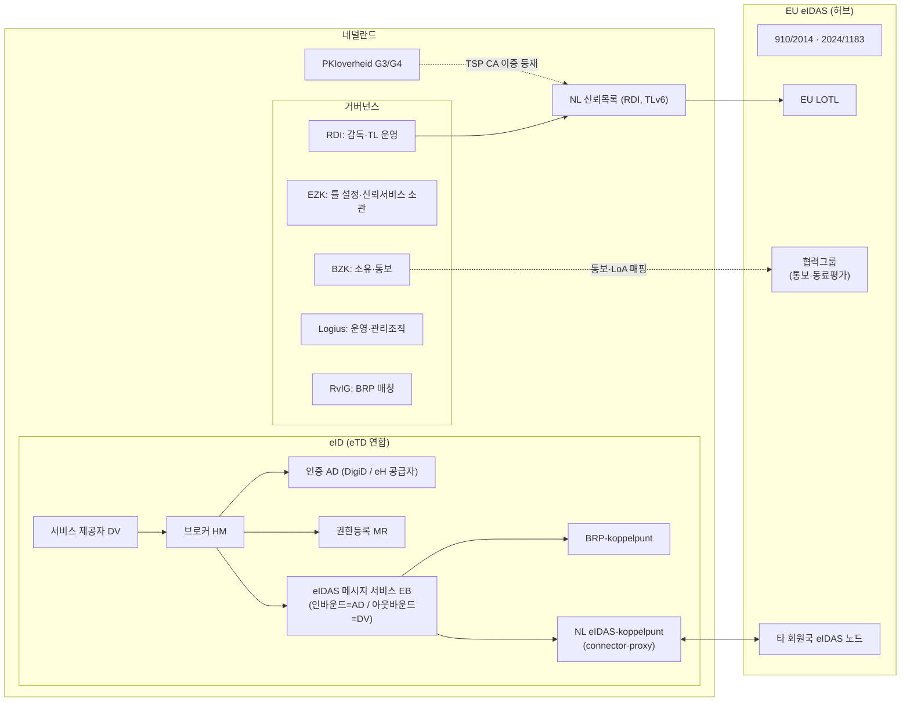

# 00 부속3 — 네덜란드의 eIDAS 통합·매핑 사례 (EIF 계층별)

조사일: 2026-09-29. [00 부속2](00_부속2_국가별_구조분류_및_매핑구조.md)에서 "EU 허브 편입"으로 분류한 나라 가운데 네덜란드를 골라 심층 조사했다.

**조사 질문**: 네덜란드는 자국의 신뢰체계(DigiD, eHerkenning, 신뢰서비스, PKIoverheid, NL Wallet)를 EU eIDAS 체계와 **실제로 통합·매핑했는가**. 했다면 법률·거버넌스·조직·의미·기술·검증·시험의 각 계층에서 **어떻게** 했는가.

**조사 방법과 한계**
- 법률·거버넌스, 조직·의미, 기술·검증·시험의 세 갈래로 나눠 조사했다.
- 웹 검색 한도가 소진돼 공식 사이트(wetten.overheid.nl, afsprakenstelsel.etoegang.nl, logius.nl, rdi.nl, forumstandaardisatie.nl, officielebekendmakingen.nl, EC, GitHub)와 저장소 원문을 직접 읽었다.
- 네덜란드 신뢰목록은 원본 XML을 내려받아 수치를 직접 확인했다.
- 확인하지 못한 항목은 13장에 모았다.

---

## 1. 요약 — 통합했는가

**결론: 통합했다.** 방식은 "EU 규정 직접 적용 + 국내 인프라를 EU 역할에 치환 + 명칭 통일"이다. 다만 계층마다 성숙도가 다르다.

| 계층 | 통합 방식 | 수준 |
|---|---|---|
| 거버넌스 | 소유(BZK)·틀 설정(EZK)·운영(Logius·RvIG)·감독(RDI)을 분리. EU 통보·동료평가·LOTL로 연결 | ● |
| 법률(신뢰서비스) | eIDAS 직접 적용 + 통신법(Tw)으로 관할·절차·제재만 보충. 민법은 eIDAS보다 넓은 효력 인정 | ● |
| 법률(eID) | DigiD는 Wdo 법정 기반, eHerkenning은 계약형. 둘 다 **제도 전체를 통보**해 EU LoA에 편입 | ◐(eHerkenning 법정 인정 미시행) |
| 법률(EUDI) | 이행법 없음(2026년 말 입법예고, 2028년 시행 예상) | ○ |
| 조직 | eIDAS 노드의 메시지 서비스(EB)를 국내 연합의 **한 역할로 편입**. 서비스 제공자는 브로커 계약 하나로 국내·EU 인증을 모두 받음 | ● |
| 의미 | 국내 등급 명칭을 eIDAS와 같게(laag·substantieel·hoog). 외국인 신원을 BSN에 매칭(2024/1183 제11a조 선행 구현) | ● |
| 기술 | 국내 SAML(eTD) ↔ eIDAS SAML을 EB가 변환(LoA URI, 속성) | ● |
| 검증 | RDI 신뢰목록(TLv6)에 PKIoverheid 발급 CA를 개별 적격 서비스로 이중 등재. G4는 적격 서명 루트를 "EUTL"로 분리 | ●(국가 검증 서비스·LoTE 없음) |
| 시험 | 국내는 시뮬레이터(적합성)와 체인 테스트(상호운용성) 2단계 + 상설 시험망 + TRIAL PKI | ◐(EU 노드 간 시험 기록 미확인) |

●: 통합 완료, ◐: 부분 통합, ○: 미통합

### 통합 구조도

---

## 2. 대상 체계

| 체계 | 성격 | 법적 기반 | EU 연결 |
|---|---|---|---|
| **DigiD** | 시민 eID(정부 운영, Logius) | Wdo 제5조 + Regeling voorzieningen Wdo | 통보 2020-08-21, OJ 2020/C 276/02, Substantieel·Hoog |
| **eHerkenning(eTD)** | 기업·대리 eID(민간 발급자 + 정부 소유 협약) | Afsprakenstelsel eTD AS1.24e + 참여자 계약(Wdo §4.3 미시행) | 통보 2019-09-13, OJ 2019/C 309/09, Substantial·High(법인용) |
| **신뢰서비스** | 전자서명·인장·타임스탬프·QERDS·QWAC | eIDAS 직접 적용 + Telecommunicatiewet | RDI 신뢰목록 → EU LOTL |
| **PKIoverheid** | 정부 PKI(국가 루트 + 민간 TSP CA) | Logius 운영 정책 | TSP CA가 신뢰목록에 적격 서비스로 등재 |
| **NL Wallet** | EUDI 지갑(BZK 프로그램) | 이행법 없음 | 오픈소스(MinBZK/nl-wallet), 2024/1183 이행 준비 |

---

## 3. 상호운용성 거버넌스 계층

| 주체 | 역할 | EU 연결 |
|---|---|---|
| EZK(디지털경제·주권 차관) | 2026-02 재편(Stcrt 2026, 8180)으로 디지털 사무 이관. Wdo 틀 설정, 표준 지정(Wdo 제3조). **Tw의 소관 장관이자 eIDAS 제46b조 감독기관**(Tw 제18.2a조 ②) | 협력그룹 대표 여부 미확인 |
| BZK(차관) | GDI(DigiD·MijnOverheid·eHerkenning 인프라) 실현·운영 책임(Wdo 제5조). Afsprakenstelsel 소유자·감독자. **통보 책임 당국** | 통보 주체(제9조) |
| RDI(구 Agentschap Telecom) | ① 신뢰서비스 감독과 신뢰목록 운영 ② eTD 가입·집행 독립 자문과 위임 시정지시 ③ Wdo 감독(인정 절차 2027-06 개시 예정) ④ NIS2(Cbw, 2026-08-15 시행) 감독 | 제46b조, NIS2 관할 연계 |
| Logius(BZK 산하 청) | DigiD·eHerkenning 운영, eTD 관리조직(메타데이터 집계, 가입 시험). eIDAS 체인 파트너로 국내·외국 수단 통보 절차 조정, 서비스 제공자 지원 | 통보·동료평가 대응 |
| RvIG | eIDAS 노드 체계 관리, 외국 식별자와 BSN 매칭(BRP-koppelpunt), NL Wallet PID 발급 | 2024/1183 제11a조 |
| DICTU(EZK IT 공유서비스) | 2018년 통보 당시 connector·proxy·메시징 운영(ISO 27001) | 현재 운영 여부 미확인 |
| eTD 협의체 | 전략·전술·운영 3층 협의체(Instellingsbesluit Besturing eTD) | — |
| Forum Standaardisatie | "적용 또는 사유 설명(Pas toe of leg uit)" 의무 표준 목록. SAML + OpenID.NLGov(IdP·브로커 인터페이스), **AdES Baseline Profiles**(서명·인장·타임스탬프) | ETSI 규격의 국내 의무화 |
| AP / J&V | 개인정보 감독, 보안 침해 통지(eIDAS 제19조) | 제19조 |

**EU 연결 경로**
- **eID**: BZK·Logius 사전통보(2018-12) → 협력네트워크 동료평가(독일 주도, 2019-03 헤이그 대면회의) → OJ 게재
- **신뢰서비스**: RDI 신뢰목록 → LOTL 포인터, 회원국 간 공조 조항(Tw 제15.3b~15.3d조)
- **EUDI**: BZK 프로그램, NL Wallet 오픈소스, 대규모 시범사업(LSP) 참여(세부 미확인)

---

## 4. 법적 계층

### 4.1 신뢰서비스 — 직접 적용 + 최소 보충

| 항목 | 네덜란드 | eIDAS | 매핑 방식 |
|---|---|---|---|
| 이행 법률 | Telecommunicatiewet §2.2(제2.5a~2.5e조), 제18.15a~18.18조. 제1.1조가 "eidas-verordening"을 910/2014와 그 실행·위임법으로 정의 | 규정 직접 적용 | 별도 전자서명법 없음. 정의는 eIDAS 조문 참조 |
| 감독기관 | 장관(EZK)이 제46b조 감독기관(Tw 제18.2a조 ②). 제17조 → 제46b조 참조 갱신(Stb. 2025, 200) | 제46b조 | 실제 감독은 장관이 지정한 RDI 공무원(Tw 제15.1조 ① m호) |
| 적격 지위 | 적격 서비스 개시 통지 = 적격 지위 신청(제2.5b조 ①). 국외 설립자는 불수리(②). 3개월 기한(④) | 제21조 | EU 절차 그대로, 관할만 추가 |
| 신뢰목록 | 장관이 작성·공개(제2.5c조), 운영은 RDI | 제22조 | 장관 책임을 RDI가 운영 |
| 철회 | 제20조 ③ 외에 국내 사유 추가(법 위반, TL 정보 미제출·부정확, 제2.5d조) | 제20조 ③ | 국내 사유 추가 |
| 신원확인 | 적격 인증서 발급 시 신분증(Wet op de identificatieplicht), 법인은 상업등기·대리권(제18.15b조). eID 경로는 LoA substantial·high(제18.15c조). 가명 인증서도 실명 수준 확인(제18.15e조) | 제24조 | 국내 신분·등기 인프라로 구체화 |
| QSCD 인증기관 | 장관 지정(제18.17a조) | 제30조 | 지정기관제 |
| 제재 | 제III장 위반·적격 사칭 금지(제18.18조), 과징금 최고 90만 유로(재범 100% 가중, 제15.4조) | 제16조 | 행정 과징금 체계 편입 |
| 서명 효력 | **BW 제3:15a조**: 방법이 충분히 신뢰할 만하면 AdES·단순 전자서명도 자필 동등. 행정은 Awb 제2:18조 | 제25조 | **국내법이 eIDAS보다 넓음** |

### 4.2 eID — 법정형과 계약형의 이원 구조

| 항목 | 네덜란드 | eIDAS | 매핑 방식 |
|---|---|---|---|
| 기본법 | Wet digitale overheid(Stb. 2023, 158, 2023-07-01 1차 시행) | 제6~12조 | LoA 용어를 eIDAS에서 차용 |
| DigiD | Wdo 제5조 ① a호 + Regeling voorzieningen Wdo(laag·substantieel·hoog = eIDAS 제8조 LoA로 정의) | 제8조 | **국내 등급을 EU LoA로 직접 정의**(환산표 불요) |
| 서비스 요구 LoA | 공공기관이 Regeling betrouwbaarheidsniveaus 부속서 2 기준으로 결정(Wdo 제6조). 위험 완화 시 한 단계 하향 가능(제3조), 특례는 2028-07-01까지 | 제6조 ① | 요구 LoA의 법정 판정이 제6조 인정 의무의 전제 |
| 외국 eID 인정 | 시행 중: Wdo 제5조 ② a호(EU 통보 eID를 쓰게 하는 "eIDAS-voorziening" 설치), b호(NL 수단 대외 개방). 미시행: 제7조 ① c호(행정기관의 외국 eID 수용 의무). BSN 연결은 Besluit digitale overheid 제5d·9d·14d조(BSN-Koppelregister, 보관 5년) | 제6조, 제7조 f호 | **인정 의무는 EU 규정에서 직접 발생**. 국내법은 노드·BSN 연결 인프라만 규율 |
| eHerkenning | Afsprakenstelsel + 참여자 계약 + 이용약관(사법 계약). Wdo §4.3(제11~15조 인정·수용 의무) 미시행, 2027년 이후 예정 | 제7·8조 | **계약형 허브를 제도 전체로 통보** |
| 책임 | 노드는 BZK 장관의 국가배상 책임. 발급자·인증자는 민법상 자기 역할 책임 | 제11조 | 민법 일반원칙으로 매핑 |

### 4.3 통보서와 동료평가 — 법적 매핑의 실체

| 요소 | 통보서(2018-09, eHerkenning) | 동료평가(2019-05-29) |
|---|---|---|
| 대상 | 제도 전체(Afsprakenstelsel). 발급자 7곳(Connectis, Digidentity, KPN, QuoVadis, Reconi, Unified Post, iWelcome). 시민 도메인(Idensys) 제외 | 법인 eID만 인정. 자연인 단독 사용은 책임 합의 부재로 제외 |
| LoA 매핑 | 2015/1502 항목마다 Normenkader 2.x장 참조표 제출(등록·수단관리·인증·관리조직) | 플랫폼별 판정: P1(KPN, Reconi)·P2(Connectis, Unified Post, iWelcome, QuoVadis) = S·H. **P3(Digidentity) = Substantial만**(HSM 기반 가상 스마트카드, 비공개 프로토콜, EN 419 241-1 감사 범위 문제) |
| 감독 | BZK 장관(소유자·감독자), 독립 전문가위원회 자문, AT 사무국 | 거버넌스 확인. 외주는 감독기관 승인(EU 역외 처리·ISO 27001 미보유·GDPR 계약 부재 시 거부) |
| 책임 | 민법 일반원칙, 노드는 BZK | 과실 5요소 설명으로 수용 |
| 상호운용 | 2015/1501 제4~11조 대응표(부속서 3 "Dutch eIDAS architecture", 비공개) | — |
| 유보 | — | "IdP를 포함하지 않고 신뢰 프레임워크 자체를 통보할 만큼 거버넌스가 충분한가"는 판단하지 않고 협력네트워크로 넘김 |

### 4.4 EUDI 지갑 — 법적 공백

- **이행법**: 없음. 2026-04-24 의회 서한에 따르면 Wdo 개정을 포함한 uitvoeringswet을 준비 중이다. 2026년 말 입법예고, 2028년 시행 예상이다(kst-34972-AG).
- **지연 인정**: 2025-09-15 서한은 24개월 이행기한을 넘길 것이라고 인정했다(kst-26643-1397). 2027 예산은 EDI 평가를 2030년으로 연기했다.
- **자발성**: 지갑 사용은 자발적이라고 반복 확인했다(kst-26643-1511).
- **요약**: 기술(NL Wallet)이 법보다 앞서 있다.

---

## 5. 조직 계층 — 노드를 국내 역할로 치환

| 네덜란드 요소 | eIDAS 대응 | EUDI 대응 | 매핑 방식 |
|---|---|---|---|
| Eigenaar(BZK) | 스킴 책임 당국 | 지갑 제공 회원국 | 협약 소유자 = 통보 당국 |
| Toezichthouder(RDI, Wdo 2023-07-01 지정) | 감독기관 | (추정) 지갑·PID 감독 | 2018년 BZK·전문가위원회·AT 체계를 RDI가 승계 |
| Beheerorganisatie(Logius) | 스킴 운영(메타데이터 집계, 참여자 가입·탈퇴) | — | 협약 운영자 |
| MU 수단 발급자 / AD 인증 서비스 | eID 수단 발급자(제7조 a호 iii) / 인증 절차 | — | 1:1. 동료평가는 MU+AD 묶음을 "플랫폼" 단위로 심사 |
| MR 권한위임 등록부 | "법인을 대리하는 자연인" 속성 출처 | (EAA 제공자 유사) | 통보 범위에 포함 |
| HM 브로커 | 서비스 제공자 쪽 단일 접점 | — | DV는 HM 한 곳과만 계약 |
| DV 서비스 제공자 | 신뢰당사자 | Wallet-RP(제5b조 등록) | 1:1 |
| **EB eIDAS 메시지 서비스** | 노드의 국내 접점 | — | **인바운드: AD 역할 / 아웃바운드: HM에 연결된 DV 역할**(외국 SP의 proxy) |
| eIDAS-koppelpunt | eIDAS 노드(connector·proxy) | — | EB만 eTD 구성원, 나머지는 경계 밖 |
| BRP-koppelpunt(RvIG) | (구 eIDAS 규정 없음) | **2024/1183 제11a조 신원 매칭** | 인바운드 속성을 BRP·RNI와 대조해 BSN 연결 |
| BSNk(BZK 책임, Logius 운영) | 노드 밖 국내 가명화 | (제5a조 비연결성과 유사) | DV별 다형 가명·암호화 BSN |
| NL Wallet | — | 지갑 제공자(BZK), PID 발급자(RvIG), RP = verifier | RP는 WRPAC 발급, 운영팀이 CA를 trust anchor에 등재 |

**조직 프로세스**

| 프로세스 | 네덜란드 방식 | eIDAS |
|---|---|---|
| 수용 의무 | 공공 과업 DV가 DigiD·eH를 substantieel·hoog로 받으면 유럽 수단도 받아야 함(2018-09-29부터). **기준은 서비스 요구수준이 아니라 이용자 수단 수준** | 제6조 |
| DV 온보딩 | Regelhulp로 수준 결정 → HM 계약 → 서비스 카탈로그 등록(수준·대상·속성) → DV–HM 인터페이스 시험 → eIDAS에는 인터페이스 1.11 이상 필요 | 인바운드 연결을 **국내 브로커 계약에 흡수** |
| 접근 조건 | 네덜란드인에게 적용하는 법적 조건(BSN, 거주 요건)을 EU 이용자에게도 동등 적용 | 비차별 |
| UX | "European login" 버튼 분리(EU 깃발). 국가 선택은 EB만 표시 | — |
| 사고 관리 | 참여자(Deelnemer, BO, BSNk, EB)는 모든 사고를 BO에 신고. P1은 Logius 위기조직(24/7) | 제10조, 2015/1501 제9·10조 |
| 제재 | RDI 심사 → BZK 계약 → 시정 → 정지 → 계약 해지. 장관이 공익상 스킴 정지 가능 | 제10조 |

---

## 6. 의미 계층

### 6.1 보증수준

| 네덜란드 | eIDAS | 근거 |
|---|---|---|
| EH1 | 해당 없음 | Normenkader |
| EH2·EH2+ | Low | Normenkader(eherkenning.nl 비교표는 EH2+만 표시 — 표기 차이 확인 필요) |
| **EH3** | **Substantial** | 통보·동료평가 |
| **EH4** | **High** | 통보·동료평가 |
| DigiD Basis | Low 상당(통보 대상 아님) | Forum Standaardisatie Handreiking v5 §3.3 |
| DigiD Midden | 공식 매핑 미확인 | — |
| **DigiD Substantieel**(앱 + 신분증 1회 확인) | **Substantial** | 통보 |
| **DigiD Hoog**(NFC 신분증 + PIN) | **High** | 통보 |

- **구조 대응**: Normenkader의 절 구성이 CIR 2015/1502 부속서(2.1 등록, 2.2 수단관리, 2.3 인증, 2.4 관리·조직)와 같다.
- **서비스 요구 수준**: Wdo와 Regeling(2023)이 laag·substantieel·hoog로 정한다. **명칭이 같아 인바운드 LoA를 환산 없이 비교**한다.
- **원칙**: 위임은 요구 수준을 바꾸지 않는다. BSN을 쓰는 서비스는 최소 substantieel이다.

### 6.2 식별자

| 네덜란드 | eIDAS | 매핑 방식 |
|---|---|---|
| BSN(`urn:etoegang:1.12:EntityConcernedID:BSN`) | PersonIdentifier 원천 | DV별 **다형 암호화**(EncryptedIdentity) |
| PseudoID / Pseudo | 서비스 제공자별 고유 식별자 | DV별 영속 가명(BSNk 생성) |
| KvKnr, RSIN | LegalPersonIdentifier, VAT·TaxReference | RSIN에서 도출·검증 |
| eIDASLegalIdentifier(`1.11`) | 인바운드 외국 LegalPersonIdentifier | 문자열 그대로 |
| 인바운드 외국 자연인 ID(예: `ES/AT/02635542Y`) | PersonIdentifier | DV에 "DV 전용 식별번호"로 전달. **koppeltabel**(내부 ID 대응표) 권고 — 국가 변경·키 교체로 값이 바뀔 수 있음 |

식별자는 SAML `EncryptedID`로 전달하고, 종류는 `NameQualifier`에 표시한다.

### 6.3 속성

- **자연인**: 필수는 DV 전용 ID, 현재 성, 이름, 생년월일, 전치사(tussenvoegsel)다. 선택은 출생 시 성명, 출생지, 주소, 성별이다.
- **법인**: 필수는 대리인 DV 전용 ID, 법인 고유 ID, 공식 명칭이다. 선택은 주소, VAT·EORI, 세무번호, LEI 등이다.
- **URN**: `urn:etoegang:x.y:attribute:*`는 AD 전용, `attribute-represented:*`는 MR 전용이다. EB는 둘 다 공급할 수 있다. 출처는 `attribute-sourceid:eIDAS:XX`로 표시한다.
- **비라틴 문자**: `non-transliterated:*` 속성을 둔다. 2015/1501 제11조 ③(원문자·음역 병행)에 대응한다.
- **EB의 책임**: eIDAS 속성 → eTD 속성, eIDAS 속성 → BRP 속성으로 변환한다. 카탈로그 범위를 넘는 요청은 거부한다.

### 6.4 BSN이 없는 외국인 — 국경 간 신원 매칭

| 단계 | 처리 |
|---|---|
| 첫 로그인 | RvIG BRP-koppelpunt가 이름·성·생년월일로 BRP(거주자)·RNI(비거주자) 조회 |
| 1건 일치 | DV 전용 암호화 BSN 전달 |
| 불일치 | BSN 필요 서비스는 거부, BRP 등록 안내 |
| 복수 후보 | RvIG 수동 매칭 |
| 재시도 | 매 로그인 재매칭 |
| BSN 불요 서비스 | eIDAS 속성만으로 이용(예: Studielink, CJIB) |

- **실적**: 2025-09 기준 누적 매칭 10만 건, 월평균 약 2,000건이다. 연결 기관은 341곳 이상이고, 2024년 유럽 수단 로그인은 약 32.5만 건이다.
- **잔여위험**: Logius는 최소 속성만으로 매칭하므로 오매칭을 완전히 배제할 수 없다고 명시한다.

### 6.5 대리·위임

| 네덜란드 | eIDAS | 상태 |
|---|---|---|
| MR 서비스 단위 위임 | "법인을 대리하는 자연인" 데이터셋(2015/1501 제11조 ②) | 통보 범위에 포함 |
| Ketenmachtiging(조직 → 중개자 → 직원) | 직접 대응 없음 | **국내 전용**(IntermediateEntityID) |
| 법정대리, DigiD Machtigen | eIDAS 1.x에서 제한적 | 국내 전용 |
| EB의 MR 역할 | 외국 대리 속성 수용 | "장래 가능"으로만 규정 |

---

## 7. 기술 계층

| 항목 | 네덜란드 | eIDAS 규격 | 매핑 방식 |
|---|---|---|---|
| 노드 | eIDAS-koppelpunt(connector·proxy·메시징). EB만 eTD 구성원 | CIR 2015/1501 제5조 | 국내 SAML 연합과 eIDAS 노드 사이에 EB 번역 계층을 둠 |
| 노드 소프트웨어 | EC 샘플 여부 미확인. "Dutch eIDAS architecture"(통보서 부속서 3)는 비공개(eidas@logius.nl 요청) | EC eIDAS-Node(현행 3.1.0) | — |
| eIDAS SAML 버전 | NL 적용 버전 미확인(EC 현행 v1.4.1, 2024-09 승인) | eIDAS SAML Message Format·Attribute Profile·Crypto | — |
| 국내 SAML | Afsprakenstelsel AS1.24e. 구간별 인터페이스(DV-HM, HM-AD, HM-MR, **HM-EB**, AD-BSNk). Artifact 바인딩 필수 | SAML 2.0 | EB가 도메인 프로파일 ↔ eIDAS 프로파일 변환 |
| LoA URI | `urn:etoegang:core:assurance-class:loa2/2+/3/4` | `http://eidas.europa.eu/LoA/low·substantial·high` | EB가 AuthnContextClassRef 변환. 서비스 카탈로그 최대 LoA와 비교 |
| 메시지 보안 | enveloped XMLDSig(exc-c14n, SHA-256, RSA-SHA256). **서명 인증서는 PKIoverheid(2048비트 이상)**. 전 구간 양방향 TLS. BSN은 XML-Enc 종단간 암호화 + 다형 가명 | 2015/1501 제6·7조 | 국내 신뢰 앵커 = PKIoverheid. 노드 간 인증서 체계는 미확인 |
| 메타데이터 | 참여자 메타데이터를 Logius가 검증하고 서명된 EntitiesDescriptor 하나로 집계(cacheDuration 7일). EB는 "Interstelseldiensten" 그룹 | 2015/1501 제9조 | **국내는 중앙 서명 집계 메타데이터가 신뢰목록 역할** |

---

## 8. 검증 계층 — 신뢰목록과 PKIoverheid

### 8.1 NL 신뢰목록 실측 (2026-09-29 내려받음, 원본 XML 확인)

| 항목 | 값 |
|---|---|
| 위치(LOTL 포인터) | `https://www.rdi.nl/site/binaries/content/assets/site-content/bestanden/current-tsl.xml` |
| 운영자 | RDI(감독기관 = TL 운영자) |
| 형식 | **TLv6**(TSLVersionIdentifier=6), Sequence **79**, 발행 2026-06-26, NextUpdate 2026-12-26(6개월) |
| 서명 | XAdES enveloped, RSA-SHA512. 서명자 "RDI NL TSL Signer 2"는 LOTL 포인터에 사전 등록된 인증서 2장 중 하나와 지문이 일치한다(키 교체 대비) |
| TSP | **14곳**(현재 granted 서비스 보유 9곳, 전부 withdrawn 5곳: DigiNotar, ESG, Getronics, KPN Corporate Market, NID) |
| 서비스 | **97개**(현재 granted 42 / withdrawn 55), 이력 인스턴스 138 |
| 유형별(granted/withdrawn) | CA/QC 30/45, TSA/QTST 9/6, EDS/Q 1/3, EDS/REM/Q(QERDS) 2/1 |
| QWAC | ForWebSiteAuthentication granted 2개 |
| 확장 | Qualifications 120건(QCWithQSCD 49, QCWithSSCD 57, QCQSCDManagedOnBehalf 11, QCNoQSCD 4). TakenOverBy 27건(QuoVadis → DigiCert 등 사업자 승계) |
| 검증 서비스 | QVal·QPres **0건** |

### 8.2 PKIoverheid와 eIDAS

| 항목 | 내용 | 통합 방식 |
|---|---|---|
| G3 | 단일 루트(Staat der Nederlanden Root CA-G3, 2028-11 만료) → 도메인 CA → 민간 TSP CA | 국가 루트는 국내 신뢰(Afsprakenstelsel 등)에 사용. **TSP CA는 EU 신뢰목록에 개별 적격 서비스로 이중 등재**(granted QC 서비스 중 이름에 PKIoverheid·PKIo가 들어간 것 21개) |
| G4 | 용도별 루트 분리: **G4 Root EUTL G-Sigs 2024**(EU 적격 서명·인장, NP·LP), Priv G-TLS, Priv G-Other 등. RSASSA-PSS, PQC 대비, 인증서 1장 1용도 | **적격 서명 루트를 EU 신뢰목록 기반 검증 전제로 설계**. TLS 등은 사설 루트로 분리 |
| 서명 형식 | Forum Standaardisatie가 AdES Baseline Profiles(XAdES·PAdES v2.1, CAdES·ASiC v2.2)를 의무화 | 공공 조달에서 강제. EN 319 1x2 갱신 여부 미확인 |
| 국가 검증 서비스 | 확인 안 됨 | 제33조 적격 검증 서비스 없음 |
| EUDI 신뢰목록(TS 119 602) | NL Wallet은 신뢰 앵커를 설정값(`wrprc_trust_anchors`, `wia_trust_anchors`)과 정적 CA로 처리. LoTE 소비 코드 없음 | 미준비 |

---

## 9. 통합 경로 — 실제 연동 흐름

| 방향 | 흐름 | 비고 |
|---|---|---|
| **인바운드**(외국 eID → NL 서비스) | 이용자 → DV → HM → (HM-EB SAML, HM-AD와 같은 형식) → **EB** → NL connector → 해당국 proxy·IdP → EB가 LoA·속성을 eTD로 변환(BSN 서비스는 BRPk 매칭) → Artifact 응답 → HM → DV | 연결 기관 341곳 이상, 일평균 약 1,000회. 2023년 폴란드가 16번째 연결국. EB는 웹만 지원(네이티브 앱 불가) |
| **아웃바운드**(NL eID → 외국 서비스) | 외국 SP → 해당국 connector → NL **proxy** → EB(외국 SP의 대리 DV로 동작) → HM → AD·MR → 최소 데이터셋을 eIDAS SAML로 반환 | **eHerkenning은 2021-09부터 국외 사용 가능**(법인만). DigiD는 통보(2020)됐으나 proxy 가동은 "op termijn(향후)"으로 표기(미확인) |

---

## 10. 시험·적합성

| 항목 | 네덜란드 | 비고 |
|---|---|---|
| 가입 시험 | ① **eTD 시뮬레이터 시험**: 요청 생성·응답 검증으로 규격 적합성 확인 ② **체인 테스트**: 참여자 A 환경을 다른 참여자의 preprod와 연결해 상호운용성 확인. BO(Logius)에게 시연해 준비 상태 입증. 릴리스별 시험 범위 공개 | 적합성과 상호운용성을 분리(GITB/ITB 구조와 유사) |
| 시험망 | 참여자가 서로 시험 수단 제공 의무(모든 LoA). 시험망에서도 PKIoverheid 인증서 필수. 3년마다 CC 파생 방법으로 평가, 모의침투 결과를 감독기관에 제출 | 상설 운영 |
| PKI 시험 | TRIAL PKIoverheid G3·G4 루트. G4 시험 루트는 GitHub 공개. 무료 G4 trial 인증서 | 실환경과 같은 PKI로 시험 |
| EU 노드 시험 | EC는 노드 릴리스마다 회원국과 시험. NL 참여 기록 미확인 | — |
| NL Wallet | 단위·통합 시험(SoftHSM), UI 자동화(근접 BLE 포함), Playwright 브라우저 시험, 논리 시험사례, GSN 보증 사례. 외부 연동은 "NL Wallet Community" 온보딩(기관 CA를 trust anchor에 등록) | LSP·ETSI 플러그테스트 참여 미확인 |

---

## 11. EUDI 지갑 기술 구조

| 항목 | 내용 |
|---|---|
| 저장소 | github.com/MinBZK/nl-wallet(최신 릴리스 v0.5.0, 2026-03-27, 문서 v0.6.0 dev) |
| 구조 | Flutter UI + Rust 코어. 백엔드: wallet_provider(HSM, PKCS#11), pid_issuer, issuance_server, verification_server. 외부: DigiD용 OIDC/SAML 프록시(RDO-MAX), BrpProxy |
| 프로토콜·형식 | OpenID4VCI 1.0(PAR, DPoP, PKCE), OpenID4VP 1.0 + DCQL + JAR/JARM, HAIP, ISO mdoc(18013-5, 근접 BLE) + SD-JWT VC, Token Status List, PID Rulebook |
| PID | `vct = urn:eudi:pid:nl:1`(`urn:eudi:pid:1` 확장). 클레임에 **bsn** 포함. 발급자 RvIG. **DigiD Hoog**로 인증 → BSN으로 BRP 조회 → PID 발급 |
| RP 신뢰 | WRPAC(접근 인증서) + WRPRC(등록 인증서, 요청 가능 클레임 제한, status list 폐지). 전용 CA 기관은 "향후". **EU LoTE 연동 없음** |

**의미**
- 기존 eID 계층(DigiD Hoog)을 지갑 PID 발급의 신원확인 근거로 재사용했다.
- BSN을 PID 국가 확장 클레임으로 직접 넣었다. 이는 기존 노드의 가명 원칙과 긴장 관계에 있다.

---

## 12. 종합 — E1~E8 × EU 매핑표

| 요소 | 네덜란드 | EU 대응 | 매핑 방식 | 단계 | 판정 |
|---|---|---|---|---|---|
| E1 목적·원칙 | Wdo, Afsprakenstelsel 목적, Tw | eIDAS 제1조 | 규정 직접 적용 + 국내 목적 조항 | ①~⑤ | 동등 |
| E2 거버넌스 | EZK(틀·신뢰서비스), BZK(eID 소유·통보), RDI(감독), Logius·RvIG(운영) | 감독기관(제46b조), 통보 당국, 협력그룹 | 역할 분리 후 EU 기관 역할에 지정 | ①~⑤ | 동등 |
| E3 역할 | MU·AD·MR·HM·DV·BSNk·**EB** | 발급자·신뢰당사자·노드 | **EB를 국내 역할로 치환**(인바운드 AD / 아웃바운드 DV) | ①~⑤ | 동등(대리 역할 일부 국내 전용) |
| E4 규칙 | Normenkader(2015/1502 구조), Tw 제18.15조, 인터페이스 규격 | 2015/1502, 2015/1501, 제24조 | 구조 동형화 + 조항별 참조표(통보서) | ①~⑤ | 동등 |
| E5 보증수준 | EH1~4, DigiD Basis~Hoog, 서비스 요구 laag~hoog | eIDAS LoA | **명칭 통일 + 통보 매핑**(EH3·DigiD Substantieel → substantial, EH4·DigiD Hoog → high) | ①~⑤ | 동등(발급자 단위 부분 인정 사례 있음) |
| E6 평가·인정 | RDI 심사, BZK 계약, 시험(시뮬레이터·체인) / 신뢰서비스는 CAB + RDI | 동료평가, CAB(제20조) | 통보·동료평가 / eIDAS 절차 그대로 | ①~⑤ | 동등 |
| E7 감독·집행 | RDI, Tw 과징금(최고 90만 유로), 계약 제재 | 제16·20조 | 국내 과징금 체계 편입 + 국내 철회 사유 추가 | ⑤ | 동등(보충) |
| E8 신뢰공시 | RDI 신뢰목록(TLv6), 집계 SAML 메타데이터, OJ 통보 목록, eHerkenning 상표 | LOTL, 통보 목록, EU 신뢰표시 | TL → LOTL 포인터, PKIoverheid CA 이중 등재 | ①~⑤ | 동등(LoTE 미준비) |

---

## 13. 평가와 한국 시사점

### 13.1 네덜란드 방식의 핵심

1. **법률은 "직접 적용 + 최소 보충"이다.** eIDAS 정의를 조문 참조로 받아들이고 관할·절차·제재만 보충했다. 별도 전자서명법이 없다.
2. **계약형 허브도 EU에 편입할 수 있다.** 법정 인정 조항이 미시행이어도, 제도 문서를 2015/1502 항목별로 대응시킨 참조표와 소유자·감독자·자문기관의 분리가 있으면 통보·동료평가를 통과했다. 인정은 발급자 단위로 부분 인정됐다.
3. **노드를 국내 역할로 치환한다.** EB 하나로 국내 연합과 EU 노드를 연결해, 서비스 제공자는 추가 구현 없이 EU 수단을 받는다.
4. **명칭을 통일해 환산을 없앴다.** 국내 서비스 요구 수준을 eIDAS 명칭으로 법정화했다.
5. **신원 매칭 인프라(BRPk)가 있다.** 외국 eID를 국가 식별번호에 연결하되, 서비스 제공자별 가명으로 추적 가능성을 억제한다.
6. **PKI를 이중으로 연결한다.** 국가 PKI의 사업자 CA를 EU 신뢰목록에 개별 적격 서비스로 등재하고, G4에서 적격 서명 루트를 EU 신뢰목록 전용으로 분리했다.

### 13.2 한국 적용 시사점

| 네덜란드 방식 | 한국 대응 과제 |
|---|---|
| Tw가 eIDAS 정의를 참조하고 보충만 함 | (EU 비회원) 전자서명법에 국제 규격(ETSI) 기반 요건·효력 차등을 두고 외국 동등성 조항 정비 |
| Normenkader를 2015/1502 구조로 작성 | 전자서명인증업무 운영기준·본인확인기관 기준을 2015/1502 4영역 구조로 재편하거나 대응표 작성 |
| 서비스 요구 수준 = eIDAS 명칭 | 국내 공통 보증수준(E5)을 만들 때 명칭·정의를 eIDAS·ISO/IEC 29115와 대응 가능하게 설계 |
| EB(노드 ↔ 국내 역할 치환) | 해외 연동 게이트웨이를 국내 신뢰체계의 "역할"로 정의(분산형이라 역할 모델 자체가 먼저 필요) |
| BRPk 신원 매칭 + BSNk 가명 | 외국인 신원 매칭과 서비스별 가명 설계(현재 CI는 국내 전용 식별자) |
| RDI 신뢰목록(TLv6, 6개월 주기, 키 롤오버, TakenOverBy·이력) | **KR-TL**에 ServiceHistory, 서명 인증서 사전 등록 롤오버, 사업자 승계 이력, Qualifications 확장 반영 |
| PKIoverheid TSP CA의 TL 개별 등재, G4 용도별 루트 | 국내 인정 CA를 KR-TL에 서비스 단위로 등재하고, 서명 루트와 TLS 등 용도별 분리 검토 |
| AdES Baseline Profiles 의무화 | KR-AdES 프로파일의 공공 의무 표준 지정 → KR-DSS 검증 범위 명확화 |
| 국가 검증 서비스 없음 | KR-DSS가 국가 검증 서비스(QVal 상당)의 기반이 될 수 있음 |
| 시뮬레이터 + 체인 테스트, TRIAL PKI | KR-AdES·KR-TL 적합성 시험(18번 문서)에 적합성·상호운용성 2단계 분리와 시험용 PKI 반영 |
| NL Wallet은 LoTE 미준비 | KR-TL이 TS 119 602 LoTE 생성·소비를 먼저 갖추면 선행 가능 |

---

## 14. 확인하지 못한 사항

- 현재(2026) eIDAS 노드 운영 주체(2018년 DICTU → 이관 여부), 노드 소프트웨어(EC 샘플 여부), 적용 eIDAS SAML 버전, 노드 간 메타데이터 인증서 체계
- DigiD 동료평가 보고서와 LoA 판정, DigiD 아웃바운드(proxy) 가동 여부
- DigiD Midden의 공식 eIDAS 매핑, Normenkader와 eherkenning.nl의 EH2 표기 차이
- ketenmachtiging·DigiD Machtigen의 eIDAS 연동 여부
- RDI 공무원 지정결정 원문, Agentschap Telecom → RDI 개칭일, Instellingsbesluit Besturing eTD 원문
- 협력그룹·EUDI 툴박스 회의체의 NL 대표 기관
- EUDI uitvoeringswet 초안(미공개), 지갑 감독기관·PID 제공자 법적 지정, LSP 참여 내역, ETSI 플러그테스트 참가
- "Dutch eIDAS architecture"(통보서 부속서 3) 원문(비공개)
- 국가 서명검증 서비스·DSS 도입 여부, AdES 표준의 EN 319 1x2 갱신 여부
- Interoperable Europe Act의 NL 이행, GDI 조정기구(OBDO 등)

## 15. 근거 원문

| 원문 | 위치 |
|---|---|
| NL 신뢰목록 TLv6(Seq 79) | `참조문서/01_원문/③ 기술/NL Trusted List TLv6 (RDI, Seq79 2026-06-26)__0a0cc4cb.xml` |
| NL eID 통보서(eHerkenning) | `참조문서/01_원문/⑥ 해외사례/NL_eIDAS eID Notification Form Dutch Trust Framework for Electronic Identification__5843f256.pdf` |
| NL 동료평가 보고서 | `참조문서/01_원문/⑥ 해외사례/NL_eIDAS Peer Review Report eHerkenning (2019-05-29)__0cb28c87.pdf` |
| EU LOTL | `참조문서/01_원문/③ 기술/EU LOTL TLv6 (Seq395 2026-09-24)__28ba0050.xml` |
| 웹 원문(주요) | wetten.overheid.nl BWBR0009950(Tw)·BWBR0048156(Wdo)·BWBR0048167·BWBR0048168·BWBR0005291(BW), afsprakenstelsel.etoegang.nl(AS1.24e 각 페이지), logius.nl(eIDAS·DigiD·BSNk·PKIoverheid G4), rdi.nl(신뢰서비스), forumstandaardisatie.nl(betrouwbaarheidsniveaus, AdES Baseline), officielebekendmakingen.nl(Stb. 2023-158·160, Stb. 2025-200, kst-34972-AG, kst-26643-1397·1511), cert.pkioverheid.nl, github.com/MinBZK/nl-wallet, EC 통보 스킴 개요 페이지 |
